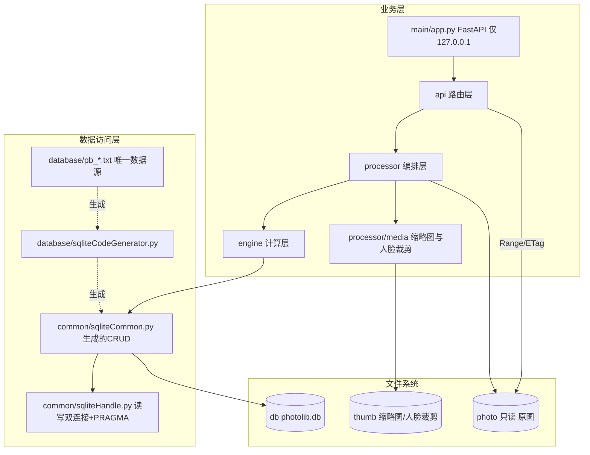

## 用户需求

为 `photo-browser`（本地照片浏览 + 人脸归类系统）准备**开发计划与分步提示语**，本轮**不写任何业务代码**。

1. **缩略图目录需确认**：用户建议在 photo 目录内建独立目录存放；原设计是放在应用状态目录（`db\thumbs\`）。已核对原设计，结论是「photo 目录严格只读、绝不写入生成物」，最终确定缩略图与人脸裁剪图放在**与 photo 平级的独立顶层目录 `D:\PhotoLib\thumb\`**，并同步修订所有相关文档。
2. **拆分开发步骤**：整个开发过程切成约 12 个步骤，每步单独开一次对话完成，并为每步给出**可直接复制使用的提示语**。
3. **界面风格**：采用淡雅浅色系或跟随系统，**不要直接使用深色系**（原 UI 稿定的「暗色单一主题」需推翻）。
4. **配置文件配置 photo 根目录，默认 `d:\photoLib`**（可改；缩略图与数据库目录随之派生）。
5. **`recID` 用 `INT` 即可，不需要 `BIGINT`**，表定义与生成器映射同步调整。
6. **有问题及时确认**，先出计划与步骤。

## 核心交付物

- **开发计划总纲**：架构分层、12 步路线图（每步的目标 / 前置 / 产出文件 / 关键约束 / 验收标准）、关键决策记录、性能与风险对策。
- **12 步提示语文档**：每条提示语自包含（目标、前置依赖、涉及文件路径、必须遵守的约束、验收清单、禁止事项、统一结尾格式），可直接粘贴到新会话。
- **既有设计文档的同步修订**：缩略图落点、`photoRoot` 默认值、`recID` 类型、界面主题、技术取舍（放弃 ORM、改用原生 sqlite3 运行层）在全部文档中保持一致，无矛盾。
- **项目入口更新**：README 状态、目录结构、下一步指引、忽略规则。

## 视觉效果（界面方向）

- 整体为**浅色淡雅**风格：米白/浅灰底、白色卡片、柔和蓝主色、蜜桃点缀色，圆角柔和、阴影极轻、留白充足。
- **默认浅色并跟随系统**：系统切换深色时自动切换为深色同色系（同一套语义色微调），另提供手动切换开关并记忆偏好。
- 照片呈现区保持真实色彩，不叠加任何滤镜；人脸框等状态标记沿用「颜色 + 图标 + 文字」三重编码，保证浅底与深底下都清晰可辨。

## 一、技术栈（沿用项目既定决策，不引入新范式）

| 层 | 选型 | 依据 |
| --- | --- | --- |
| 语言/运行时 | Python 3.13（托管解释器 `C:\Users\NINGMEI\.workbuddy\binaries\python\versions\3.13.12\python.exe`）+ venv；pip **必须官方源** `https://pypi.org/simple` | README「六、本机环境事实（已验证）」 |
| 后端框架 | FastAPI + `uvicorn[standard]` + pydantic-settings；服务**只绑 `127.0.0.1`** | `plan/MVP_plan.md` S1/S5；主方案 3.9 |
| 数据访问 | **原生 `sqlite3` 运行层 + 代码生成器**（**放弃 SQLAlchemy ORM**） | `plan/数据库设计.md` v1.0 三层结构 + 禁止裸 SQL + 单写入者；运行层参照 `d:/home/lianyi/git/stock_rotation_strategy/src/common/sqliteHandle.py`（已核实：读写双连接、`%s`→`?`、fetchMany 批量 2000） |
| 主键类型 | **`recID INT AUTO_INCREMENT`**（SQLite 侧 `INTEGER PRIMARY KEY AUTOINCREMENT`），**不用 BIGINT** | 用户确认；8 张表规模最大 3 万行，`INT` 足够 |
| 图像 | Pillow（EXIF 方向纠正 + WebP 缩略图）、opencv-python-headless、numpy、insightface `buffalo_l` + onnxruntime(CPU) | 主方案「技术选型」表；S0 实测 0.42–0.50s/张 |
| 元数据 | Pillow EXIF（不额外引 exifread）；逆地理 `reverse_geocoder` 作**可选**依赖，缺失时降级为「无地点」 | 减少依赖面 |
| 联系人 | `vobject`（vCard 3.0/4.0） | MVP_plan S4 |
| 前端 | **从零搭建** Vue 3 + Vite + Pinia + Vue Router + Tailwind CSS + Element Plus + axios | 用户确认 D4；UI 稿 v0.1 技术栈 |
| 前端主题 | CSS 变量双套 + `prefers-color-scheme` + 手动切换（localStorage 记忆）+ Element Plus `html.dark` | 用户确认 D2 |


> **待验证风险（步骤 10 首要动作）**：本机 Node.js / npm 版本未核实；Element Plus 暗色模式需在 `html.dark` class 下切换并覆盖其 CSS 变量。

## 二、关键决策记录（必须在文档中定稿，避免后续返工）

| # | 决策 | 结论与理由 |
| --- | --- | --- |
| DR-1 | 缩略图/人脸裁剪图落点 | **`D:\PhotoLib\thumb\`**：`thumbs\<fileHash[:2]>\<fileHash>_<size>.webp` + `faces\<faceCode[:2]>\<faceCode>.jpg`。理由：保持「photo 目录绝对只读」，同时与应用状态目录分离；**文件名必须可推导**（`pb_photo` 无 thumbPath 字段，路径由 `fileHash` + size 计算，不入库） |
| DR-2 | 数据访问层 | 用**原生 sqlite3 + 生成器**，不用 SQLAlchemy ORM。原因：①「业务层禁止裸 SQL、一律走 sqliteCommon」这一层已等价替代 ORM；② 需要精确控制 WAL/双连接/单写入者；③ 与工作区 README「三、数据库要点」及 `数据库设计.md` 一致。**与 `MVP_plan.md` S1 的 SQLAlchemy 代码块冲突，以 `数据库设计.md` 为准并标注** |
| DR-3 | 双连接与线程安全 | FastAPI 同步端点跑在线程池，必须 `check_same_thread=False`，且**读/写两个连接都要执行同一套 PRAGMA**（stock 版 `getSqlliteDB` 未设 PRAGMA，需补齐） |
| DR-4 | 界面主题 | 浅色默认 + 跟随系统 + 手动开关；推翻 UI 稿第 375/368/419 行 |
| DR-5 | 前端起步 | 从零搭建，不复用 `contentHub` 基线；仅**参照**其表定义书写规范（已核实 `ch_*.txt` 与 `pb_*.txt` 格式一致：单字段一行、`recID INT AUTO_INCREMENT PRIMARY KEY COMMENT '...'`） |
| DR-6 | 索引落地 | `.txt` 内不写索引；由生成器在建表函数中输出 `CREATE INDEX idx_<表>_<字段>`，清单照 `数据库设计.md` §五（含 `pb_face(personCode IS NULL)` 部分索引） |
| DR-7 | 生成器 | 新写 `code/src/database/sqliteCodeGenerator.py`（SQLite 口径），参照 `stock_rotation_strategy/src/database/mysqlCodeGenerator.py` 的 `genCreateCode`（第 261–330 行的 ENGINE/CHARSET 需替换为 SQLite 子句）、以及 `contentHub` 版的 `queryTableGeneral` 架构；生成物落 `code/src/database/auto_generated/sqliteCommon.py` |
| DR-8 | **photo 根目录可配置** | 由 `code/src/config/local_settings.py` 的 `photoRoot` 配置，**默认 `d:\photoLib`**；`thumbRoot` / `dbFile` 默认从 `photoRoot` 派生（`thumb\photolib.db` 同级规则见下）。改配置即可整库迁移，无需改代码。**校验三条目录不得互相嵌套，也不得等于 photoRoot 本身** |
| DR-9 | **`recID` 用 INT** | 8 张表 `recID` 统一改为 `INT AUTO_INCREMENT PRIMARY KEY`（SQLite 落为 `INTEGER PRIMARY KEY AUTOINCREMENT`）。理由：最大表 `pb_photo` 仅 3 万行，`INT`（SQLite 内部即 64 位整数）完全够用，无溢出风险；`BIGINT` 只带来 DDL 与文档噪音。**必须先改 8 个 `pb_*.txt`（唯一数据源）再跑生成器**，禁止只改生成产物；`数据库设计.md` §1.5 类型映射表与 §4 逐表字段说明同步改为 `recID INT AUTO_INCREMENT` |


## 三、12 步路线图（每步独立可验收）

| 步 | 主题 | 主要产出 | 关键验收 |
| --- | --- | --- | --- |
| 1 | 工程基线与配置骨架 | venv + `requirements.txt`；`config/{basicSettings,sqliteSettings,local_settings.py}`（`photoRoot` 默认 `d:\photoLib`，另附 `.example`）；`common/{miscCommon,globalDefinition,paths}.py` | import 通过；配置与日志可打印；**默认路径解析为 `d:\photoLib\photo` / `d:\photoLib\thumb` / `d:\photoLib\db\photolib.db`**；改配置后路径随之变化；三条目录嵌套校验通过；路径规范化有单测 |
| 2 | SQLite 运行层 + 生成器 + 建库 | **先改 8 个 `pb_*.txt` 的 `recID` 为 `INT`**；`common/sqliteHandle.py`、`database/sqliteCodeGenerator.py`、`auto_generated/sqliteCommon.py`、`tools/build_db.py` | 8 表 + 索引建成；`PRAGMA table_info` 显示 `recID INTEGER`；`journal_mode=wal`、`foreign_keys=1`；`chkTableExist` 幂等 |
| 3 | 扫描器 | `processor/scanner/{walker,meta,runner}.py` | 3 万张幂等；增量仅处理新增；重命名识别为「移动」；缺失标记 `isMissing`；每 100 张 `PAUSED` + `lastCursor` 续扫 |
| 4 | 缩略图与原图文件服务 | `processor/media/{thumbStore,thumbMaker,faceCropper}.py`、最小 `main/app.py`、`api/static.py`、`tools/gen_thumbs.py` | 二次访问不重复解码（磁盘命中）；`/api/original` 支持 Range；网格只出缩略图 |
| 5 | 人脸引擎 | `engine/face/{engine,pool,faceStore}.py` | 100 张验证集与 S0 一致 ±2%；<1s/张；质量过滤（det<0.6 / 短边<64 / \ | yaw\ | >45 丢弃）；裁剪图落 `thumb\faces\` |
| 6 | 分桶 + 质心 + 匹配 | `engine/match/{bucket,centroid,matcher}.py` | 自适应分桶（0–18 岁 3 年 / 18+ 10 年）；相邻三桶取 **max**；每桶 ≥3 样本启用；三段式决策 + Top-5；向量内存 <100MB |
| 7 | 聚类与待确认数据 | `engine/cluster/dbscan.py`（纯 numpy，可选 sklearn） | 仅对未归类集合聚类；`clusterCode` 幂等；`pendingCount` 与队列一致 |
| 8 | 联系人导入 | `processor/contact/{csv_import,vcard_import}.py`、`main/cli.py` | 200 人导入字段正确；重复导入 0 新增；`Categories` 分号拆分不残留；`KIND:group` → `pb_family` |
| 9 | 后端 API 全量 | `api/{scan,browse,review,contacts,dto}.py` + 路由注册 | `timeline` 首屏 <500ms（3 万张）；分页统一 `page/size/total`；扫描后台任务可轮询进度 |
| 10 | 前端骨架 + 双主题 | `webserver` 全部构建配置、`styles/tokens.css`、布局组件、8 页空壳 | `npm run dev/build` 通过；系统深色自动切换；Element Plus 两套主题都可读 |
| 11 | 照片流 + 详情 + 待确认队列 | `PhotosView/PhotoDetailView/ReviewView` + `PhotoThumb/FaceBox/CandidateRow/BucketTimeline/ConfirmMerge` | 3 万张滚动不卡；批量确认 50 张 ≤3 次点击；确认后照片数即时更新；键盘 `1/2/3/N/S/I` |
| 12 | 人物库/详情 + 扫描台 + 设置 + 打磨 | `PeopleView/PersonDetailView/ScanJobsView/SettingsView`；备份脚本；Leaflet 地图（可选） | 年代桶时间轴成型；批次限流与断点续扫可用；M4 自测一周 |


> 每步的**完整自包含提示语**写入 `plan/step-prompts.md`（本轮产出），统一结尾格式：「完成后请输出：本步改动文件清单 + 验收结果 + 遗留问题」。

## 四、架构与数据流



- **单写入者**：扫描/人脸写入经单一 writer（进程内串行 + 事务 500 条一批）；子进程只做 CPU 计算（读图/检测/提特征），结果经 Queue 回主进程 —— 违反此条会直接 `database is locked`。
- **扫描链路**：walk → 规范化（仅用于算 hash，`relPath` 原值不改写）→ 双 hash（8MB 分块）→ 增量三路判定 → EXIF/年份 → 批量 upsert → 进度落 `pb_scan_job` → 到 `batchSize` 置 `PAUSED`。
- **识别链路**：face 提取（质量过滤）→ 桶键 → 相邻三桶质心 max → 三段式（≥T_high 自动 / 灰区待确认记 Top-5 / <T_low 进聚类）→ 人工确认后**立即重算**该 `(personCode, bucketKey)` 质心。

## 五、执行要点（防返工/防回归）

- **目录落点同步**：需同步修订 5 处文档 —— 主方案 3.3 目录树与 3.4 容量表、3.9 缩略图注释；`MVP_plan.md` S5 第 2 条；`数据库设计.md` Q-5；UI 稿第 198 行（`code/data/cache/`）。`.gitignore` 第 40–42 行 `code/data/cache/` 规则可精简（缓存已移出仓库）。全部路径默认值统一写 `d:\PhotoLib\`。
- **photoRoot 配置化**：`local_settings.py` 提供 `photoRoot`（默认 `d:\photoLib`）、可选 `thumbRoot`（默认 `photoRoot\thumb`）、`dbFile`（默认 `photoRoot\db\photolib.db`）；`common/paths.py` 统一解析 + 校验三者互不嵌套、不得等于 `photoRoot`。启动时打印解析后的三条绝对路径，便于排查。`local_settings.py` 不入库，提供 `.example`。
- **recID 改 INT 的落地顺序**：① 改 8 个 `pb_*.txt` 首行 → ② 同步 `数据库设计.md` §1.5 映射表与 §4 各表首行字段 → ③ 生成器映射表新增 `INT AUTO_INCREMENT PRIMARY KEY → INTEGER PRIMARY KEY AUTOINCREMENT`（置于 `BIGINT` 规则之前避免误匹配）→ ④ 重跑生成器 + 建库 → ⑤ `PRAGMA table_info(pb_photo)` 校验 `recID` 为 `INTEGER` 且 `pk=1`。**禁止手工改 `auto_generated/` 产物**。
- **PRAGMA 双连接**：`journal_mode=WAL`、`foreign_keys=ON`、`synchronous=NORMAL`、`busy_timeout=5000`、`temp_store=MEMORY`、`cache_size=-64000`；读写连接都要执行，否则只读连接缺 `foreign_keys` 会留孤儿数据。
- **热路径与性能**：3 万张 × 512 float32 ≈ 60MB 内存全量加载、暴力余弦 <10ms（不引 ANN）；列表页 `faceCount` 冗余字段避免 N+1；时间轴用 `shotYear/takenAt` 索引 + 分组聚合；缩略图批量生成用**进程池**（CPU 解码），单张按需生成用线程池；避免逐张解码原图。
- **缩略图原子写**：先写 `*.tmp` 再 `os.replace`，防止半文件被前端读到；目录按 `hash[:2]` 分桶避免单目录文件过多。
- **HTTP**：`/api/original` 必须支持 Range（否则浏览器滚动预加载卡）；`/api/thumb` 支持 ETag/If-None-Match 与 `Cache-Control: max-age`；服务只绑 `127.0.0.1`。
- **日志**：复用 `common/miscCommon.setLogNew` 风格；不打印原图路径全集与 embedding 内容；单张耗时只在 debug 级输出，避免 3 万张刷屏。
- **原图零风险**：任何操作只改数据库与 `thumb/`，不写、不删、不改名原图。
- **构建安全**：`.txt` 是唯一数据源，改表 = 改 txt + 重跑生成器；生成物只落 `database/auto_generated/`。

## 六、目录结构（本轮及后续 12 步涉及的全部文件）

```
d:/home/lianyi/git/photo-browser/
├── plan/
│   ├── 开发计划.md                        # [NEW] 本轮主交付。总纲：定位/架构/数据流/12 步路线图（目标·前置·产出·约束·验收）/DR 决策记录/性能与风险对策/文档一致性检查表
│   ├── step-prompts.md                    # [NEW] 12 条可复制提示语，每条自包含（目标·前置·文件路径·硬约束·验收清单·禁止事项·统一结尾格式）
│   ├── 照片管理方案_开源调研与自研设计.md   # [MODIFY] 3.3 目录树（db\thumbs → d:\PhotoLib\thumb\）、3.4 容量表、3.9 缩略图落盘注释
│   ├── MVP_plan.md                        # [MODIFY] S5 关键实现点第 2 条缩略图路径；S1 的 SQLAlchemy 片段加注「以数据库设计.md 为准（DR-2）」；S1 表定义 recID 改 INT；新增「执行路线 = 12 步」索引
│   ├── 数据库设计.md                      # [MODIFY] §1.5 类型映射表与 §4 逐表字段说明的 recID → `INT AUTO_INCREMENT`；Q-5 落点改为 d:\PhotoLib\thumb\；Q-1 主键类型备注；新增 DR-1/DR-2/DR-6/DR-8/DR-9 决策记录
│   └── UI/photo-browser UI 设计.md        # [MODIFY] 第 368/375/419 行改浅色默认+跟随系统；第 198 行改 thumb 路径；补 token 双套变量与手动切换说明
├── README.md                              # [MODIFY] 状态改为「编码中（按 12 步）·S0 已通过」、目录结构补 config/webserver/thumb、明确 photoRoot 默认 d:\PhotoLib 与第一步入口、验收命令
├── .gitignore                             # [MODIFY] 精简 code/data/cache 规则；忽略 code/src/config/local_settings.py、*.tmp
├── requirements.txt                       # [NEW] 后端依赖清单（含 insightface/onnxruntime CPU 版），附本机 pip 官方源与 3.13 降级 3.12 预案
├── code/src/
│   ├── main/                              # [NEW] app.py（FastAPI 实例，挂 api 路由与静态）、cli.py（建库/生成缩略图/导入联系人/扫描命令）
│   ├── common/                            # [NEW] miscCommon.py（日志/字符串/时间）、globalDefinition.py（错误码与常量）、paths.py（photoRoot/thumbRoot/dbFile 解析与嵌套校验）
│   │                                      #      sqliteHandle.py（读写双连接 + PRAGMA + %s→? + fetchMany）、sqliteCommon.py（由生成器产出，业务唯一入口）
│   ├── config/                            # [NEW] basicSettings.py（批大小/阈值/质量过滤/扩展名白名单）、sqliteSettings.py（双连接装配）、local_settings.py（photoRoot 默认 d:\photoLib）+ local_settings.py.example
│   ├── database/
│   │   ├── pb_family.txt / pb_person.txt / pb_person_category.txt    # [MODIFY] recID → INT AUTO_INCREMENT PRIMARY KEY
│   │   ├── pb_photo.txt / pb_face.txt / pb_person_centroid.txt      # [MODIFY] recID → INT AUTO_INCREMENT PRIMARY KEY
│   │   ├── pb_photo_person.txt / pb_scan_job.txt                   # [MODIFY] recID → INT AUTO_INCREMENT PRIMARY KEY
│   │   ├── sqliteCodeGenerator.py          # [NEW] SQLite 口径生成器：类型映射、建表（含索引）、chkTableExist、通用 insert/update、各表 CRUD → auto_generated/sqliteCommon.py
│   │   └── auto_generated/sqliteCommon.py  # [NEW] 生成产物（禁止手工改）
│   ├── processor/
│   │   ├── scanner/{walker,meta,runner}.py # [NEW] 遍历+双hash / EXIF+年份识别+逆地理 / 增量+批次限流+断点续扫
│   │   ├── media/{thumbStore,thumbMaker,faceCropper}.py # [NEW] 路径派生与原子写 / Pillow WebP 多尺寸 / 人脸裁剪图
│   │   ├── contact/{csv_import,vcard_import}.py          # [NEW] Outlook CSV 主力通道 / vobject 解析（KIND:group→家庭组）
│   │   └── review/{assigner,merger}.py                    # [NEW] 确认归属与质心即时重算 / 合并拆分
│   ├── engine/
│   │   ├── face/{engine,pool,faceStore}.py # [NEW] 检测+提特征+质量过滤 / 进程池封装（子进程不连库）/ 裁剪图落盘
│   │   ├── match/{bucket,centroid,matcher}.py # [NEW] 自适应分桶 / 桶质心（≥3 样本）/ 三段式决策 + Top-5
│   │   └── cluster/dbscan.py                # [NEW] 未归类人脸聚类，生成 clusterCode
│   ├── schedule/scanScheduler.py            # [NEW] 扫描任务后台调度与状态流转（IDLE/RUNNING/PAUSED/DONE/FAILED）
│   ├── tools/{build_db.py,gen_thumbs.py,backtest_s0.py} # [NEW] 建库校验 / 缩略图批量生成 / 用 S0 验证集回归
│   └── test/                               # [NEW] conftest.py + 单测：路径规范化与目录嵌套校验、hash 幂等、分桶边界、阈值决策、占位符转换
└── code/webserver/                          # [NEW] 步骤 10 起从零搭建
    ├── package.json / vite.config.js / tailwind.config.js / postcss.config.js / index.html
    └── src/
        ├── main.js / App.vue
        ├── styles/{tokens.css,element-theme.css,main.css}   # 双套 CSS 变量 + prefers-color-scheme + .dark 覆盖
        ├── router/index.js
        ├── store/{photos,persons,review,scan,settings}.js   # Pinia
        ├── api/{request,scan,browse,review,contacts,static}.js # axios 封装 + 拦截器 + 统一分页
        ├── utils/{format,lazyImage,keyboard,theme}.js        # 主题切换（持久化）、图片懒加载、快捷键
        ├── components/layout/{AppSidebar,AppTopbar}.vue
        ├── components/{common,photo,review}/*                # L1 基础 + L2 业务组件
        ├── views/{Overview,Photos,PhotoDetail,People,PersonDetail,Review,ScanJobs,Settings}View.vue
        └── config/index.js
```

## 七、关键接口契约（仅接口级，供跨步对齐）

```python
# code/src/config/local_settings.py —— 路径集中配置，photoRoot 可改
PHOTO_ROOT: str = r"d:\photoLib"          # 默认值；photo\ 只读
THUMB_ROOT: str = ""                      # 空 = 派生为 <PHOTO_ROOT>\thumb
DB_FILE: str = ""                         # 空 = 派生为 <PHOTO_ROOT>\db\photolib.db

# code/src/common/paths.py —— 统一解析 + 校验
def photo_dir() -> str: ...
def thumb_dir() -> str: ...               # <PHOTO_ROOT>\thumb
def db_file() -> str: ...                  # <PHOTO_ROOT>\db\photolib.db
def validate_layout(photo: str, thumb: str, db: str) -> None:
    """三者互不嵌套、不得等于 photoRoot；启动时调用，违规直接抛错"""
```

```python
# code/src/processor/media/thumbStore.py —— 路径必须可推导（pb_photo 无 thumbPath 字段）
THUMB_SIZES: tuple[int, ...] = (200, 400, 800)          # 宽像素，WebP

def thumb_relpath(file_hash: str, size: int = 400) -> str:
    """相对 thumbRoot：thumbs/<file_hash[:2]>/<file_hash>_<size>.webp"""

def face_relpath(face_code: str) -> str:
    """相对 thumbRoot：faces/<face_code[:2]>/<face_code>.jpg"""

def write_atomic(abs_path: str, data: bytes) -> bool:
    """先写 *.tmp 再 os.replace，返回是否成功；失败清理 tmp 不留半文件"""
```

```python
# code/src/common/sqliteHandle.py —— 读写分离 + PRAGMA + 线程安全（FastAPI 线程池必需）
def open_db(db_path: str, *, read_only: bool = False) -> sqlite3.Connection:
    """row_factory=sqlite3.Row; check_same_thread=False;
       PRAGMA journal_mode=WAL / foreign_keys=ON / synchronous=NORMAL /
              busy_timeout=5000 / temp_store=MEMORY / cache_size=-64000"""

class sqliteHandle:
    def __init__(self, db_path: str) -> None: ...      # 自建读、写两个连接
    def executeRead(self, sql: str, values: tuple = ()) -> int: ...
    def executeWrite(self, sql: str, values: tuple = ()) -> int: ...
    def fetchAll(self) -> list[dict]: ...
    def fetchMany(self, num: int = 2000) -> list[dict]: ...
    def fetchOne(self) -> dict | None: ...
```

```sql
-- code/src/database/pb_*.txt（8 张表统一首行，recID 用 INT）
recID INT AUTO_INCREMENT PRIMARY KEY COMMENT '记录ID'
-- 生成器映射（注意顺序：INT 规则必须排在 BIGINT 之前）
INT AUTO_INCREMENT PRIMARY KEY  ->  INTEGER PRIMARY KEY AUTOINCREMENT
```

## 设计方向

全新搭建的本地照片浏览与人脸归类工作台，风格关键词为**浅色淡雅 + 照片优先**。项目既定组件方案为 **Element Plus + Tailwind CSS**（非 shadcn/mui/tdesign），故 component 属性留空。核心矛盾是「界面要淡雅」与「照片要突出」——解决方式是：界面用低饱和中性色 + 大留白 + 极轻阴影，让高饱和的照片内容成为页面里唯一的高对比元素。

## 主题策略（推翻原暗色单一主题）

- **浅色为默认**：底色 `#F7F8FA`、卡片纯白 `#FFFFFF`、卡片边框 `#E8EBF0`。
- **跟随系统**：`@media (prefers-color-scheme: dark)` 自动切换为深色同色系（底 `#14161A`、卡片 `#1E2128`、边框 `#2B2F38`），Element Plus 通过 `html.dark` class 同步切换并覆盖其 CSS 变量。
- **手动开关**：TopBar 提供 浅色/深色/跟随系统 三态选择，写入 localStorage，首屏读取避免闪白。
- **语义色双套**：成功/警告/危险/信息各定义浅色版与深色版，保证浅底与深底下对比度均达 WCAG AA；状态识别沿用「颜色 + 图标 + 文字」三重编码，不依赖单一颜色。

## 页面与布局

沿用 UI 稿的信息架构：左侧栏 6 项（概览 / 照片流 / 人物库 / 待确认① / 扫描任务 / 设置，固定 220px，<1024 收窄为图标）+ 56px 顶栏（面包屑、搜索、待确认角标、主题开关）+ 内容区最大宽 1600。照片流默认网格、一键切时间轴；照片详情为主图 + 右侧信息栏（人脸框叠加，侧栏列出「出现的人」可直接跳人物）；待确认队列为未知人脸大图与候选人物并排比对，候选按相似度降序，灰区橙色提示，支持键盘选择。

## 交互与动效

- 卡片与缩略图 hover 轻微上浮（2px / 120ms ease-out），角标淡入。
- 主题切换用 View Transition 平滑过渡，避免闪白。
- 照片网格滚动懒加载 + 骨架占位，滚动到底淡入下一批。
- 合并人物、软删除等不可逆动作弹 ConfirmMerge 弹窗，复述双方姓名与照片数，动词按钮二次确认。
- 照片呈现区按真实色彩渲染，不叠加任何滤镜；人脸框 2px 描边，悬停显示人名 + 相似度。

## 响应式与无障碍

桌面基准 1440；<1024 侧栏图标化；<768 网格 2 列、详情转上下布局。移动端仅浏览与轻操作，扫描/合并/删除引导至桌面端。全流程键盘可达，焦点可见，人脸状态不靠颜色单通道表达。