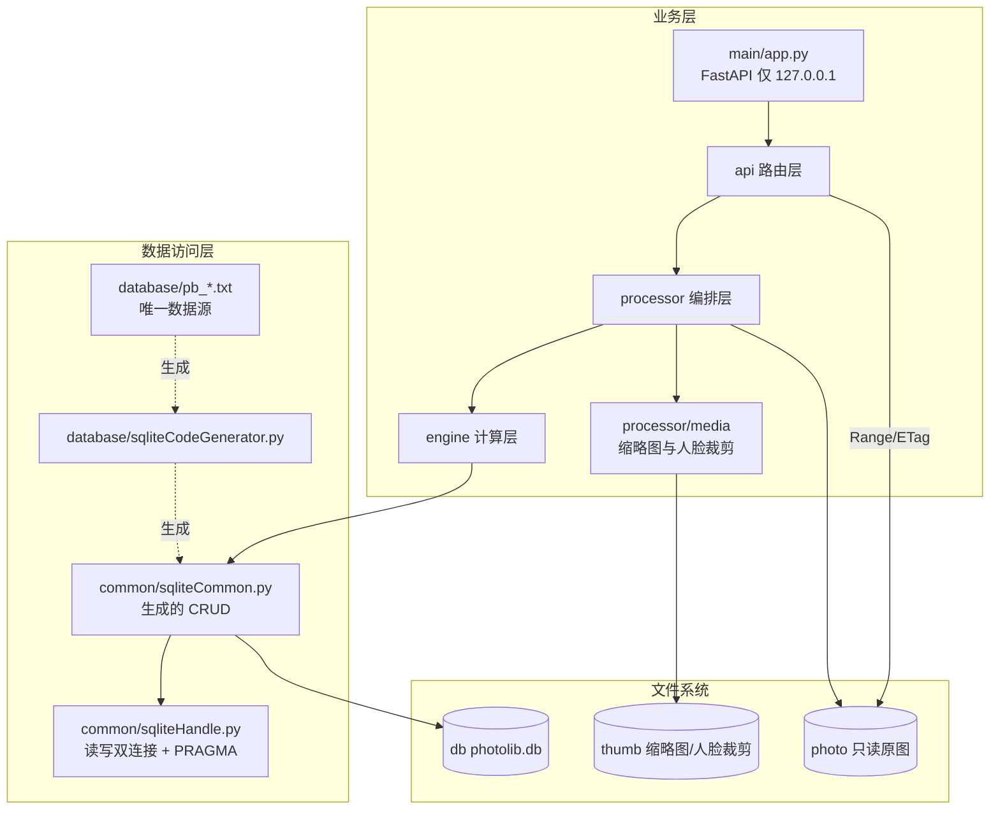

# photo-browser 开发计划（执行总纲）

> 版本：v1.0 ｜ 日期：2026-10-04 ｜ 状态：**编码中（按本文 12 步路线执行）**
> 配套：`plan/数据库设计.md`（表定义与三层结构）、`plan/UI/photo-browser UI 设计.md`（信息架构）、`plan/照片管理方案_开源调研与自研设计.md`（技术选型）、`plan/MVP_plan.md`（阶段划分）
> 分步提示语：`plan/step-prompts.md`（每步单独开对话，提示语可直接复制）

---

## 一、项目定位与核心约束

**是什么**：一个本地优先的照片浏览 + 人脸归类工具，对标 Picasa 3 但更轻。把磁盘上散落的照片，变成可按人浏览、可跨年代追溯的私人相册。

| 项 | 结论 |
|---|---|
| 规模 | **3 万 ~ 10 万张照片**（**按 10 万设计**）；目录 4–5 级；单机 |
| 原图 | **只读**，绝不改写 / 删除 / 改名 |
| 硬件 | **无需 GPU**、**无需安装数据库服务**（SQLite 进程内） |
| 数据库 | SQLite 单文件，备份 = 拷贝文件 |
| 唯一硬约束 | **单写入者** —— 子进程只做 CPU 计算，主进程单线程批量写库 |
| 准确性策略 | 人脸识别给建议，**人工确认兜底**；灰区一律进待确认队列，不静默归属 |
| 端口/网络 | 服务只绑 `127.0.0.1`，不开 `0.0.0.0` |

### 技术栈（不引入新范式）

| 层 | 选型 |
| --- | --- |
| 语言/运行时 | Python 3.13（托管解释器 `C:\Users\NINGMEI\.workbuddy\binaries\python\versions\3.13.12\python.exe`）+ venv；pip **必须官方源** `https://pypi.org/simple` |
| 后端 | FastAPI + `uvicorn[standard]` + pydantic-settings |
| 数据访问 | **原生 `sqlite3` 运行层 + 代码生成器**（不用 SQLAlchemy ORM） |
| 图像 | Pillow（EXIF 纠正 + WebP 缩略图）、opencv-python-headless、numpy、insightface `buffalo_l` + onnxruntime(CPU) |
| 元数据 | Pillow EXIF；`reverse_geocoder` 作**可选**依赖，缺失降级为「无地点」 |
| 联系人 | `vobject` |
| 前端 | Vue 3 + Vite + Pinia + Vue Router + Tailwind CSS + Element Plus + axios（**从零搭建**） |
| 前端主题 | CSS 变量双套 + `prefers-color-scheme` + 手动切换 + Element Plus `html.dark` |

---

## 二、目录布局

### 2.1 照片库（运行期数据，不入库）

```
d:\PhotoLib\                     ← photoRoot，可在 config/local_settings.py 改
├── photo\                       ← 原图，只读
│   ├── 2024\2024-05-01\IMG_0001.jpg ...
├── thumb\                       ← 生成物（缩略图 + 人脸裁剪图），可随时重建
│   ├── thumbs\<xx>\<fileHash>_<size>.webp
│   └── faces\<xx>\<faceCode>.jpg
└── db\
    ├── photolib.db (+ -wal / -shm)
    └── imports\ / exports\      导入的联系人原件归档、导出产物
```

### 2.2 代码仓库

```
d:/home/lianyi/git/photo-browser/
├── plan/                       本目录：设计与计划文档
├── requirements.txt            后端依赖
└── code/
    ├── src/
    │   ├── main/               app.py（FastAPI 实例）/ cli.py（命令行入口）
    │   ├── api/                路由层：scan / browse / review / contacts / static / dto
    │   ├── processor/          编排层：scanner / media / contact / review
    │   ├── engine/             计算层：face / match / cluster
    │   ├── schedule/           扫描任务调度与状态流转
    │   ├── common/             sqliteHandle / sqliteCommon(生成) / miscCommon / globalDefinition / paths
    │   ├── config/             basicSettings / sqliteSettings / local_settings(不入库)
    │   ├── database/           pb_*.txt（唯一数据源）/ sqliteCodeGenerator / auto_generated
    │   ├── tools/              build_db / gen_thumbs / backtest_s0
    │   └── test/               单测
    └── webserver/              前端（Vue3 + Vite）
```

### 2.3 三层数据访问结构

```
database/pb_*.txt        唯一数据源（表定义，纯文本，入库）
        │
        │  sqliteCodeGenerator.py（SQLite 口径代码生成器）
        ▼
common/sqliteCommon.py    生成层：通用 CRUD + 各表 query（业务层唯一入口）
common/sqliteHandle.py    运行层：原生 sqlite3 封装（读写双连接 / PRAGMA / %s→?）
        │
        ▼
processor / engine        业务层：**禁止裸 SQL**
```

- `.txt` 是唯一权威定义，改表 = 改 txt + 重跑生成器，**不允许手工改生成产物**。
- 占位符统一写 `%s`，由 `sqliteHandle` 内部转为 SQLite 的 `?`（防注入）。

---

## 三、架构与数据流



### 3.1 扫描链路（步骤 3）

```
walk 遍历 photo\
  → 路径规范化（仅用于算 hash，relPath 原值不改写）
  → 双 hash：relPathHash(规范化路径) + fileHash(8MB 分块流式 SHA-256)
  → 增量三路判定（见下表）
  → EXIF / 年份识别 / GPS 逆地理
  → 批量 upsert（executemany，500 条一事务）
  → 进度写 pb_scan_job
  → 累计到 batchSize（默认 100）即 jobStatus=PAUSED + 记 lastCursor
```

| 判定 | 条件 | 处理 |
|---|---|---|
| 全新 | `relPathHash` 未命中 | 新增，`scanState=0` |
| 未变 | `relPathHash` 命中 且 `fileHash` 相同 | 跳过（幂等） |
| 内容变更 | `relPathHash` 命中 但 `fileHash` 不同 | 更新元数据，人脸重新提取 |
| 移动/重命名 | `fileHash` 命中、`relPathHash` 未命中，且**同内容的旧文件全都不在磁盘上** | 标「移动」：新行 `isDuplicate=1`+`dupOfPhotoCode`，旧行 `movedToPhotoCode`（**双向可查**），计入 `pendingCount`；**不自动改路径**，由用户确认 |
| 内容重复（复制） | 同上，但**同内容至少还有一个旧文件在磁盘上** | 只标 `isDuplicate=1` + `dupOfPhotoCode`，**不建移动链接、不提示移动** |
| 缺失 | 库中存在但磁盘找不到 | `isMissing=1`，**不删记录** |

### 3.2 识别链路（步骤 5–7）

```
face 提取（SCRFD 检测 + ArcFace 512维）
  → 质量过滤：detScore<0.6 / 短边<64px / |yaw|>45° → 丢弃不入库
  → 桶键 bucketKey（自适应：0–18 岁 3 年一桶 / 18+ 10 年一桶）
  → 候选桶 = 相邻三桶有样本的质心，score = max(cosine)   ← 取 max，不取 mean
  → 三段式决策：≥T_high 自动归属 / 灰区进待确认(记 Top-5) / <T_low 进聚类
  → 人工确认后立即重算该 (personCode, bucketKey) 质心
```

### 3.3 单写入者（写错就 `database is locked`）

```
主进程：遍历 + hash + 批量写库（单线程，executemany，500 条/事务）
子进程：只做 CPU 密集的读图/检测/提特征，结果经 Queue 回主进程
```

子进程**绝对不能连数据库**。此架构对 MySQL 也是最佳实践，在 SQLite 下从「建议」变成「必须」。

---

## 四、关键决策记录（DR）

| # | 决策 | 结论与理由 |
| --- | --- | --- |
| DR-1 | 缩略图/人脸裁剪图落点 | **`d:\PhotoLib\thumb\`**：`thumbs\<fileHash[:2]>\<fileHash>_<size>.webp` + `faces\<faceCode[:2]>\<faceCode>.jpg`。保持「photo 目录绝对只读」，同时与应用状态目录分离。**文件名必须可推导**（`pb_photo` 无 thumbPath 字段，路径由 `fileHash` + size 计算，不入库） |
| DR-2 | 数据访问层 | **原生 sqlite3 + 生成器**，不用 SQLAlchemy ORM。①「业务层禁止裸 SQL、一律走 sqliteCommon」已等价替代 ORM；② 需精确控制 WAL/双连接/单写入者；③ 与 `数据库设计.md` v1.0 一致。**`MVP_plan.md` S1 的 SQLAlchemy 代码块与本决策冲突，以 `数据库设计.md` 为准** |
| DR-3 | 双连接与线程安全 | FastAPI 同步端点跑在线程池，必须 `check_same_thread=False`；**读/写两个连接都要执行同一套 PRAGMA** |
| DR-4 | 界面主题 | **浅色默认 + 跟随系统 + 手动开关**；推翻 UI 稿 v0.1 第 368/375/419 行的「暗色单一主题」 |
| DR-5 | 前端起步 | **从零搭建**，不复用 contentHub 基线；仅参照其表定义书写规范 |
| DR-6 | 索引落地 | `.txt` 内不写索引；由生成器在建表函数中输出 `CREATE INDEX idx_<表>_<字段>`，清单见 `数据库设计.md` §五（含 `pb_face(personCode IS NULL)` 部分索引） |
| DR-7 | 生成器 | 新写 `code/src/database/sqliteCodeGenerator.py`（SQLite 口径），产物落 `code/src/database/auto_generated/sqliteCommon.py` |
| DR-8 | **photo 根目录可配置** | `config/local_settings.py` 的 `PHOTO_ROOT` 配置，**默认 `d:\PhotoLib`**；`THUMB_ROOT` / `DB_FILE` 为空时从 `PHOTO_ROOT` 派生。改配置即可整库迁移，无需改代码。**校验三条目录不得互相嵌套、不得等于 photoRoot** |
| DR-9 | **`recID` 用 INT** | 8 张表统一 `recID INT AUTO_INCREMENT PRIMARY KEY`（SQLite 落 `INTEGER PRIMARY KEY AUTOINCREMENT`），**不用 BIGINT**。最大表 `pb_photo` 按 **10 万行**估（1 亿行内 INT 都够用，故仍不用 BIGINT）。**必须先改 8 个 `pb_*.txt` 再跑生成器**，禁止只改生成产物 |
| DR-10 | **`dbHandle()` 无参调用绝不切库** | 步骤 3 修复的潜在事故：本项目所有 `query_*`/`insert_*` 内部都是 `dbHandle()` **无参**调用，若无参也按 `paths.db_file()` 重新解析，则「先 `dbHandle(临时库)` 指定库、再调任一生成函数」会被悄悄切回正式库。实测后果：`build_db.py --db 临时库 --verify` 校验的是正式库、`scan_cli.py --db 临时库` 把**任务行写进正式库而照片写进临时库**（一个进程同时存在两个库句柄，最难查的一类错）。规则：**要换库必须显式 `dbHandle(路径)`** |
| DR-11 | **`pb_photo` 加 `movedToPhotoCode`** | 步骤 3 定稿。新记录的 `dupOfPhotoCode` 对「复制」和「移动」长得一样，UI 无法提示用户；于是在**旧记录**上补一个指向新记录的字段：`旧.movedToPhotoCode = 新.photoCode` 且 `新.dupOfPhotoCode = 旧.photoCode` ⟺ 确凿移动对。**两条记录都不自动改 `relPath`**。配套口径：EXIF 优先于截图名（`SCREENSHOT_OVERRIDES_EXIF` 默认 `False`）、`pendingCount` = 疑似移动/重命名待确认张数、软删行命中按「跳过」且 `delFlag` 不参与 `DO UPDATE`（扫描器不复活用户删掉的照片） |
| DR-12 | **规模上调到 10 万，扫描器按 10 万实测定型** | 步骤 3 实测（10 万行 `pb_photo` + 真实扫描路径）定下三条硬指标：① **索引必须分页读**（`SCAN_INDEX_PAGE=2000`）：一次性全取峰值 157.5MB，分页 3.2MB，速度相同；② **索引必须跨批复用**（`ScanRunner.ensureIndex` + 调度层 `_runnerFor`）：每批重建 = 1000 批 × 2.3s ≈ **57.6 分钟纯开销**（平方级劣化），复用后降到 **19.3 分钟**（其中大部分是 hash 本身这个必需工作）；③ **每批仍重新 stat 全树**（保「批次之间目录变动可见」），单次耗时已单独打点进日志，现场按日志调策略。**遗留**：人脸向量全量加载 10 万 × 512 × 4B = **205MB**，已超步骤 6/11 原来的「内存 <100MB」验收指标 —— 步骤 6 需改为**按候选桶惰性加载**（本项目本来就只取相邻三桶，全量加载是浪费），见步骤 6 关键约束 |
| DR-13 | **老库改表走 `build_db.py --migrate`，不用 `--drop`** | 步骤 3 补。建表 DDL 是 `CREATE TABLE IF NOT EXISTS`，**老库不会因为 `pb_*.txt` 加了字段而自动多出那一列** → 代码按新字段写库、老库没这列 → 运行时 `no such column`。`--migrate` 比对 .txt 与实际列，只 `ALTER TABLE ADD COLUMN` 缺的（SQLite 纯元数据操作，**不动任何一行**），并补建缺失索引；**不删列、不改列类型**（SQLite 不支持；类型亲和性对不上只报告，由人决定是否 `--drop`）。生成层新增 `columnDefOf()` / `addColumnGeneral()` 供其使用，DDL 仍只出自生成层 |
| DR-14 | **"库在哪"只有一个真相：`paths.setRootOverride()`** | 步骤 4 补。`scan_cli` / `gen_thumbs` 早就能 `--db/--root/--thumb` 指到临时库，但那是**工具自己解析好再往下传**；HTTP 服务的 `api/static.py` 是直接调 `paths.photo_dir()` / `paths.thumb_dir()` 的，没有传参口子 —— 想用临时库起服务就只能去改 `local_settings.py`，那是在动**正式配置**，风险与收益完全不成比例。解法不是"给服务再加一份自己的根"（会出现「A 层以为在 tmp、B 层写进正式库」这种最难查的错），而是把覆盖做进 `paths`：`photo_dir()/thumb_dir()/db_file()/validate_layout()/ensure_dirs()` 全部自动跟随，**不制造第二个真相**。纪律：① 缺省不调时行为与之前完全一致；② 只由命令行显式参数触发，不读环境变量、不猜、不自动探测；③ 覆盖值仍要过 `validate_layout()`（指到 photo 里面照样抛错）；④ 覆盖是**进程级全局**，单测必须 autouse 还原；⑤ **一个进程只服务一个库，不支持多库并行**（覆盖是全局的，这是有意的简化：多库要等到真出现第二个库再改，别现在就为想象的需求付复杂度） |
| DR-15 | **出图失败按原因分类，不是一律 5xx** | 步骤 4 补。`make_thumb` 的结果带机器可读的 `errCode`，`/api/thumb` 按它映射状态码：**422** = 原图在磁盘上但**解不出像素**（截断/全零/扩展名骗人）—— 这不是服务端的 bug，重试一万次也一样，回 5xx 会让前端和代理无限重试并弹错误提示，正解是显示"文件损坏"占位；**404** = 原图不在磁盘（拔盘/挪走），重试有意义；**500** = 落盘侧或数据不对，这才是我们的问题。⚠️ 分类时**不能按 `OSError` 分流**：Pillow 对坏图抛的就是 `OSError("image file is truncated")`，`UnidentifiedImageError` 更是它的子类，按 OSError 归到"原图不在"会把坏图**全部误报成 404**（"拔盘了？"），排障方向直接带偏；"原图不在"由 `os.path.isfile` 单独挡。批量汇总额外给 `failedDecode` 计数与一句人话提示 —— 只报"失败 9 张"没信息量，"其中 9 张是原图坏了"才决定得了要不要去重新拷贝。**实测：正式库 2137 张里 9 张坏**（6 张拷贝中断的截断 JPEG、1 张 6.9MB 全零、2 张只差 10~12 字节；后两张用 `ImageFile.LOAD_TRUNCATED_IMAGES` 能救，但那样连严重截断的也会出**下半张是废图**的结果，宁可一律 422） |
| **DR-16** | **纠错闭环：改判 / 拆分 / 合并 / 陌生人 + 质心防污染 + 可撤销** | 用户浏览时最高频的纠错场景是「**自动认错了人**」，而原设计只覆盖「未归属」（待确认队列），没有纠错入口。落地四条：<br>**① 四态语义**（由 `personCode` / `isConfirmed` / `isStranger` 三字段推导，**不新增 matchType**，无冗余）：<br>　未归属 = `personCode IS NULL AND isStranger=0` → 进待确认队列<br>　自动归属未确认 = `personCode IS NOT NULL AND isConfirmed=0 AND isStranger=0` → 进**「我不同意」列表**（纠错入口）<br>　人工确认 = `isConfirmed=1`｜陌生人 = `isStranger=1`（永久排除，不进队列也不聚类）<br>　⚠️ 修正原「待确认 = `personCode IS NULL OR isConfirmed=0`」：自动归属**不会**把 `isConfirmed` 置 1，该条件会把**全部自动归属**卷入（10 万张 ≈ 4~8 万条，队列爆炸）<br>**② 改判入口**：人脸框悬停「✗ 不是他」/ 照片详情侧栏改判 / 「我不同意」列表批量改判<br>**③ 质心防污染**：质心**只用 `isConfirmed=1` 样本**；桶确认样本 <3 → 退到 `ALL` 兜底桶（该人全部确认样本，不分桶）；总确认样本 <3 → 该人**不参与自动匹配**，其脸全走队列。否则一张误认样本拉偏质心 → **越错越错**<br>**④ 可撤销**：新增第 9 张表 `pb_review_log`（8 种 opType），仅 `SPLIT`/`MERGE` 标 `isRevertible=1`，提供「撤销上次合并」。理由：合并/拆分**不可逆**，质心一旦被污染靠重算回不到原值；日志同时是「这张脸当初怎么被认成这个人的」唯一排障依据<br>**改判的连带副作用**（缺一不可）：删旧 `linkKey` + 写新 `source=1` + **重算原人 *与* 新人**的全部桶 + 同步 `pb_photo.faceCount` 与 `pb_scan_job.pendingCount` |

---

## 五、12 步路线图

> 每步单独开一次对话完成；提示语见 `plan/step-prompts.md`。
> **强约束（每步都适用）**：原图零风险（只读）；不写裸 SQL（业务层）；不改 `pb_*.txt` 除非该步明确要求；不手改 `auto_generated/`。

### ⚠️ 修正步骤 R · 返工修正步骤 1–6（DR-16 引发，先于步骤 7）

| 项 | 内容 |
| --- | --- |
| 目标 | 把已完成的步骤 1–6 对齐到纠错闭环口径：区分「自动归属/人工确认」、质心防污染、`ALL` 兜底桶、`isStranger` + `pb_review_log` |
| 前置 | 步骤 1–6 已完成（真实数据已在 `photo\` 与正式库里） |
| **根因** | `assigner.assign()` 对**自动归属也写 `isConfirmed=1`**（约 234 行硬编码）。后果：①「机器认的」与「人工确认的」无法区分，「我不同意」列表无从表达；② 质心全部由自动样本构成，防污染无从下手 |
| 产出 | 重跑生成器（含新表 `pb_review_log`）；`build_db.py --migrate` 加 `isStranger` 列 + 建表 + 补 4 个索引；`tools/fix_confirmed_flag.py` 一次性回改存量 `isConfirmed`；`assigner` 拆 `confirm()`/`autoAssign()` + 新增 `fix()`/`batchFix()`；`merger` 新增 `undo()`；`centroid` 加 `confirmedOnly` + `ALL` 桶；`matcher` 候选桶 ∪ `{ALL}`；`basicSettings.CENTROID_CONFIRMED_ONLY` 开关 |
| 关键约束 | 迁移只用 `--migrate`（不删列不改类型不动数据）；迁移前备份 `photolib.db.bak-before-R`；存量回改以 `pb_photo_person.faceCode` 为准；旧质心全部重算；**不改生成器加 `isConfirmed` 查询参数**（在 Python 侧过滤） |
| 验收 | 24 条（见 `plan/step-prompts.md`「修正步骤 R」第四节）。核心三条：质心防污染（`sampleCount` 与 `centroid` 逐字节不变）、`ALL` 兜底可用、四态互斥且之和 == `pb_face` 总行数 |
| 冷启动提示 | 改成「只用确认样本」后，**用户未人工确认过任何脸之前所有质心不可用 → 自动归属数 0 → 全部进待确认**。这是正确行为；留 `CENTROID_CONFIRMED_ONLY=False` 作回归对比逃生口 |

> 完整提示语见 `plan/step-prompts.md` 开头的「修正步骤 R」。**步骤 7 必须等 R 通过后再开始。**

### 步骤 1 · 工程基线与配置骨架

| 项 | 内容 |
| --- | --- |
| 目标 | 建立可运行的 Python 工程骨架、配置体系与路径解析 |
| 前置 | 无 |
| 产出 | `requirements.txt`；`config/{basicSettings,sqliteSettings,local_settings.py,local_settings.py.example}`；`common/{miscCommon,globalDefinition,paths}.py`；`src/test/conftest.py` |
| 关键约束 | `PHOTO_ROOT` 默认 `d:\PhotoLib`；`paths.py` 统一解析 + 三目录互不嵌套校验；`local_settings.py` 不入库（提供 `.example`）；pip 用官方源 |
| 验收 | ① 全部模块 import 通过；② 配置与日志能打印；③ 默认解析出 `d:\PhotoLib\photo` / `d:\PhotoLib\thumb` / `d:\PhotoLib\db\photolib.db`；④ 改配置后路径随之变化；⑤ 嵌套校验能抛错；⑥ 路径规范化函数有单测 |

### 步骤 2 · SQLite 运行层 + 代码生成器 + 建库

| 项 | 内容 |
| --- | --- |
| 目标 | 打通「txt 定义 → 生成器 → 运行层 → 真实建库」全链路 |
| 前置 | 步骤 1 |
| 产出 | **先改 8 个 `pb_*.txt` 的 `recID` 为 `INT`**；`common/sqliteHandle.py`；`database/sqliteCodeGenerator.py`；`database/auto_generated/sqliteCommon.py`；`tools/build_db.py` |
| 关键约束 | 类型映射顺序：`INT AUTO_INCREMENT PRIMARY KEY` 规则**必须排在** `BIGINT` 之前；读写连接都执行 PRAGMA（`journal_mode=WAL` / `foreign_keys=ON` / `synchronous=NORMAL` / `busy_timeout=5000` / `temp_store=MEMORY` / `cache_size=-64000`）；`%s`→`?`；`chkTableExist` 幂等；不建物理外键 |
| 落地补充 | ① **读连接 = 正常连接 + `PRAGMA query_only=ON`**（WAL 库不支持文件级只读连接，详见 §6.2）；② **`.txt` 里的 `UNIQUE` 关键字不写进列定义**，由生成器按 `数据库设计.md` §五 转成命名唯一索引 `idx_<表>_<字段>`（避免同一份唯一性在列定义与索引清单里各生成一次）；`pb_person.displayName`、`pb_person_centroid(personCode,bucketKey)` 的唯一性以 §五 索引清单为准 |
| 验收 | ① 8 表 + 全部索引建成；② `PRAGMA table_info(pb_photo)` 显示 `recID` 类型为 `INTEGER` 且 `pk=1`；③ `journal_mode=wal`、`foreign_keys=1`；④ 重复执行 `build_db.py` 不报错不重复建表；⑤ 通用 insert/update 走通一条真实数据 |

### 步骤 3 · 扫描器（遍历 / hash / EXIF / 去重 / 批次限流）

| 项 | 内容 |
| --- | --- |
| 目标 | 把 `photo\` 变成库里的结构化事实数据 |
| 前置 | 步骤 2 |
| 产出 | `processor/scanner/{walker,meta,runner}.py`；`schedule/scanScheduler.py`；`tools/scan_cli.py`；`tools/make_scan_testset.py`（验收测试集生成器） |
| 关键约束 | 路径规范化**只用于算 hash，不改写 `relPath` 原值**；hash 分块 8MB 不整读；增量走 `relPathHash`/`fileHash` 索引 O(1)；`FileHash` 命中而 `relPathHash` 未命中 → 按「同内容旧文件是否都还在」拆成**移动**（写 `movedToPhotoCode` 双向链接、计入 `pendingCount`）与**复制**（只标 `isDuplicate`），两者都**不自动改** `relPath`；库中有磁盘无 → `isMissing=1` **不删**（且「根目录 0 文件」时跳过缺失判定，防拔盘误伤）；每 500 条提交；到 `batchSize` 置 `PAUSED` + `lastCursor`；年份识别 `EXIF → 文件名(mmexport*) → mtime`，**EXIF 优先于截图名**，无 EXIF 的截图归 NULL |
| 落地补充 | ① **relPath 字典序 = 遍历顺序**：先 `listPhotoFiles()` 全量收集并排序，再逐条算 hash —— DFS 天然顺序与字典序不一致，会让 `lastCursor` 的 `> cursor` 过滤漏文件；② **补丁行必须带齐 NOT NULL 身份列**（`photoCode/relPath/relPathHash/fileHash/fileSize`）：upsert 走的是 INSERT 语义，只写 `(photoCode, isMissing)` 会撞 `NOT NULL constraint failed: relPath`；③ 补丁行与「整列替换」行**分批写**，否则 `forceColumns` 会把没写的列刷成 NULL；④ 整列替换行用 `forceColumns`，否则「整批该列皆空」的列不进 `DO UPDATE`，旧值永久残留；⑤ **限流只在「还有剩余」时才 PAUSED**，正好在最后一张撞到 `batchSize` 直接 DONE |
| 验收 | ① 首次全量扫描无遗漏无重复；② 二次扫描新增 0 条（幂等）；③ 新增 100 张只处理这 100 张；④ 同图复制到另一路径 → 标重复；⑤ 重命名 → 识别为「移动」；⑥ 拔盘/删文件 → `isMissing=1`；⑦ 到 100 张自动 `PAUSED`，点「继续」从 `lastCursor` 续扫；⑧ 库中 `relPath` 与磁盘逐字一致；⑨ 单测（`normalize_relpath` / `relPathHash` 幂等 / `fileHash` 分块一致性 / 三路判定 / 端到端）全通过 |

### 步骤 4 · 缩略图与原图文件服务

| 项 | 内容 |
| --- | --- |
| 目标 | 让前端能快速看图，且网格里绝不加载原图 |
| 前置 | 步骤 3 |
| 产出 | `processor/media/{thumbStore,thumbMaker,faceCropper}.py`；`main/app.py`（最小实例）；`api/static.py`；`tools/gen_thumbs.py` |
| 关键约束 | 缩略图 WebP 多尺寸 `200/400/800`，落 `thumb\thumbs\<xx>\<fileHash>_<size>.webp`，**路径可推导**；**原子写**（先写 `*.tmp` 再 `os.replace`）；`/api/original` **必须支持 Range**；`/api/thumb` 带 ETag + `Cache-Control: max-age`；批量生成用进程池（CPU 解码），单张按需生成用线程池；服务只绑 `127.0.0.1` |
| 落地补充 | ① **进程池子进程不得自己解析路径**：`make_thumbs_bulk` 必须先在主进程把 photoRoot / thumbRoot 解析成绝对路径再分发 —— spawn 起的子进程读不到主进程的配置打桩，让它各自去读 `local_settings` 会出现「主进程报生成成功、磁盘上什么都没有」（实测踩过：9 张测试缩略图落进了真实的 `d:\PhotoLib\thumb`）；② **只读原图**用 `thumbStore.write_atomic` 里的守卫兜底（目标落在 photo 之内即抛错），子进程也必须显式收到 photoRoot，守卫不能去读"另一个进程看到的" photo 根；③ **进程池任务分块**（默认 16 张/块）而不是一张一个任务 —— 一张一任务在 10 万张上 IPC+pickle 要吃掉几分钟；④ 批量进程池被拒（杀软拦 `CreateProcess`）时自动退回主进程串行，不整体失败；⑤ **`X-Thumb-Cache: hit/miss/generated`** 诊断头（非标准）—— 验收"二次请求没有重复解码原图"要有一个 HTTP 层可观测证据，否则只能靠 mtime 猜；⑥ **ETag 含编码参数**：`"<fileHash>_<size>_<变体>"`，变体是 `q82m4`（质量+method）/ 人脸是 `s160q85sq`（边长+质量+方形）。缩略图是**磁盘上的旧文件**，URL 与 fileHash 都不变；ETag 里若没有编码参数，改了 `THUMB_QUALITY` 重新生成之后浏览器会一直拿 304 供旧图，**怎么刷都刷不出来**。变体随进程启动读到的配置算一次、不缓存（测试改配置立即生效）；想一次性作废整批仍可删 `thumb\thumbs\` 重生成；⑦ **`pb_face.bbox` 格式定死**为 `"x,y,w,h"`（归一化四小数、逗号分隔、无空格），写入唯一入口 `faceCropper.formatFaceBox()`、读取 `parseFaceBox()`（只读侧额外容忍 JSON 数组/分号/竖线）。**列名是 `bbox` 不是 `faceBox`** —— 代码读错列名时 `row.get` 返回 None 且不报错，一路走到"数据有问题"的报错信息上，方向完全带偏；`formatFaceBox` 越界值照原样写不夹紧，库里要留检测模型的原始框供事后复查；⑧ **人脸图缺省输出 160×160 正方形**（`FACE_CROP_SQUARE=True`），因为头像位按圆形遮罩渲染，方形图不必再由前端裁，斜脸/侧脸也不会被拉成"人脑袋被压扁"；**允许 upscale**（远处 40px 的脸拉到 160px，糊但认得出人），质量过滤是步骤 5 的职责，裁剪层不重复判断 |
| 验收 | ① 二次访问缩略图命中磁盘（不重复解码原图）；② `/api/original` Range 请求返回 `206` 与正确 `Content-Range`；③ 网格页只请求 `/api/thumb`；④ 生成过程中断不留半文件；⑤ 单目录按 `xx` 分桶不超千级文件 |

### 步骤 5 · 人脸引擎（检测 + 特征 + 质量过滤）

| 项 | 内容 |
| --- | --- |
| 目标 | 从照片里稳定抽出人脸与 512 维特征 |
| 前置 | 步骤 4（人脸裁剪图与缩略图共用 thumb 目录） |
| 产出 | `engine/face/{engine,pool,faceStore}.py`；`tools/backtest_s0.py` |
| 关键约束 | insightface `buffalo_l` + onnxruntime **CPU 版**；**子进程不连库**，结果经 Queue 回主进程；质量过滤 `detScore<0.6` / 短边<64px / `\|yaw\|>45°` 丢弃；bbox 存归一化 `x,y,w,h`；裁剪图落 `thumb\faces\<xx>\<faceCode>.jpg`（160px JPEG） |
| 验收 | ① 用 S0 的 100 张验证集跑，准确率与 S0 结果一致 ±2%；② 单张 <1s（CPU）；③ 质量过滤规则生效（构造小脸/侧脸样本被丢弃）；④ 裁剪图正确落盘；⑤ 子进程侧确认无任何 DB 连接 |

### 步骤 6 · 分桶 + 质心 + 匹配决策

| 项 | 内容 |
| --- | --- |
| 目标 | 把「这是谁」从玄学变成可解释的三段式判定 |
| 前置 | 步骤 5 |
| 产出 | `engine/match/{bucket,centroid,matcher}.py` |
| 关键约束 | 自适应分桶（0-18 岁 3 年 / 18+ 10 年，无生日降级等宽 5 年）；相邻三桶取 **max**；**向量按候选桶惰性加载**（DR-12：10 万 × 512 float32 = 205MB，全量加载已超内存预算；而本来就只取相邻三桶，全量加载纯属浪费）暴力余弦，**不引 ANN**；三段式：≥T_high 自动 / 灰区记 Top-5 待确认 / <T_low 进聚类；embedding 存 MEDIUMBLOB float32[512] 小端 2048 字节；**自动归属时 `isConfirmed` 保持 0**（DR-16：`isConfirmed` 只表示「经人工确认」，不参与判定是否进队列） |
| 落地补充 | ① **质心只用人工确认样本**（DR-16 防污染）：`sampleCount` 统计的是**确认样本**数，自动样本一律不入质心；② **`ALL` 兜底桶**：`bucketKey='ALL'` 表示「该人全部确认样本、不分桶」，桶确认样本 <3 时用它兜底，保证早期样本不足仍能自动归属；总确认样本 <3 → 该人**不参与自动匹配**（其脸全部走队列）；③ **候选桶集合 = `[B0-1,B0,B0+1]` 有样本的桶 ∪ `{ALL}`**；④ **`recompute_person(personCode)`** 是唯一写质心的入口，确认/改判/拆分/合并后调用它重算该人**全部**桶，不做全量重跑；⑤ 改判要**同时重算原人与新人** |
| 验收 | ① 桶边界单测（0/3/18/19/70 岁、跨年、`shotYear=NULL`）；② 相邻三桶 max 生效；③ 桶确认样本 <3 时回退 `ALL` 桶，**构造「某桶只有 1 张确认样本」验证确实回退且能匹配**；④ 总确认样本 <3 的人不参与自动匹配；⑤ 阈值切换「保守/激进」结果可复现；⑥ **10 万人脸下内存占用 <100MB**（靠按候选桶惰性加载达成 —— 见 DR-12）；⑦ S0 验证集上 FR 相比不分桶有明显下降；⑧ **质心防污染验证**：往某桶塞 1 张属于他人的自动样本，质心**不变化**（对比 `centroid` BLOB 前后一致） |

### 步骤 7 · 聚类与待确认数据

| 项 | 内容 |
| --- | --- |
| 目标 | 未识别的人脸自动聚成「未命名人物」，并与待确认队列数据对齐 |
| 前置 | 步骤 6 |
| 产出 | `engine/cluster/dbscan.py`；待确认队列查询函数（写入 `sqliteCommon`） |
| 关键约束 | **只对未归类集合聚类**（`personCode IS NULL AND isStranger=0`）；DBSCAN `eps=0.45, min_samples=3`（按 S0 数据可调）；`clusterCode` 幂等（重跑不产生新簇）；**待确认队列 = `personCode IS NULL AND isStranger=0`**（⚠️ 修正原 `OR isConfirmed=0` —— 那会把全部自动归属卷入，见 DR-16）；**不建独立待确认表**（`personCode` 可空即表达）；⚠️ `pendingCount` 口径需拆分：**疑似移动张数**（步骤 3 的 `movedToPhotoCode`）与**待确认人脸数**是两个不同计数，不能混用同一个字段 |
| 产出补充 | `processor/review/assigner.py`（确认/改判/置未知/标记陌生人 + `pb_review_log` 留痕 + 级联刷新）、`processor/review/merger.py`（合并/拆分/撤销，`isRevertible` 标记）—— 从步骤 6 前移到本步，理由：改判与质心重算是同一套逻辑，分开放会出现「质心按步骤 6 写、改判按步骤 11 补」的两套写法 |
| 验收 | ① 输出 contact sheet 抽查，同簇视觉上确实是同一人；② 重跑聚类 `clusterCode` 稳定；③ **待确认队列条数 = `pb_face` 中 `personCode IS NULL AND isStranger=0 AND delFlag='0'` 的行数**（用 SQL 直接数，不是读 `pendingCount`）；④ 已归类人脸不被重新聚类；⑤ **`isStranger=1` 的脸既不进队列也不进聚类**；⑥ 自动归属的脸（`isConfirmed=0` 且 `personCode` 非空）**不出现在待确认队列**里（DR-16 修正点，构造 10 条自动归属数据验证队列仍为 0）；⑦ 每次人工操作都落了 `pb_review_log` 一条，`opType`/`fromPersonCode`/`toPersonCode` 正确 |

### 步骤 8 · 联系人导入（CSV / vCard）

| 项 | 内容 |
| --- | --- |
| 目标 | 把通讯录变成「可被识别归属」的已知人员档案 |
| 前置 | 步骤 2（可与 3–7 并行，但按顺序执行以减少上下文切换） |
| 产出 | `processor/contact/{csv_import,vcard_import}.py`；`main/cli.py`；导入原件归档到 `db\imports\` |
| 关键约束 | **CSV 为主力通道**（Outlook 导出）；幂等以 `vCardUid` 为准，无 UID 用 `displayName` 匹配；**只建档案不关联照片**（照片归属由人脸识别负责）；`Categories` 分号分隔 → 拆多行写 `pb_person_category`，重复导入**不残留旧行**；`FamilyName` 相同 → **提示**是否合并家庭组，不自动建；vCard `KIND:group` → `pb_family` |
| 验收 | ① 200 人 CSV 字段全部正确落库；② 重复导入同一文件 → 0 新增、字段被更新、分类表无残留；③ 按 `category='family'` 查询正确；④ `KIND:group` 识别为家庭组；⑤ 导入原件归档到 `db\imports\` |

### 步骤 9 · 后端 API 全量

| 项 | 内容 |
| --- | --- |
| 目标 | 前端可直接消费的完整 HTTP 接口 |
| 前置 | 步骤 3–8 |
| 产出 | `api/{scan,browse,review,contacts,static,dto}.py`；路由注册到 `main/app.py` |
| 关键约束 | 扫描为**后台任务** + 内存状态字典 + `jobId` 轮询；分页统一 `page` + `size` 返回 `total`；**只绑 `127.0.0.1`**；P0：`POST /api/scan/start`、`GET /api/scan/status/{jobId}`、`GET /api/timeline`、`/api/photos`、`/api/persons`、`/api/thumb/{photoId}`、`/api/original/{photoId}`；P1：`GET /api/review/pending`、`PUT /api/review/{faceId}/assign`、`POST /api/review/merge`、`POST /api/review/split`、`POST /api/contacts/import/csv` |
| 纠错接口（DR-16） | ① `POST /api/review/fix` —— **改判**，`{faceCode \| faceCodes[], action, personCode?}`，`action ∈ {assign 改判到某人 / unknown 置为未知 / stranger 标记陌生人}`；服务端负责删旧 `linkKey`+写新 `source=1`+重算原人与新人全部桶+同步 `faceCount`，并落 `pb_review_log`（`opType=FIX/UNKNOWN/STRANGER`）<br>② `GET /api/review/disputed` —— **「我不同意」列表** = `personCode IS NOT NULL AND isConfirmed=0 AND isStranger=0`，按 `photoCode` 分组，支持「这张照片里所有脸都不同意」批量<br>③ `POST /api/review/batch-fix` —— 同一 `clusterCode` 下批量改判（一次点击解决 N 张）<br>④ `POST /api/review/undo` —— 撤销一条 `isRevertible=1` 的 `SPLIT`/`MERGE`，写 `opType=UNDO` 并回填 `revertedByLogCode`<br>⑤ `GET /api/review/log?faceCode=` —— 某人脸的操作历史（排障用）<br>⑥ 侧栏角标要**分两个数**：`pendingCount`（待确认）与 `disputedCount`（我不同意），不能混用一个 |
| 验收 | ① 触发扫描后前端能实时看到真实计数进度；② 10 万张 `/api/timeline` 首屏 <500ms；③ `/api/original` Range 可用（步骤 4 已验）；④ 缩略图二次请求命中缓存；⑤ 合并/拆分后质心即时重算生效；⑥ **改判后原人与新人的 `pb_person_centroid` 都已重算**（查 `modifyYMDHMS` 或对比质心内容）；⑦ 改判后 `pb_photo_person` 无残留旧 `linkKey`；⑧ `/api/review/undo` 能把一次合并完整还原（人脸归属 + 关联行 + 质心）；⑨ 每次纠错接口调用都新增一条 `pb_review_log` |

### 步骤 10 · 前端骨架 + 双主题

| 项 | 内容 |
| --- | --- |
| 目标 | 从零搭起可运行的前端工程与浅色淡雅主题体系 |
| 前置 | 步骤 9 |
| 产出 | `code/webserver/`：`package.json`、`vite.config.js`、`tailwind.config.js`、`postcss.config.js`、`index.html`；`src/main.js`、`App.vue`、`styles/{tokens.css,element-theme.css,main.css}`、`router/`、`store/`、`api/`、`utils/`、`components/layout/{AppSidebar,AppTopbar}.vue`、8 个 `views/*View.vue` 空壳 |
| 关键约束 | **本机 Node.js / npm 版本先核实再装依赖**；主题三态（浅色 / 深色 / 跟随系统）写 localStorage，首屏读取避免闪白；`prefers-color-scheme` 自动生效；Element Plus 需在 `html.dark` class 下同步切换并覆盖其 CSS 变量；语义色**双套**（浅/深各一）保证 WCAG AA；照片区不叠加任何滤镜；主色 `#5B8DEF`，底 `#F7F8FA`，卡片 `#FFFFFF`，边框 `#E8EBF0` |
| 验收 | ① `npm run dev` 与 `npm run build` 均通过；② 系统切深色时页面自动跟随；③ 手动三态切换并重启后仍保持；④ Element Plus 组件在两套主题下均可读（无隐形文字）；⑤ 8 个路由可跳转且有真实文案（无占位文案） |

### 步骤 11 · 照片流 + 照片详情 + 待确认队列

| 项 | 内容 |
| --- | --- |
| 目标 | 打通主链路：看照片 → 看人脸 → 确认归属 → **发现认错了能改** |
| 前置 | 步骤 10 |
| 产出 | `views/{Photos,PhotoDetail,Review}View.vue`；`components/photo/{PhotoThumb,FaceBox,BucketTimeline}.vue`；`components/review/{CandidateRow,ConfirmMerge}.vue`；`components/review/DisputedList.vue` |
| 关键约束 | 网格只加载缩略图，点击才取原图；角标 `👤n / ⚠重复 / 📷GPS`；人脸框**已归属绿 / 待确认橙**且**颜色+图标+文字三重编码**；候选按相似度降序、灰区橙色提示；键盘 `1/2/3` 选候选、`N` 新建、`S` 跳过、`I` 忽略；**合并/拆分入口在手边**（不藏三级菜单）；滚动懒加载 + 骨架占位；不可逆操作弹二次确认并**复述双方姓名与照片数** |
| 纠错 UI（DR-16） | ① **人脸框悬停出「✗ 不是他」**（`FaceBox` 加操作 slot，图标+文字，不仅靠颜色）—— 这是最高频纠错入口，必须**一次点击可达**，不许绕到人物详情；② 照片详情 P-03 侧栏「出现的人」每行加「✗ 改判」；③ **P-06 改双 Tab**：「待确认 N」+「我不同意 M」，后者取 `/api/review/disputed`，按照片分组，支持**整张照片一键否决**与簇内批量改判；④ 自动归属但未确认的脸在人脸框上用**虚线描边**区分（与人工确认的实线区分），提示「机器认的，可否决」；⑤ 标记陌生人独立按钮，**带一次性确认**（不可逆地排除该脸）；⑥ 侧栏角标分两个数字：待确认数与「我不同意」数 |
| 验收 | ① 10 万张滚动不卡（分页或虚拟滚动）；② 确认一张人脸后该人照片数立即更新；③ 批量确认 50 张同类人脸 ≤3 次点击；④ 键盘快捷键全部生效；⑤ 灰度模式下人脸状态仍可辨（图标+文字）；⑥ **人脸框悬停「✗ 不是他」可完成改判**，改后该人照片数与待确认数同时变化；⑦ 「我不同意」列表里的脸改判后从列表消失、出现在「待确认」（若置未知）；⑧ 整张照片否决 ≤2 次点击 |

### 步骤 12 · 人物库/详情 + 扫描台 + 设置 + 打磨

| 项 | 内容 |
| --- | --- |
| 目标 | 补齐剩余页面并完成 M4 自测 |
| 前置 | 步骤 11 |
| 产出 | `views/{People,PersonDetail,ScanJobs,Settings}View.vue`；`components/common/PersonCard.vue`；备份脚本；Leaflet 离线地图（可选） |
| 关键约束 | 人物详情时间轴**按年代桶分组**（对齐 S0 结论：分桶是刚需）；人物卡片显示年代跨度；**Tab2 人脸样本要区分「人工确认 N」与「自动 M」两段**（DR-16），自动的那段每张带「✗ 移除」；扫描台显式展示「本批进度 / 已暂停等待指示」+「继续下一批」；设置页可调 `T_high` / `T_low` / 分桶策略并提示「需重算质心」；不提供任何编辑/覆盖原图的入口 |
| 纠错收尾（DR-16） | ① **「撤销上次合并」**：人物详情与操作历史处都能撤销最近的 `SPLIT`/`MERGE`（`POST /api/review/undo`），撤销后立刻重算双方质心；② **质心健康度提示**：若某人「自动归属数 ≫ 人工确认数」，在人物卡片上提示「识别质量偏低，建议人工确认 N 张」—— 用数据引导用户去纠错，而不是等用户自己发现；③ 确认/改判/合并/拆分全部写 `pb_review_log`，提供按人脸/按照片回溯的「这张脸的经历」 |
| 验收 | ① 年代桶时间轴成型且空桶不显示；② 批次限流与断点续扫可用；③ 备份 = 停服务 → 拷贝 `db\` + `thumb\`；④ **撤销一次合并后数据完整还原**（人脸归属 + `pb_photo_person` + 双方质心）；⑤ 人脸样本页能一眼分出人工确认与自动；⑥ 质心健康度提示会正确出现；⑦ **M4：自己真正用一周**（若三天后还想开资源管理器看照片，说明产品逻辑有问题，须回头改） |

---

## 六、执行要点（防返工 / 防回归）

### 6.1 SQLite 类型映射（生成器核心）

`.txt` 里继续写 `VARCHAR(n)` / `CHAR(n)` 保持可读与可移植，生成器负责映射：

```
INT AUTO_INCREMENT PRIMARY KEY  ->  INTEGER PRIMARY KEY AUTOINCREMENT   # 须排在 BIGINT 之前
BIGINT / INT / SMALLINT / TINYINT -> INTEGER
VARCHAR / CHAR / MEDIUMTEXT / TEXT -> TEXT
DECIMAL / FLOAT / DOUBLE        -> NUMERIC
MEDIUMBLOB                      -> BLOB
```

> SQLite 无 `VARCHAR` 类型，`VARCHAR(n)` 与 `TEXT` 完全等价（亲和性规则：含 `CHAR`/`CLOB`/`TEXT` → `TEXT`），**长度 `(n)` 被完全忽略、不做校验**。业务层需自行校验长度，长度值从 `.txt` 读取（建表后库中已丢失）。

### 6.2 PRAGMA（读写连接都要执行）

```
journal_mode = WAL          # 写不阻塞读，扫描时前端还能浏览
foreign_keys = ON           # SQLite 默认关闭外键
synchronous = NORMAL
busy_timeout = 5000         # 遇锁等待而非报错
temp_store = MEMORY
cache_size = -64000
```

**读连接怎么实现「只读」**：SQLite **不支持对 WAL 库做文件级只读连接**（只读连接无法参与 `-shm`
的读标记协调，`open` 时直接报 `unable to open database file`）。因此
`open_db(db_path, read_only=True)` 走等效方案：**正常连接 + `PRAGMA query_only = ON`** ——
SQL 层任何写语句都会被 SQLite 拒绝，同时保留 WAL「读不阻塞写」。

⚠️ `query_only` 必须在上面 6 条 PRAGMA **之后**才设：`journal_mode = WAL` 属于写操作，
`query_only` 生效后再设会失败，读连接就拿不到同一套 PRAGMA（违背本节「都要执行」）。

⚠️ `journal_mode` 是**库级持久项**，`foreign_keys` / `synchronous` / `temp_store` /
`cache_size` 是**连接级会话项**。验收时另开一个裸连接查 `PRAGMA foreign_keys` 会读到 **0**
（那个连接没执行 PRAGMA），别据此判定「没生效」—— 要看 `sqliteHandle` 上两个连接的实测回读值。

### 6.3 热路径与性能

| 项 | 指标 / 做法 |
|---| --- |
| 首次全量扫描 | 30–60 分钟（8 核 CPU 多进程） |
| 增量扫描（+500 张） | 1–2 分钟 |
| 向量内存 | 10 万 × 512 float32（205MB） ≈ **60MB**；**10 万 × 512 ≈205MB**（已超旧指标「内存<100MB」，见 DR-12） |
| 数据库体积 | 3 万 ≈200MB；**10 万 ≈600MB**（10 万 × 2048B BLOB + 元数据；实测 10 万行元数据 ≈40MB） |
| 缩略图 | 3 万≈750MB；**10 万 ≈2.5GB**（400px WebP ≈25KB；**步骤 4 实测 290 张真实照片抽样 20 张：avg 33.7KB / min 11.9KB / max 67.7KB**，单桶最多 5 个文件） |
| 人脸裁剪图 | 3 万 ≈240MB；**10 万 ≈800MB**（160px JPEG ≈8KB） |
| 列表页 | 复用 `pb_photo.faceCount` 冗余字段，避免 N+1 |
| 时间轴 | 走 `shotYear` / `takenAt` 索引 + 分组聚合，首屏 <500ms |
| 缩略图生成 | 批量用进程池（CPU 解码），单张按需用线程池；禁止逐张解码原图。**步骤 4 实测**：290 张真实照片（4000x3000 级 JPEG）、8 进程、全新生成 290 张约 2.2~2.9 秒（≈100~137 张/秒）；**单张按需生成的冷启动（起进程池 ~0.3s）比解码本身还慢** —— 这就是按需必须用线程池的实测依据 |

### 6.4 文件与并发安全

- **缩略图原子写**：先写 `*.tmp` 再 `os.replace`；目录按 `hash[:2]` 分桶避免单目录文件过多。
- **原图零风险**：任何操作只改数据库与 `thumb/`；`photo/` 不写、不删、不改名。
- **日志**：复用 `common/miscCommon.setLogNew` 风格；不打印原图路径全集与 embedding 内容；单张耗时只在 debug 级输出（避免 10 万张刷屏）。
- **构建安全**：`.txt` 是唯一数据源；生成物只落 `database/auto_generated/`。

### 6.5 风险与对策

| 风险 | 影响 | 对策 |
| --- | --- | --- |
| 本机 Node.js / npm 版本未核实 | 步骤 10 可能卡住 | 步骤 10 首要动作就是核实，装依赖前先报版本 |
| `insightface` 在 Python 3.13 装不上（Cython 编译） | 步骤 5 阻塞 | 降级 Python 3.12 重建 venv；再不行走裸 ONNX（SCRFD+ArcFace），零编译 |
| 清华 pip 镜像在本机失效（返回 `no versions`） | 装不上依赖 | **必须官方源** `https://pypi.org/simple` |
| OCR/逆地理数据缺失 | 地点字段为空 | `reverse_geocoder` 设为可选，缺失时降级为「无地点」不报错 |
| 人脸跨年龄漂移 | 误判 | 已由分桶缓解（S0 实测 FR 32.75% → ~19%）；灰区一律人工确认兜底 |
| SQLite 写锁冲突 | 扫描失败 | 单写入者架构 + WAL + `busy_timeout` |
| Element Plus 暗色覆盖不彻底 | 深色下文字不可读 | 步骤 10 验收项硬性检查两套主题对比度 |

---

## 七、文档一致性检查表

本文档与既有文档的同步点，**任何一步开始前先确认相关文档已改**：

| # | 文档 | 需修订处 | 已由本轮同步 |
| --- | --- | --- | --- |
| 1 | `照片管理方案_开源调研与自研设计.md` | 3.3 目录树（`db\thumbs` → `d:\PhotoLib\thumb\`）、3.4 容量表、3.9 缩略图落盘注释 | ✅ |
| 2 | `MVP_plan.md` | S5 第 2 条缩略图路径；S1 SQLAlchemy 片段加注「以 `数据库设计.md` 为准（DR-2）」；新增「执行路线 = 本文 12 步」索引 | ✅ |
| 3 | `数据库设计.md` | §1.5 类型映射表（补 SQLite 无 `VARCHAR` 类型、长度不强制）；§1.2 架构图生成器名；§七/§八 生成器工作流（`sqliteCodeGenerator.py`）；Q-1~Q-5 定稿结论；新增 §十 决策对照；**§4.4 补 `movedToPhotoCode` 行** | ✅（`recID INT AUTO_INCREMENT` 已先行改好；**步骤 3 补**：`movedToPhotoCode` 字段行 + 「EXIF 优先于截图名」+「`dupOfPhotoCode` 与 `movedToPhotoCode` 分工」两条口径，见 DR-11） |
| 4 | `UI/photo-browser UI 设计.md` | 第 368/375/419 行改浅色默认+跟随系统；第 198 行改 thumb 路径；补双套 token 与手动切换 | ✅ |
| 5 | `README.md` | 状态、目录结构、`photoRoot` 默认值、第一步入口与验收命令 | ✅ |
| 6 | `.gitignore` | 精简 `code/data/cache/` 规则；忽略 `local_settings.py`、`*.tmp` | ✅ |
| 7 | `requirements.txt` | 新建（官方 pip 源 + 3.13 降级 3.12 预案） | ✅ |
| 8 | 8 个 `pb_*.txt` | `recID` → `INT`（**步骤 2 执行**）；`pb_photo` → `movedToPhotoCode`（**步骤 3 执行**） | ✅ 步骤 2 已改：8 张表 `recID INT AUTO_INCREMENT PRIMARY KEY`；另把 `pb_photo.fileSize` 由 `BIGINT` 归一为 `INT`，消除与 `数据库设计.md` §4.4 / DR-9「不用 BIGINT」口径的不一致（两者均落 `INTEGER`，改前改后 DDL 无差异）。✅ 步骤 3 已改：`pb_photo` 增 `movedToPhotoCode VARCHAR(64) NULL`（第 31 列，见 DR-11） |

---

## 八、里程碑

| 检查点 | 位置 | 通过条件 |
| --- | --- | --- |
| M1 | 步骤 3 结束 | 10 万张扫描幂等、去重准确、断点续扫可用 |
| M2 | 步骤 7 结束 | 识别准确率复现 S0，人工确认闭环生效 |
| M3 | 步骤 9 结束 | API 全部可用，扫描可后台跑 |
| **M4** | **步骤 12 结束** | **自己真正用起来——把日常浏览照片的习惯切过来用一周** |

> M4 是最重要的验收点。若用了三天还想打开 Windows 资源管理器看照片，说明产品逻辑有问题，必须回头改。

---

## 九、第一步怎么开始

```
第 1 步：复制 plan/step-prompts.md 里的「步骤 1」提示语 → 新开一个对话 → 粘贴 → 执行
第 2 步：步骤 1 验收通过后，复制「步骤 2」提示语 → 再新开一个对话
……
```

每步完成后的统一输出格式见 `plan/step-prompts.md` 结尾约定：**改动文件清单 + 验收结果 + 遗留问题**。
