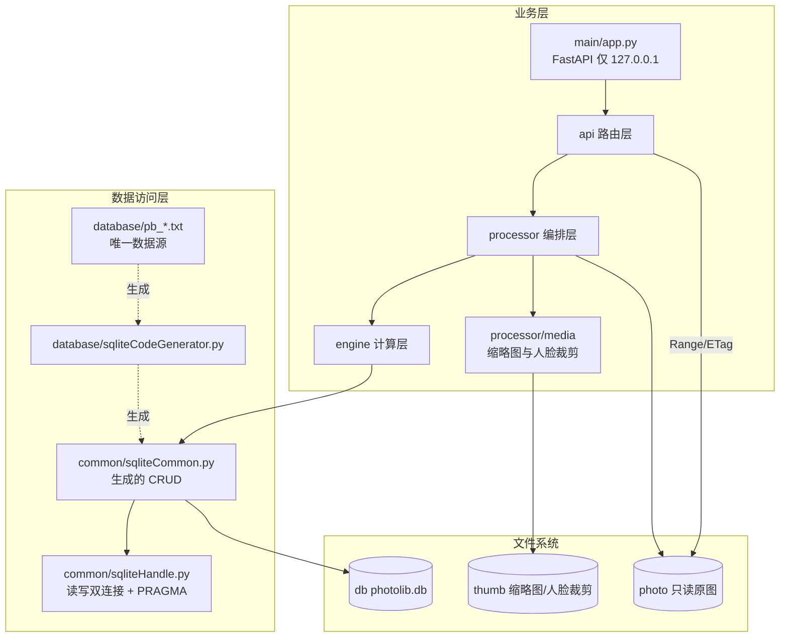

# photo-browser 开发计划（执行总纲）

> 版本：v1.0 ｜ 日期：2026-10-08 ｜ 状态：**12 步编码全部完成**，之后 **R3/R4/R4a/R4b/R6/R7 已完成**，**只剩 R5（地点界面）待做**；M1~M3 已过，**M4 = 自己真正用一周**（步骤 12 已交付，见步骤 12 的 `**状态**` / `落地补充` / `已知取舍` 三行；R7 见 §五「人物头像」一节）
> 配套：`plan/数据库设计.md`（表定义与三层结构）、`plan/UI/photo-browser UI 设计.md`（信息架构）、`plan/照片管理方案_开源调研与自研设计.md`（技术选型）、`plan/MVP_plan.md`（阶段划分）
> 分步提示语：`plan/step-prompts.md`（每步单独开对话，提示语可直接复制）

---

## 一、项目定位与核心约束

**是什么**：一个本地优先的照片浏览 + 人脸归类工具，对标 Picasa 3 但更轻。把磁盘上散落的照片，变成可按人浏览、可跨年代追溯的私人相册。

| 项 | 结论 |
|---|---|
| 规模 | **3 万 ~ 10 万张照片**（**按 10 万设计**）；目录 4–5 级；单机 |
| 原图 | **只读**，绝不改写 / 删除 / 改名 |
| 硬件 | **无需 GPU**、**无需安装数据库服务**（SQLite 进程内） |
| 数据库 | SQLite 单文件，备份 = 拷贝文件 |
| 唯一硬约束 | **单写入者** —— 子进程只做 CPU 计算，主进程单线程批量写库 |
| 准确性策略 | 人脸识别给建议，**人工确认兜底**；灰区一律进待确认队列，不静默归属 |
| 端口/网络 | 服务只绑 `127.0.0.1`，不开 `0.0.0.0` |

### 技术栈（不引入新范式）

| 层 | 选型 |
| --- | --- |
| 语言/运行时 | Python 3.13（托管解释器 `C:\Users\NINGMEI\.workbuddy\binaries\python\versions\3.13.12\python.exe`）+ venv；pip **必须官方源** `https://pypi.org/simple` |
| 后端 | FastAPI + `uvicorn[standard]` + pydantic-settings |
| 数据访问 | **原生 `sqlite3` 运行层 + 代码生成器**（不用 SQLAlchemy ORM） |
| 图像 | Pillow（EXIF 纠正 + WebP 缩略图）、opencv-python-headless、numpy、insightface `buffalo_l` + onnxruntime(CPU) |
| 元数据 | Pillow EXIF；`reverse_geocoder` 作**可选**依赖，缺失降级为「无地点」 |
| 联系人 | `vobject` |
| 前端 | Vue 3 + Vite + Pinia + Vue Router + Tailwind CSS + Element Plus + axios（**从零搭建**） |
| 前端主题 | CSS 变量双套 + `prefers-color-scheme` + 手动切换 + Element Plus `html.dark` |

---

## 二、目录布局

### 2.1 照片库（运行期数据，不入库）

```
d:\PhotoLib\                     ← photoRoot，可在 config/local_settings.py 改
├── photo\                       ← 原图，只读
│   ├── 2024\2024-05-01\IMG_0001.jpg ...
├── thumb\                       ← 生成物（缩略图 + 人脸裁剪图），可随时重建
│   ├── thumbs\<xx>\<fileHash>_<size>.webp
│   └── faces\<xx>\<faceCode>.jpg
└── db\
    ├── photolib.db (+ -wal / -shm)
    └── imports\ / exports\      导入的联系人原件归档、导出产物
```

### 2.2 代码仓库

```
d:/home/lianyi/git/photo-browser/
├── plan/                       本目录：设计与计划文档
├── requirements.txt            后端依赖
└── code/
    ├── src/
    │   ├── main/               app.py（FastAPI 实例）/ cli.py（命令行入口）
    │   ├── api/                路由层：scan / browse / review / contacts / static / dto
    │   ├── processor/          编排层：scanner / media / contact / review
    │   ├── engine/             计算层：face / match / cluster
    │   ├── schedule/           扫描任务调度与状态流转
    │   ├── common/             sqliteHandle / sqliteCommon(生成) / miscCommon / globalDefinition / paths
    │   ├── config/             basicSettings / sqliteSettings / local_settings(不入库)
    │   ├── database/           pb_*.txt（唯一数据源）/ sqliteCodeGenerator / auto_generated
    │   ├── tools/              build_db / gen_thumbs / backtest_s0
    │   └── test/               单测
    └── webserver/              前端（Vue3 + Vite）
```

### 2.3 三层数据访问结构

```
database/pb_*.txt        唯一数据源（表定义，纯文本，入库）
        │
        │  sqliteCodeGenerator.py（SQLite 口径代码生成器）
        ▼
common/sqliteCommon.py    生成层：通用 CRUD + 各表 query（业务层唯一入口）
common/sqliteHandle.py    运行层：原生 sqlite3 封装（读写双连接 / PRAGMA / %s→?）
        │
        ▼
processor / engine        业务层：**禁止裸 SQL**
```

- `.txt` 是唯一权威定义，改表 = 改 txt + 重跑生成器，**不允许手工改生成产物**。
- 占位符统一写 `%s`，由 `sqliteHandle` 内部转为 SQLite 的 `?`（防注入）。

---

## 三、架构与数据流



### 3.1 扫描链路（步骤 3）

```
walk 遍历 photo\
  → 路径规范化（仅用于算 hash，relPath 原值不改写）
  → 双 hash：relPathHash(规范化路径) + fileHash(8MB 分块流式 SHA-256)
  → 增量三路判定（见下表）
  → EXIF / 年份识别 / GPS 逆地理
  → 批量 upsert（executemany，500 条一事务）
  → 进度写 pb_scan_job
  → 累计到 batchSize（默认 100）即 jobStatus=PAUSED + 记 lastCursor
```

| 判定 | 条件 | 处理 |
|---|---|---|
| 全新 | `relPathHash` 未命中 | 新增，`scanState=0` |
| 未变 | `relPathHash` 命中 且 `fileHash` 相同 | 跳过（幂等） |
| 内容变更 | `relPathHash` 命中 但 `fileHash` 不同 | 更新元数据，人脸重新提取 |
| 移动/重命名 | `fileHash` 命中、`relPathHash` 未命中，且**同内容的旧文件全都不在磁盘上** | 标「移动」：新行 `isDuplicate=1`+`dupOfPhotoCode`，旧行 `movedToPhotoCode`（**双向可查**），计入 `pendingCount`；**不自动改路径**，由用户确认 |
| 内容重复（复制） | 同上，但**同内容至少还有一个旧文件在磁盘上** | 只标 `isDuplicate=1` + `dupOfPhotoCode`，**不建移动链接、不提示移动** |
| 缺失 | 库中存在但磁盘找不到 | `isMissing=1`，**不删记录** |

### 3.2 识别链路（步骤 5–7）

```
face 提取（SCRFD 检测 + ArcFace 512维）
  → 质量过滤：detScore<0.6 / 短边<64px / |yaw|>45° → 丢弃不入库
  → 桶键 bucketKey（自适应：0–18 岁 3 年一桶 / 18+ 10 年一桶）
  → 候选桶 = 相邻三桶有样本的质心，score = max(cosine)   ← 取 max，不取 mean
  → 三段式决策：≥T_high 自动归属 / 灰区进待确认(记 Top-5) / <T_low 进聚类
  → 人工确认后立即重算该 (personCode, bucketKey) 质心
```

### 3.3 单写入者（写错就 `database is locked`）

```
主进程：遍历 + hash + 批量写库（单线程，executemany，500 条/事务）
子进程：只做 CPU 密集的读图/检测/提特征，结果经 Queue 回主进程
```

子进程**绝对不能连数据库**。此架构对 MySQL 也是最佳实践，在 SQLite 下从「建议」变成「必须」。

---

## 四、关键决策记录（DR）

| # | 决策 | 结论与理由 |
| --- | --- | --- |
| DR-1 | 缩略图/人脸裁剪图落点 | **`d:\PhotoLib\thumb\`**：`thumbs\<fileHash[:2]>\<fileHash>_<size>.webp` + `faces\<faceCode[:2]>\<faceCode>.jpg`。保持「photo 目录绝对只读」，同时与应用状态目录分离。**文件名必须可推导**（`pb_photo` 无 thumbPath 字段，路径由 `fileHash` + size 计算，不入库） |
| DR-2 | 数据访问层 | **原生 sqlite3 + 生成器**，不用 SQLAlchemy ORM。①「业务层禁止裸 SQL、一律走 sqliteCommon」已等价替代 ORM；② 需精确控制 WAL/双连接/单写入者；③ 与 `数据库设计.md` v1.0 一致。**`MVP_plan.md` S1 的 SQLAlchemy 代码块与本决策冲突，以 `数据库设计.md` 为准** |
| DR-3 | 双连接与线程安全 | FastAPI 同步端点跑在线程池，必须 `check_same_thread=False`；**读/写两个连接都要执行同一套 PRAGMA** |
| DR-4 | 界面主题 | **浅色默认 + 跟随系统 + 手动开关**；推翻 UI 稿 v0.1 第 368/375/419 行的「暗色单一主题」 |
| DR-5 | 前端起步 | **从零搭建**，不复用 contentHub 基线；仅参照其表定义书写规范 |
| DR-6 | 索引落地 | `.txt` 内不写索引；由生成器在建表函数中输出 `CREATE INDEX idx_<表>_<字段>`，清单见 `数据库设计.md` §五（含 `pb_face(personCode IS NULL)` 部分索引） |
| DR-7 | 生成器 | 新写 `code/src/database/sqliteCodeGenerator.py`（SQLite 口径），产物落 `code/src/database/auto_generated/sqliteCommon.py` |
| DR-8 | **photo 根目录可配置** | `config/local_settings.py` 的 `PHOTO_ROOT` 配置，**默认 `d:\PhotoLib`**；`THUMB_ROOT` / `DB_FILE` 为空时从 `PHOTO_ROOT` 派生。改配置即可整库迁移，无需改代码。**校验三条目录不得互相嵌套、不得等于 photoRoot** |
| DR-9 | **`recID` 用 INT** | 8 张表统一 `recID INT AUTO_INCREMENT PRIMARY KEY`（SQLite 落 `INTEGER PRIMARY KEY AUTOINCREMENT`），**不用 BIGINT**。最大表 `pb_photo` 按 **10 万行**估（1 亿行内 INT 都够用，故仍不用 BIGINT）。**必须先改 8 个 `pb_*.txt` 再跑生成器**，禁止只改生成产物 |
| DR-10 | **`dbHandle()` 无参调用绝不切库** | 步骤 3 修复的潜在事故：本项目所有 `query_*`/`insert_*` 内部都是 `dbHandle()` **无参**调用，若无参也按 `paths.db_file()` 重新解析，则「先 `dbHandle(临时库)` 指定库、再调任一生成函数」会被悄悄切回正式库。实测后果：`build_db.py --db 临时库 --verify` 校验的是正式库、`scan_cli.py --db 临时库` 把**任务行写进正式库而照片写进临时库**（一个进程同时存在两个库句柄，最难查的一类错）。规则：**要换库必须显式 `dbHandle(路径)`** |
| DR-11 | **`pb_photo` 加 `movedToPhotoCode`** | 步骤 3 定稿。新记录的 `dupOfPhotoCode` 对「复制」和「移动」长得一样，UI 无法提示用户；于是在**旧记录**上补一个指向新记录的字段：`旧.movedToPhotoCode = 新.photoCode` 且 `新.dupOfPhotoCode = 旧.photoCode` ⟺ 确凿移动对。**两条记录都不自动改 `relPath`**。配套口径：EXIF 优先于截图名（`SCREENSHOT_OVERRIDES_EXIF` 默认 `False`）、`pendingCount` = 疑似移动/重命名待确认张数、软删行命中按「跳过」且 `delFlag` 不参与 `DO UPDATE`（扫描器不复活用户删掉的照片） |
| DR-12 | **规模上调到 10 万，扫描器按 10 万实测定型** | 步骤 3 实测（10 万行 `pb_photo` + 真实扫描路径）定下三条硬指标：① **索引必须分页读**（`SCAN_INDEX_PAGE=2000`）：一次性全取峰值 157.5MB，分页 3.2MB，速度相同；② **索引必须跨批复用**（`ScanRunner.ensureIndex` + 调度层 `_runnerFor`）：每批重建 = 1000 批 × 2.3s ≈ **57.6 分钟纯开销**（平方级劣化），复用后降到 **19.3 分钟**（其中大部分是 hash 本身这个必需工作）；③ **每批仍重新 stat 全树**（保「批次之间目录变动可见」），单次耗时已单独打点进日志，现场按日志调策略。**遗留**：人脸向量全量加载 10 万 × 512 × 4B = **205MB**，已超步骤 6/11 原来的「内存 <100MB」验收指标 —— 步骤 6 需改为**按候选桶惰性加载**（本项目本来就只取相邻三桶，全量加载是浪费），见步骤 6 关键约束 |
| DR-13 | **老库改表走 `build_db.py --migrate`，不用 `--drop`** | 步骤 3 补。建表 DDL 是 `CREATE TABLE IF NOT EXISTS`，**老库不会因为 `pb_*.txt` 加了字段而自动多出那一列** → 代码按新字段写库、老库没这列 → 运行时 `no such column`。`--migrate` 比对 .txt 与实际列，只 `ALTER TABLE ADD COLUMN` 缺的（SQLite 纯元数据操作，**不动任何一行**），并补建缺失索引；**不删列、不改列类型**（SQLite 不支持；类型亲和性对不上只报告，由人决定是否 `--drop`）。生成层新增 `columnDefOf()` / `addColumnGeneral()` 供其使用，DDL 仍只出自生成层 |
| DR-14 | **"库在哪"只有一个真相：`paths.setRootOverride()`** | 步骤 4 补。`scan_cli` / `gen_thumbs` 早就能 `--db/--root/--thumb` 指到临时库，但那是**工具自己解析好再往下传**；HTTP 服务的 `api/static.py` 是直接调 `paths.photo_dir()` / `paths.thumb_dir()` 的，没有传参口子 —— 想用临时库起服务就只能去改 `local_settings.py`，那是在动**正式配置**，风险与收益完全不成比例。解法不是"给服务再加一份自己的根"（会出现「A 层以为在 tmp、B 层写进正式库」这种最难查的错），而是把覆盖做进 `paths`：`photo_dir()/thumb_dir()/db_file()/validate_layout()/ensure_dirs()` 全部自动跟随，**不制造第二个真相**。纪律：① 缺省不调时行为与之前完全一致；② 只由命令行显式参数触发，不读环境变量、不猜、不自动探测；③ 覆盖值仍要过 `validate_layout()`（指到 photo 里面照样抛错）；④ 覆盖是**进程级全局**，单测必须 autouse 还原；⑤ **一个进程只服务一个库，不支持多库并行**（覆盖是全局的，这是有意的简化：多库要等到真出现第二个库再改，别现在就为想象的需求付复杂度） |
| DR-15 | **出图失败按原因分类，不是一律 5xx** | 步骤 4 补。`make_thumb` 的结果带机器可读的 `errCode`，`/api/thumb` 按它映射状态码：**422** = 原图在磁盘上但**解不出像素**（截断/全零/扩展名骗人）—— 这不是服务端的 bug，重试一万次也一样，回 5xx 会让前端和代理无限重试并弹错误提示，正解是显示"文件损坏"占位；**404** = 原图不在磁盘（拔盘/挪走），重试有意义；**500** = 落盘侧或数据不对，这才是我们的问题。⚠️ 分类时**不能按 `OSError` 分流**：Pillow 对坏图抛的就是 `OSError("image file is truncated")`，`UnidentifiedImageError` 更是它的子类，按 OSError 归到"原图不在"会把坏图**全部误报成 404**（"拔盘了？"），排障方向直接带偏；"原图不在"由 `os.path.isfile` 单独挡。批量汇总额外给 `failedDecode` 计数与一句人话提示 —— 只报"失败 9 张"没信息量，"其中 9 张是原图坏了"才决定得了要不要去重新拷贝。**实测：正式库 2137 张里 9 张坏**（6 张拷贝中断的截断 JPEG、1 张 6.9MB 全零、2 张只差 10~12 字节；后两张用 `ImageFile.LOAD_TRUNCATED_IMAGES` 能救，但那样连严重截断的也会出**下半张是废图**的结果，宁可一律 422） |
| **DR-16** | **纠错闭环：改判 / 拆分 / 合并 / 陌生人 + 质心防污染 + 可撤销** | 用户浏览时最高频的纠错场景是「**自动认错了人**」，而原设计只覆盖「未归属」（待确认队列），没有纠错入口。落地四条：<br>**① 四态语义**（由 `personCode` / `isConfirmed` / `isStranger` 三字段推导，**不新增 matchType**，无冗余）：<br>　未归属 = `personCode IS NULL AND isStranger=0` → 进待确认队列<br>　自动归属未确认 = `personCode IS NOT NULL AND isConfirmed=0 AND isStranger=0` → 进**「我不同意」列表**（纠错入口）<br>　人工确认 = `isConfirmed=1`｜陌生人 = `isStranger=1`（永久排除，不进队列也不聚类）<br>　⚠️ 修正原「待确认 = `personCode IS NULL OR isConfirmed=0`」：自动归属**不会**把 `isConfirmed` 置 1，该条件会把**全部自动归属**卷入（10 万张 ≈ 4~8 万条，队列爆炸）<br>**② 改判入口**：人脸框悬停「✗ 不是他」/ 照片详情侧栏改判 / 「我不同意」列表批量改判<br>**③ 质心防污染**：质心**只用 `isConfirmed=1` 样本**；桶确认样本 <3 → 退到 `ALL` 兜底桶（该人全部确认样本，不分桶）；总确认样本 <3 → 该人**不参与自动匹配**，其脸全走队列。否则一张误认样本拉偏质心 → **越错越错**<br>**④ 可撤销**：新增第 9 张表 `pb_review_log`（8 种 opType），仅 `SPLIT`/`MERGE` 标 `isRevertible=1`，提供「撤销上次合并」。理由：合并/拆分**不可逆**，质心一旦被污染靠重算回不到原值；日志同时是「这张脸当初怎么被认成这个人的」唯一排障依据<br>**改判的连带副作用**（缺一不可）：删旧 `linkKey` + 写新 `source=1` + **重算原人 *与* 新人**的全部桶 + 同步 `pb_photo.faceCount` 与 `pb_scan_job.pendingCount` |

| **DR-16 补充**（步骤 11 实测补正） | **「拆分」≠「否决」；且质心只由确认样本生成 ⇒ 合并/拆分的目标候选不能用相似度候选** | **① 「拆分」必须走 `/review/split` 而不是 `fix('unknown')`**。落地 ② 时暴露的语义错位：两者在库效果上原本一样（都把脸丢回待确认队列、都不记「谁本来属于谁」、都不可撤销），只是换了层文案。但用户点「拆分」时的真实意图是「**他其实是我表弟**」—— 只给「退回队列」等于把一次修正变成两步，中途他就放弃了。正确分工：`fix('unknown')` = **否决**（`opType=UNKNOWN`，不记归属）；`POST /review/split` = **拆分**（`opType=SPLIT`、`isRevertible=1`，`personCode` 可指向他人、可为空、给了不存在的 `displayName` 则自动建档）。⚠️ 连带：**撤销入口要同时认 `SPLIT` 与 `MERGE`**，只判 `MERGE` 会漏掉拆分<br>**② 合并/拆分的「目标候选」必须取全库人物，不能取 `topCandidates`**。这是 ③ 的**直接后果**、不是偏好：质心只由 `isConfirmed=1` 样本生成 ⇒ **从没被人工确认过的人没有质心 ⇒ 不可能出现在相似度候选里**（而提问是「**他/它属于谁**」，不是「最像谁」）。真实场景恰恰是「库里有两个同名的张三」，而重名者向量几乎一样、多半排在候选很后面。只列候选 = 让用户在自己知道答案的场景里找不到答案。⚠️ 前提补充：`pb_person.displayName` 有 UNIQUE 索引，字面同名写不进去，实际形态是「张三」与「张三(2)」这类带后缀的（`contactCommon.makeDisplayName()` 导入时加的）—— **界面必须显示真实 displayName，不能只显示姓**<br>**③ 改判类写接口的响应必须统一带 `**_counts()`**。②⑥ 要求侧栏两个角标实时变化，而 `POST /review/fix` 的**单张分支原本漏了计数**（批量分支有、`disputed` 端点也有）—— 前端表现为「角标不对」，真因在后端响应契约不统一。修法是**统一契约**而不是让前端多打一次 `/pending/count`：少一次往返，且不必让前端记得哪个端点带、哪个不带 |
| **DR-17** | **contacts 维护：只做前端 CRUD，不做导出/导入往返** | 用户确认。**不做** E1 联系人 CSV 导出、**不做** E2 未命名聚类导出、**不做** E3 vCard 导出。改为前端编辑抽屉 + 停用。<br>理由：家庭场景 contacts 规模小（几十~几百人），逐条编辑够用；`csv_import` 已有 `plan/apply` 幂等 + 列名别名 + 编码嗅探，**但那是「导入」侧的成果，导出侧一行代码都没有**，两头不对称的往返要额外做列名对齐与回导锚点。<br>**明确放弃的收益**（记下来，别日后当成漏做）：① 批量补全生日/分类只能逐条点；② 步骤 7 聚出的「未命名人物」只能在界面里逐簇改判/新建，**不能**「导出→Excel 填名→批量导回」；③ 迁移/备份改由步骤 12 的 `backup.py`（整库拷贝 db+thumb）承担，不依赖导出。<br>**前提约束**：新增功能**一律不得让 `photo\` 目录变成可写源**，也不得绕过「原图只读」不变式 |
| **DR-18** | **联系人字段分两类：匹配相关 vs 纯资料** | `pb_person` 的字段对匹配的影响完全不同，**改完要不要重算质心**取决于这一条：<br>**匹配相关（改动后必须 `centroid.recomputePerson()`）**：`birthday` —— 它决定 `bucket.bucketKeyAdaptive()` 的桶键（0–18 岁 3 年 / 18+ 10 年），**一改全套桶键都变、旧质心全部作废**，不重算的话这个人的匹配会突然全乱且无任何提示<br>**纯资料（改了什么都不用做）**：`displayName` / `familyName` / `familyGroupCode` / `relation` / `email` / `phone` / `pb_person_category`<br>⚠️ `displayName` 虽是纯资料，但 `pb_person.displayName` 是 **UNIQUE**：改成已存在的名字会撞约束。此时**不要只报错**，直接给「已存在「X」，你可能是想合并到 TA？」+ 合并入口 —— 重名极可能就是同一人（`contactCommon.makeDisplayName()` 在导入时已在加后缀避让），这是把「编辑」转化成的最高频场景 |
| **DR-18 补充**（步骤 9 实测补正） | **改 `birthday` 是三步，不是一步；只调 `recomputePerson()` 等于没改** | ⚠️ **按 DR-18 原文（"改 birthday -> `centroid.recomputePerson()`"）字面实现是无效的**，而且**不报错**。原因：`centroid.recomputePerson()` 是**按 `pb_face` 表里已存的 `shotBucket` 分桶**算的（见 `centroid.loadFaceVectors`：`if str(row["shotBucket"]) != bucket: continue`），它**不会**从 `pb_person.birthday` 重算桶键。而 `shotBucket` 是 `bucketKeyAdaptive(拍摄年, 出生年)` 的产物 —— 出生年一改，桶键体系全变。<br>**只重算不刷桶 = 用旧生日算出的桶键重算一遍同样的样本** -> 质心内容与改之前**逐位相同**，而用户的直觉是「他忽然认不准了」。<br>**正确顺序（不可颠倒）**：<br>　① 写 `pb_person.birthday`<br>　② `rebucket.rebucketPerson(personCode)` —— **重刷 `pb_face.shotBucket`**（这一步就是原文缺的那一步）<br>　③ `centroid.recomputePerson(personCode)` —— 按**新桶键**重建全部质心<br>好消息：③ 自己会先跑 `centroid._assertBucketOrder` 前置检查，顺序做反了会**直接抛 `BucketStaleError`**（宁可拒绝执行，也不静默失配）。<br>⚠️ 另一个反直觉点：**不是每个生日改动都挪桶**。自适应成年桶的起点 = `出生年 + 18 + k×10`，所以 `1985` 与 `1965` 年生的人拍 2013 年的照片**都**落在 `2003-2012`（k 不同但起点相同）。验收时挑生日必须挑**真会改变桶键**的（实测：`1985-03-07 -> 1970-01-01` 能让 2013/2016 两年的样本全挪到 `2008-2017`）。<br>⚠️ 再一个：`ALL` 兜底桶由**确认样本集合**决定，改生日不改变样本集合 -> 它的质心**理应逐位不变**。可以用它当「有没有被无谓重写」的探针，但**不能**当「有没有重算」的证据。 |
| **DR-19** | **人员只允许「停用」，不提供「删除」** | 用户确认。`delFlag='1'`。<br>理由：一个人下面挂着 `pb_face`（向量）+ `pb_person_centroid`（质心）+ `pb_photo_person`，硬删 = 制造孤儿 + 这个人的全部确认工作作废。一个误点清零几小时的确认，代价太大。<br>**停用的连带语义**（顺序固定）：① `centroid.dropPerson()` 删该人全部质心（**必须删**，否则还会被匹配，而人脸却已不可达 → 静默失配最难查）② 该人所有脸退回未归属（`personCode=NULL, isConfirmed=0`）——⚠️ **不能只删质心留 personCode**：那样脸变成「人工确认但无质心」，既不在待确认队列也不在「我不同意」，**从所有队列里消失**③ 关联行按纪律 ③ 判断存废 ④ 落 `pb_review_log`（`opType=DISABLE`）留可追溯<br>**停用前必须复述影响面**：「张明 停用后：质心 6 个将删除、412 张人脸将退回待确认队列」—— 人脸多时（误导入的陌生人数百张）这会让队列暴涨，用户必须先知道<br>**可恢复**（`delFlag` 改回 0），但要提示「恢复后需重新确认人脸才能自动匹配」（人脸已退回未归属 → 无确认样本 → 质心不可用） |
| **DR-20** | **`pb_face.shotBucket` 必须重刷：自适应分桶从未真正生效** | ⚠️ **P0 实现缺口**（R2 修复）。`faceStore.makeShotBucket()` 写的是**等宽 5 年占位桶**，注释写「步骤 6 会用自适应规则重算覆盖」，**但步骤 6 从未做这个覆盖** —— 全库 grep `bucketKeyAdaptive()`，只在 `tools/verify_bucket_gain.py`、`tools/run_match.py`（报告分组）与测试里被调用，**没有任何生产路径写回 `pb_face.shotBucket`**。而 `matcher.bucketKeyOfFace()` 明确「只认 `shotBucket` 这一列」（两边口径必须一致）。<br>**后果**：① 生产库里所有脸都是等宽 5 年桶 → **S0 的「自适应分桶让 FR 32.75%→19%」等于一直在跑对照组**；② `bucket.py` 那套自适应分桶是死代码；③ **DR-18 的「改 birthday 重算质心」是无效的**（桶键根本不依赖 birthday，重算了等于没改）<br>**选定方案 A**（用户确认）：保留落库 `shotBucket`，补「重刷」过程。理由：`CentroidSubset` 的「同一人候选行连续 → `np.maximum.reduceat`」优化是精心设计的，方案 B（不落库、匹配时实时算）会推翻它并要求重写匹配侧<br>**根治方式**：把刷桶写进 `assigner.assign()` **内部**（归属那一刻生日才确定，必然要刷），而不是靠人记着跑脚本 |
| **DR-21** | **未归属脸的候选桶必须放宽到「全部已启用桶」** | ⚠️ **DR-20 的连带问题，不解决则 R2 白做**。脸在**未归属**时没有生日 → 只能写等宽 5 年桶。而**等宽桶与自适应桶的键根本不对齐**：等宽 `"2000-2004"` 的邻居是 `"1995-1999"` / `"2005-2009"`，而自适应童年桶可能是 `"1997-1999"`（宽 3）、成年桶 `"1998-2007"`（宽 10）—— **这些键永远不在等宽桶的邻居集合里**。<br>后果：未归属脸按「相邻三桶」取候选 → **一把都取不到 → 只能靠 `ALL` 兜底桶 → 等于退化成不分桶**，而这恰恰是最需要匹配的阶段。<br>**解法**：`personCode IS NULL` 的脸，候选桶 = **`CentroidIndex.subset(全部已启用桶键)` ∪ `{ALL}`**。成本可接受：质心行数 = Σ(人 × 每人桶数) ≈ 数百~数千行 × 512 float32 ≈ **几 MB**（DR-12 的 100MB 预算绰绰有余），每脸一次矩阵乘仍是毫秒级；且 `CentroidIndex.subset()` 本来就接受任意桶键集合并保持按人连续段 → **reduceat 优化完整保留**<br>已归属脸仍走精确的相邻三桶（性能与准确性都更好） |
| **DR-22** | **「先刷桶，再重算质心」是硬顺序** | 顺序反了会静默失配：先 `recomputePerson()` 按旧桶键建好质心，再 `rebucket` 改脸表的桶键 → **质心表里留着旧桶键的行（僵尸，新桶取不到），新桶键又没有质心** → 该人匹配率归零且库里看不出任何异常。写成 `centroid.recomputePerson()` 的前置检查：桶键集合与脸表实际 `shotBucket` 不一致时**拒绝执行并提示先跑 rebucket**，而不是默默按旧口径算 |
| **DR-23** | **参数与派生数据必须分离：改参数 ≠ 已重算** | 步骤 12 实测补。设置页允许改 T_high / T_low / 分桶策略，但**改参数只改开关，一个字节的派生数据都不动**（质心、桶键都是）。理由：① 全库重算是**分钟级写库**，不该被一次点击顺带触发；② 改 T_high 只影响**下一次判定**，已有质心一个字都不该动 —— 一律弹「必须重算」会让真正的重算提示失去分量，用户学会无视所有 Toast（包括生日变更那条）。所以 `POST /settings/match` 返回的是 `needRebucket` / `needCentroidRebuild` / `steps[]`，**由界面照着显示**，重算是另一次显式操作<br>⚠️ 推论一：参数是**进程内**的（`basicSettings.setThresholdOverride` / `setBucketStrategy`），不写回源文件。HTTP 请求不该有能力改写仓库里的 `.py`（本服务零鉴权），且用户调的是参数不是代码。界面必须写明「重启后回到 `basicSettings.py` 的值」<br>⚠️ 推论二：`POST /settings/centroids/rebuild` **不提供 `rebucketFirst=false` 开关**。绕过刷桶等于按旧桶键重算一遍同样的样本 —— 质心内容逐位相同、不报错，而用户的直觉是「他忽然认不准了」（DR-18 补充的同一个坑） |
| **DR-24** | **备份/恢复不在 HTTP 里做：WAL 中间态是「备份成功但少数据」** | 步骤 12 实测补。本项目是 SQLite **WAL** 模式：服务还开着时把 `photolib.db` 单文件拷走，拷到的是「主库 + 尚未 checkpoint 的 `-wal`」的中间态；连 `-wal` 一起拷也不可靠（拷的过程中它还在被写）。结果是**拷贝成功、零报错、恢复后少几百条确认记录**。<br>⇒ 备份的定义被钉死为「**停服务 → 拷贝 `db\` + `thumb\`**」，由 `code/src/tools/backup.py` 在命令行完成；设置页只给**只读清单 + 可照抄的命令 + 这段解释**，**故意不给按钮**。加按钮的诱惑很大（用户要的就是「一键」），但一键的代价是把一类静默丢数据做成一键可达<br>⚠️ **不备份 `photo\`**（原图只读且不会坏，备份它动辄几十 GB）—— 所以「恢复」= 让索引回到某个时刻，**不找回删掉的照片**；这句话必须出现在界面上，否则用户会以为恢复能捞回照片<br>⚠️ `restore` 必须**先给现状拍一份 `pre-restore_*`**：恢复是覆盖式的，打错编号就换掉了当前库 —— 没有退路的恢复用户不敢用，于是这个功能等于没有<br>⚠️ 备份编号要唯一：时间戳只到秒，「restore 的快照」与紧接着的「backup」必然同名；复用同一目录 = 恢复出来的是**两个时刻的混合且不报错** |

---

| **DR-25** | **`(0,0)` 是占位坐标，不是真实 GPS** | ⚠️ **实测发现的 bug（R3 修复）**。真实库 2137 张里 91 张有 GPS，其中 **26 张（占 GPS 的 28.6%）恰好是 `(0,0)`** —— 相机未定位时的占位值。而 `meta.reverseGeocode()` 的坐标校验只判了范围：<br>`if not (-90.0 <= lat <= 90.0 and -180.0 <= lon <= 180.0): return None`<br>`(0,0)` 完美通过 → `reverse_geocoder` 老老实实查了**几内亚 Takoradi**（`(0,0)` 在几内亚湾外海，最近地名就是它）→ **26 张照片的 `placeName` 落成了"加纳"。**<br>更糟的是它**已经落库**：后续任何地点视图都会把这 26 张算进"加纳"，而真实 GPS 只有 **65 张（3.0%）**。<br>**修法**：① 判据加「`(0,0)` 与 `|lat|<1e-4 且 |lon|<1e-4` 一律视为无定位」→ `placeName` 留空；② **已落库的 26 行要清掉**（`placeName=NULL`）—— 光修代码不清库，错的地点会一直在；③ **`pb_place` 里那条聚合出来的「加纳」也要退场**（它 `centerLat/Lon=(0,0)`，是纯派生缓存，`delFlag='1'` 软删即可 —— 硬删会让"手工地点/历史地点要留着"这条纪律没有例外）。<br>⚠️ **`lat`/`lon` 保留不清**：那是 EXIF 里的**原始事实**（相机确实写了 0,0），抹成 NULL 等于销毁信息，且会让"有 GPS 总数"从 91 掉到 65、指标失真；**只有 `placeName`（推断结果）该清空**。 |
| **DR-26** | **地点抽取用 geohash，结构与 R2 的分桶完全同构** | 用户提出 geohash，采纳。理由：它解决的**是同一类问题**（固定精度键 + 归并），复用 R2 已验证的心智模型：<br>　**原始键** `pb_photo.geoHash`（geohash 网格）→ **归并层** `pb_place`（邻域 geohash 合并成一个地点）→ **语义层** `pb_place.name`（目录名 > 逆地理 > 手工）<br>**三个已知局限与对应处理**：<br>① **格子边界** —— 两人站在同一景点两侧会落进不同 geohash ⇒ 归并时**枚举 8 邻居格**，簇中心距离 < `PLACE_MERGE_RADIUS_KM` 则合并（与 DR-21「未归属脸取全部桶」同一教训：键系不对齐就会静默失配）<br>② **格子大小固定** —— 6 位 ≈ 1.2×0.6 km，城市尺度与景点尺度需求不同 ⇒ 精度 `PLACE_GEOHASH_PRECISION` 与归并半径**都做成配置**，不是常量<br>③ **geohash 无语义** —— 只是网格编号 ⇒ `name` 由 `nameSource` 决定优先级：**手工 > 目录名解析 > `placeName` 的 admin2**（用户改过的不能被自动覆盖）<br>**自己实现**（geohash 标准算法约 50 行），**不引 `geohash` 包** —— 与既定「减少依赖面」原则一致（`reverse_geocoder` 已经是可选依赖，再加一个不合适） |
| **DR-27** | **地点的名来自目录名，优先级高于 GPS** | ⚠️ **实测数据支撑的取舍**。真实库 2137 张：**GPS 覆盖率 4.3%（91 张，扣掉 `(0,0)` 只剩 65 张 / 3.0%）**，而**目录名里带「日期 + 地点」的约 512 张**，是有效 GPS 的 **8 倍**（如 `2013.07.26 张家界` / `2013.07.16 东莞` / `2013.07.18 大亚湾` / `2013.07.20 桂林` / `2013.07.22 凤凰` / `2013.07.23 乌镇` / `2013.07.27 南宁`）。<br>**结论**：**只靠 GPS 做的地点层是个空壳**（65 张、3~4 个地点），而 `relPath` 是**已经存好的事实**，一个正则就能提取。<br>**`nameSource` 优先级**：① `3` 手工 ② `2` 目录名 ③ `1` 逆地理 `admin2`。⚠️ 手工命名**必须最高优先级**且**自动流程不得覆盖**，否则用户辛辛苦苦起的"外婆家"会被下次重算冲掉 |
| **DR-28** | **不建「事件」表：地点×人的交叉实时 join** | 用户设想的「人物 → 地点列表 → 时间线」第三层**不落库**。理由：某事件里有哪些人 = 该事件下照片的 `pb_photo_person` 的 `DISTINCT personCode`，**实时 join 即可**（`JOIN pb_photo` + `geoHash IN (...)`，走 `pb_photo_person` / `pb_photo` 索引，10 万张毫秒级）。<br>冗余存储要维护的地方太多：改判一张脸、停用一个人、导入新联系人 —— **三处都得同步事件表，漏一处就是错的统计**，而漏了不报错。与 D-2「不建物理外键」是同一哲学。<br>⚠️ **「一次旅行跨多个地点」（东莞→大亚湾→桂林 地理跨度不小但日期连续）这种推断不做**：不可靠且无法验证。数据层只给**事实**（哪个地点、哪些人、何时），「行程」视图留到界面阶段由用户看数据后再定。 |
| **DR-29** | **地点功能先做数据层与 API，界面缓一步** | 用户确认。理由：地点维度的价值**完全取决于地点归并得对不对**，而这件事**看界面看不出来** —— 512 张照片被归成 17 个地点还是 200 个，用眼睛扫缩略图比看 JSON 快，但**判断"这个地点归得对不对"必须看清单**（地点名 + 张数 + 年份跨度 + 在场的人）。<br>**验收方式**：`GET /api/places` 返回清单，逐条人工核对；确认数据对了再做界面，避免界面返工。<br>⚠️ 目录名抽取**放在这一步**（不做它 → 只剩 65 张 → `/api/places` 验证不了任何东西，与"先验证数据"的目的自相矛盾）。 |

| **DR-28** | **地点中文名：`pb_place.nameZh` 与英文 `placeName` 并存** | 用户决策 B。**根因**：`reverse_geocoder` 的数据集（GeoNames）**只有英文、无语言参数**，而 `meta._composePlaceName()` 只是把 `cc/admin1/admin2/name` 去重拼串⇒ 界面上永远是 `CN, Xinjiang Uygur Zizhiqu, Araltobe`。⚠️ 该函数的注释写的是中文示例（`"中国, 北京市, 东城区"`），**与实际输出不符**，本身是个误导性注释。<br>**为什么不能直接改 `placeName`**：`placeStore.makePlaceCode()` 是**由 `placeName` 派生 `placeCode`**（幂等键）。`placeName` 一变中文 ⇒ `placeCode` 变 ⇒ **幂等键漂移** ⇒ 旧行不被认领 ⇒ 被归零 ⇒ 地图上出现「0 张照片却显示 N 张」的幽灵点（正是 `placeStore` 文件头自己警告过的坑）。<br>**选定方案 B**（用户确认）：`pb_place` 增一列 `nameZh VARCHAR(128)`，`placeName` **保持英文做聚合键**、`placeCode` **派生逻辑一字不改** ⇒ 回归风险极低。代价是同一行有「英文聚合键 + 中文显示名」两个名字，语义必须写清：`placeName` 是**聚合键**、`nameZh` 是**显示名**。<br>**⚠️ 最容易踩的坑**：`nameZh` 是**非派生列**，**绝不能进 `REBUILD_COLUMNS`** —— 否则每轮 `rebuildPlaces()` 把中文冲回英文，且不报错。<br>**中文名来源优先级**：① 手工（`source=1` 行的 `nameZh` 是人填的，任何自动流程不得覆盖）② **境内中文行政区（区县）** ③ `NULL` → 界面回退英文<br>**境外保留当地语言**（用户确认）：`nameZh = NULL`，Tokyo / Paris 不翻成中文。境内判定用 `amap-geo` 多边形 point-in-polygon（**不用 `cc == 'CN'`**，边界不准） |
| **DR-29** | **中文地名精度：区县级、离线；境外不译** | 用户确认三个决策：<br>**① 精度 = 区县级**（离线）。用 `amap-geo`（高德行政区划离线数据 + `shapely`）做 point-in-polygon，覆盖全国 ~3500 个区县。**不引入联网逆地理 API**（需 key + 配额，与「本地优先、离线可用」的既定原则冲突）。<br>**② 境外保留当地语言** —— 外国人地名本来就该用当地语言，翻译成中文反而是错的<br>**③ 筛选两套都支持** —— 筛选下拉给**中文名**，但内部翻译回英文 `placeName` 再做精确匹配（`browse.py` 现有注释已说明「地点筛选是精确匹配而非 LIKE」的理由：模糊匹配会让用户以为自己筛错了）。实现：`placeName=阿勒泰市` → 查 `pb_place WHERE nameZh='阿勒泰市'` → 取该行的 `placeName` → 用它做精确匹配。<br>**依赖策略**：`amap-geo` + `shapely` 是**可选依赖**，与 `reverse_geocoder` 同等地位（`meta.py` 里 `_RG_READY` / `_RG_WARNED` 的懒加载 + 「只记一次 warning」纪律直接照抄）。**装不上 → `nameZh` 全为 NULL → 界面回退英文，不报错、不中断**。<br>⚠️ 首次加载 shapely 约 1~2 秒，**必须懒加载 + 进程内缓存**，不许在请求路径上重复加载 |
| **DR-30** | **目录名线索（512 张）在现有实现下用不上，需扩表** | ⚠️ **实测发现的阻塞**。现有 `rebuildPlaces()` 第一步是 `GROUP BY pb_photo.placeName`，而**没有 GPS 的照片 `placeName` 为空，永远进不了地点字典**。所以：<br>· 有效 GPS 只有 **65 张（3.0%）** —— 这是 `pb_place` 现在的**全部**数据来源<br>· 而目录名带「日期+地点」的约 **512 张**（`2013.07.26 张家界` 114 张 / `2013.07.16 东莞` 98 / `2013.07.18 大亚湾` 99…），是有效 GPS 的 **8 倍**<br>**结论**：目录名抽取（DR-25）**不能只写解析器**，必须先扩表 —— 给 `pb_photo` 加 `placeNameDir VARCHAR(128)`（目录名解析出的地点名）或 `geoHash`（坐标网格）。这与已落地的「纯 `placeName` 字符串聚合」方案不兼容，属**独立一步**。⚠️ 与中文地名（DR-28/29）**互不依赖**，可并行 |

| **DR-31** | **照片详情左右翻页：只做 P-03，纯前端（A 档）** | 用户选定 A 档（**后端零改动**）。需求：照片浏览支持左右箭头（**按键 + 图形**）。<br>**范围只做 P-03 照片详情页** —— 网格页（P-02）**方向键保持移动焦点**（WCAG 2.1 AA 的基线，改它会破坏键盘导航）。<br>**数据源 = `store.photos.items`**（已加载列表）+ `total`。用 `photoCode` 在 `items` 里的下标 ±1 得到前后张。⚠️ `items` 有累积上限 `MAX_APPENDED_CELLS = 1800`（约 30 屏），**翻页只能在这个范围内**，超范围箭头禁用 —— B 档（后端 nav 接口）留到「从队列点开的照片也要能翻」这个需求真的出现时再做，因为 B 档要先解决**排序键不唯一**（`takenAt` 可为 NULL、`fileSize` 会重复 → 必须用 `recID` 做 tie-break 否则翻页会漏/重）。<br>**四条边界纪律**：① `photoCode` **不在 `items` 里**（从待确认队列/人物详情点进来的）⇒ **两个箭头都禁用**并给说明「不在当前列表中，无法连续翻页」② 第一张左箭头灰、最后一张右箭头灰，**不做循环**（循环会让人失去「我在哪」的位置感）③ 位置提示 `12 / 60`，**分母用 `items.length` 而非 `total`** —— 只加载 60 张而 `total=2137` 时写 `12 / 2137` 会让人以为后面还能翻 2125 张，实际翻不到；`items.length < total` 时另附「已加载 60 / 2137，滚动可继续加载」④ **换筛选后索引必须重置**（`applyFilters` / `resetFilters` 都会清空 `items`）<br>**⚠️ 与 DR-16 纠错闭环的顺序**（最容易漏的一条）：P-03 上有「✗ 不是他」改判，改判后该脸的 `personCode`/`isStranger` 与 `pb_photo_person` 都变了 ⇒ **人脸框与侧栏「出现的人」要重画**。若改判请求未完成就按 `→` 跳走，回来时状态陈旧且**不报错**。⇒ 改判进行中**禁用翻页**，成功后先刷当前图再解禁<br>**键盘三条忽略纪律照抄 `ReviewView`**（`metaKey/ctrlKey/altKey`、输入框内、EP 浮层打开时一律不响应）+ `preventDefault()`（否则触发横向滚动）<br>**预取只做下一张**（用户多为往下看），用 `requestIdleCallback` 或简单延迟，避免连按 `→` 时把带宽吃满<br>**移动端**：`<768` 时箭头仍可用但要缩小避免遮挡；**不要**引入手势滑动（与 `touchstart` 的既有行为冲突，且属于加分项不是本步） |

| **DR-32** | **R4b：目录名线索接入 `pb_photo.placeNameDir`** | 用户确认要做。**根因**（DR-30）：`rebuildPlaces()` 第一步是 `GROUP BY pb_photo.placeName`，而**没 GPS 的照片 `placeName` 为空，永远进不了地点字典** ⇒ 地点字典的全部数据来源只有 **65 张有效 GPS**；而目录名线索约 **598 张（9 倍）**。<br>**做法**：① `pb_photo` 增 `placeNameDir VARCHAR(128) NULL`（目录名解析结果，**非派生列**，`rebuild` 只填空不覆盖）② `rebuildPlaces()` 的**聚合键**改为 `COALESCE(NULLIF(p.placeNameDir,''), p.placeName)` —— **目录名优先**（DR-25）③ 重跑一次 rebuild（顺带清掉 DR-33 的幽灵行）<br>**⚠️ 连带：`placeCode` 的派生基础从「GPS placeName」变成「聚合键」** ⇒ 这是 R4b 最大的风险点：目录名（`relPath` 的一部分）**会被用户改动**（实测：用户两天内把 `2013.07.26 张家界` 改成了 `华盛顿`，张数 114 完全对应）⇒ 改一次名就产生一批新 `placeCode`、旧行 `photoCount` 归零。必须：① 旧行**只归零不删除**（现有逻辑已支持）② 手工行（`source=1`）**永不归零** ③ 报告**孤儿 `nameZh`**（`photoCount=0` 但 `nameZh` 非空的行 —— 手工填的中文名会因改名变成孤儿，必须让用户看见而不是静默丢）<br>**判据**（实测得出，覆盖 598 张）：`^(\d{4})[.\-]?(\d{2})[.\-]?(\d{2})\s*(\S.+)$` → 「日期前缀 + 非空地名」。**人名/组名目录全都不带日期前缀**（`BaiRuiQin` 452 / `MOT Friends` 157 / `lianzhongwen` 116 / `BUPT871` 98 / `Family` / `Friends`…），而 A 类全都带 ⇒ 干净分开且**可解释**。判据的**正则做成配置**（`basicSettings`），因为它是用户的命名习惯、不是普适规律 |
| **DR-33** | **`pb_place` 是陈旧的：R3 清数据后没重跑 rebuild，26 张幽灵** | ⚠️ **实测发现**：`pb_place.photoCount` 合计 **91**，而 `pb_photo` 实际有 `placeName` 的只有 **65** 张 ⇒ 差 **26**，正是 `(0,0)` 那批（`PL_GH_Western_Takoradi` 还挂着 `photoCount=26`）。原因：R3 清了 `pb_photo.placeName`，但**没有重跑 `rebuildPlaces()`**。<br>**教训**：`pb_place` 是**派生缓存**，「上游数据被清理」也必须触发重算 —— 否则地图/列表上留着一个「0 张照片却显示 26 张」的幽灵点，而**没有任何报错**。<br>**R4b 顺带解决**：重跑 rebuild 即可清零。⚠️ 这也说明**清理类脚本（如 `fix_placeholder_geo.py`）应当在结束时提示「请重跑 rebuildPlaces」**，或直接调用它 |
| **DR-34** | **目录名地点不需要 `nameZh`（设计洞察）** | 目录名本身就是中文 ⇒ 聚合键（= `placeName`）**已经是中文**，`nameZh` 留 **NULL** 即可：<br>　GPS 地点：`placeName="CN, Xinjiang…, Araltobe"`（英文）+ `nameZh="新疆维吾尔自治区 · 阿勒泰市"`（中文）<br>　目录名地点：`placeName="华盛顿"`（**已是中文**）+ `nameZh=NULL`<br>　展示契约 `显示名 = nameZh ?? placeName` ⇒ **两类都对**<br>**结论：R4b 一个字都不改 `placeNameZh.py`。** 且目录名地点 `centerLat/centerLon` 为 **NULL**（没有坐标，诚实留空），地图需能接受无中心点的地点（跳过并报告，不要去猜一个坐标）<br>⚠️ 由此推出：`placeName` 这一列的语义在 R4b 后变成「**聚合键兼显示名**」（来源可能是 GPS 英文、也可能是目录名中文）—— 必须更新 `pb_place.txt` 的注释 |
| **DR-35** | **geohash 不做（收益已被 `nameZh` 替代）** | 用户最初提 geohash（DR-24），评估后**不采纳**：① 目录名**没有坐标** ⇒ geohash 对其完全无效（而目录名是 598 张的主力）② geohash 想把 `Datun`/`Wangjing` 收敛成「朝阳区」—— **R4a 的 `nameZh` 已经做到了**（两者都是「北京市 · 朝阳区」）。geohash 的收益被区县级归并替代。<br>**但 `nameZh` 归并暴露了一个新问题**（下方 DR-36）—— 那是**展示层的归并**问题，不是坐标网格问题 |

| **DR-36** | **`nameZh` 重名行：展示层归并（待用户定）** | ⚠️ **R4a 暴露的已有问题**，不是 R4b 引入的：<br>　`PL_CN_Beijing_Datun`（n=8）与 `PL_CN_Beijing_Wangjing`（n=7）的 `nameZh` **都是「北京市 · 朝阳区」**<br>　⇒ 地点列表出现**两行同名**，地图上两个相近的点。这正是 `placeStore` 文件头自己警告过的「同一地点的多种写法永远是三条并列记录，地图上就是三个点」。<br>成因：`placeCode` 由 **GPS 的 `placeName`（街道级）** 派生，而 `nameZh` 来自 **区县级** 行政区划 ⇒ 多个街道级地点折叠到同一个区县名。<br>**三种处理思路**（R4b 只**报告**，不擅自实现）：<br>① **展示层按 `nameZh` 归并**（`/api/places?groupByZh=1`）：`placeCode` 不动 ⇒ 零迁移风险，但列表总张数需合并计算<br>② **引入父级层级**（`pb_place.parentPlaceCode`）：语义最干净，但要改表 + 回填<br>③ **不处理**：接受同名两行（数据量小，5 个 GPS 地点里 2 组重名）<br>建议 **①**，但要等用户看过地点列表再定 |

| **DR-37** | **R5 地点界面：主路径改「地点 → 照片流」，人物维度降为区块** | 用户原设想「人物 → 地点列表 → 时间线」。R4b 跑完后实测数据**否掉了这个主路径**：<br>**① 人物 × 地点交叉几乎是空的**：有地点的照片 663 张，其中**已关联到人物的只有 1 张**；`pb_face` 有归属的仅 **67 / 3647**。按「先选人物」做，点进去**什么都看不到**。<br>**② 11 个目录名地点没有坐标**（占 663 张里的 **598 张 = 90%**），`centerLat/centerLon` 全为 NULL ⇒ **地图做不了**，只有 17 个 GPS 小点可画，照片最多的 11 个地点全在地图上消失。<br>**改为**：主路径 = **地点 → 照片流**（`/places` 列表 → `/places/:placeCode` 详情），**现在就有 663 张照片可看**；人物维度**降级为人物详情页的一个区块「去过的地方」**（用 `/api/persons/{code}/places`），不独立成页 —— 它是 AI 的加分项而非主入口。<br>**本轮不做地图**（11/28 无坐标）；「重名归并」按 DR-36 方案①（展示层按 `nameZh` 分组，`placeCode` 不动） |
| **DR-38** | **R4b 实测通过：598 张目录名线索接入，幽灵清零** | 实测确认：`placeNameDir` 非空 **598**、`placeName` 非空 **65**、`pb_place` **28 行**、`photoCount` 合计 **663 = 598 + 65**（**完全对上**），说明聚合键 `COALESCE(placeNameDir, placeName)` 生效且无重复计入。<br>DR-33 的 26 张幽灵（`PL_GH_Western_Takoradi`）**已清零**（`photoCount=0`）。<br>⚠️ 遗留一项：**`nameZh` 重名 3 组**（`北京市·朝阳区` ×2 = Datun+Wangjing；`特克斯县` ×2 = Hujirti+Tekes；`伊宁市` ×2 = Yengiyar+Huiyuan）—— 归因是 `placeCode` 由**街道级** GPS 名派生而 `nameZh` 来自**区县级**行政区划，交由 R5 按 DR-36 方案①处理 |

| **DR-39** | **人物详情的「去过的地方」区块：位置定在 Tab1 时间轴之后；区块必须自带 N/M 数据说明** | 用户看 `PersonDetailView` 截图后明确要求「**在时间轴后面增加地点**」。落地：<br>① **位置** = Tab1（`views/PersonDetailView.vue` 第 515–532 行）内、`BucketTimeline` 与说明文字**之后**，**不新开 Tab**（空 Tab 比空区块更难看）；新组件 `components/common/PersonPlaces.vue`（与 `PersonCard`/`PersonForm` 同目录）<br>② **端点** `GET /api/persons/{personCode}/places` 放 **`api/browse.py`**（与第 998 行 `/persons/{personCode}/timeline`、第 917 行 `/faces` 同模块）—— 该端点此前在 R4a/R4b 提示语里登记过但**实测未实现**，本步补上。返回要带 `photoTotal` / `locatedPhotoTotal` 两个计数<br>③ **点击行为** = `/photos?personCode=X&placeName=Y`（**已核实 `/api/photos` 同时支持这两个参数**），比跳 `/places/{code}` 更贴合「**这个人**去过的地方」语义<br>④ **空状态必须是信息性的**：`v-if` 隐藏整个 section，另给「该人 **N** 张照片中，**M** 张有地点信息」—— 只写「暂无数据」会让用户分不清「没做」与「真没有」<br>**实测预期**（只读探查）：`pb_photo_person` 66 行分布在 20 人上，其中**照片带地点的合计只有 2 行，且是同一张照片**（`PH_ae8b0bc8…` 2013 年 目录名=纽约）关联了 **2 个人**：`Qing Bai` / `RuiQin Bai`。<br>⇒ **本步做完后只有这 2 人会看到「纽约 1 张」**，其余 18 人（含截图里的 `Steven Lian`，9 张全无地点）区块隐藏 —— **这是数据现状不是 bug**，验收必须两种都测。要让区块真正有内容，前提是先在待确认队列给「有地点的照片」确认人脸（现 3647 张脸仅 67 张有归属），属 R5 之外的工作 |

| **DR-40** | **人物卡片「中间显示照片」= 人脸裁剪图 + 代表脸回退（不写库）** | 用户看 P-04 截图后提出「人物库**最好中间显示照片**」。**根因**：卡片只读 `pb_person.avatarFaceCode`（`PersonCard.vue` 第 40–42 行），而这一列**整个项目没有任何写入入口** —— `CONTACT_PATCH_COLUMNS`（`contacts.py` 第 415 行）不含它、`ContactPatchBody`（`dto.py` 第 370–380 行）也没有；只有「通讯录导入」（写的是**另一个列** `avatarFile`）与 `merger.merge` 的迁移会碰它 ⇒ **几乎所有人都是空** ⇒ 卡片退回首字母（截图即此状），而这些人其实每人都有大量现成样本（`RuiQin Bai` **33 张**人工确认）。<br>**决策：显示人脸裁剪图，不是照片缩略图** —— `PersonCard.vue` 文件头第 12–16 行已把这个取舍写死（照片缩略图会拍到一张**脸很小的合影**，用户根本认不出是谁）；人脸图固定 **160×160**，卡片放大到 96–112px 仍然清晰。<br>**做法**：`personSummary()` 增 `coverFaceCode`（= 用户指定的默认 **且那张脸还在他名下** → 否则代表脸；**解析出口是 `personCoversOf()`**，见下条落地补充），`thumbUrl` 指向它；代表脸由新增的 `personCoverOf(codes)` 取 —— `ORDER BY isConfirmed DESC, detScore DESC, quality DESC, regYMDHMS ASC LIMIT 1`。⚠️ **必须批量 IN**（正式库 **2030 人**，逐人查库就是 N+1）。<br>**「人工确认优先」的理由**：确认样本是用户逐张核对过的、最可信；`detScore`/`quality` 只决定清晰度与角度。<br>⚠️ **不做 `thumbStore.exists` 探测**：列表接口不该为每行去碰文件系统（一页 24 次 `stat`，且磁盘异常会把列表拖死）；裁剪图缺失由前端 `@error` 回退首字母兜底。<br>⚠️ **代表脸是展示层回退，绝不写库**：`avatarFaceCode` 为空是**合法状态**，不能变成「浏览一次就写一次库」 |
| **DR-41** | **「选一张人脸样本作为默认头像」= 给 `avatarFaceCode` 开唯一写入口（PATCH），失效不清理** | 用户要求「在人脸样本可以**选择一个作为人物的默认图片**」。落地四条：<br>**① 入口 = `PATCH /api/contacts/{personCode}`**，`avatarFaceCode` 进 `CONTACT_PATCH_COLUMNS` 与 `ContactPatchBody`。**不新开端点** —— DR-18 的「只写传了的字段」正是这里要的语义（**不给键 = 一个都不动；空串 = 清空**）<br>**② 校验必须在写库前**：非空时 `browse.faceRow(faceCode)` 要存在、未软删、且 `face.personCode == 这个人`，否则报错。**不允许把别人的脸当他的头像** —— 否则库里留下一行「头像不属于他」的矛盾数据，而界面上**完全看不出来**<br>**③ 允许选「自动归属（未确认）」的样本**：头像只影响**展示**，不进质心、不改 `pb_face.personCode`、不影响匹配 ⇒ 没必要逼用户先去确认那张脸。**也不写 `pb_review_log`**：它不是归属纠错，写进去会让操作历史（「这张脸当初怎么被认成这个人的」）混入无语义的条目<br>**④ 失效不清理**（用户确认）：默认那张脸后来被「移除 / 合并走」时，`avatarFaceCode` **留着不动**，靠 DR-40 的回退链自然降级（先退代表脸，脸没了再退首字母）。理由：把头像逻辑铺进 `review.fix` / `merger.merge` 会把两个正交的东西耦合起来、回归面更大；**而回退链本来就必须存在**（首次浏览时 `avatarFaceCode` 就是空的）<br>⚠️ **本轮不接通讯录头像 `avatarFile`**（导入时已落盘 **1012 张**）：`personSummary` 不返回它，`api/static.py` 也只有 `thumb` / `original` / `face` 三条端点 —— 要接得新增 `/api/avatar/{personCode}`，留作后续独立一步 |
| **DR-40 落地补充**（R7 实测） | **两级必须在**服务端**解析完（`personCoversOf`），前端只认 `coverFaceCode`** | ⚠️ **第一版实现错了**，而且是本步最容易错的一处：`coverFaceCode = avatarFaceCode or 代表脸` 看着对，但它**没校验「用户选的那张脸还在不在他名下」**。于是 DR-41④ 说的「失效靠展示层回退」**根本没有发生** —— 卡片会指向一张已被移除的脸（`/api/face` 404 = 破图），而用例当场就把它抓出来了（`test_defaultFaceRemovedDoesNotClearAvatar`）。<br>**修法**：新增 `personCoversOf(rows)` 作为**唯一出口**（`personCoverOf` 只算代表脸，`_liveFaceOwnersOf` 一次 IN 判「那张脸还活着且还属于他」）。`personSummary` 不再自己 `or`，`coverFaceCode` 一律由调用方解析好传进来。<br>**前端同步改**：`PersonCard` / `PersonDetailView` 只认 `coverFaceCode`，**不再拿 `avatarFaceCode` 兜底** —— 两端各退一次会出现两套口径，而且前端没有「这张脸还属不属于他」的信息。<br>**成本**：只有真的有人设过默认时才多一次 IN 查询（正式库 `avatarFaceCode` 实测 **0 / 2030**，所以默认路径**一次都不查**）。 |
| **DR-40 实测证据**（R7 验收） | **0 → 24/24：卡片从「一片首字母」变成「一片照片」** | 对**正式库的一致副本**（`sqlite backup` API 拷出，不写用户正式库）起服务实测：<br>· `pb_person` **2030** 行，其中 `avatarFaceCode` 非空 **0** 行 —— 这正是截图里全是字母的根因；<br>· `/api/persons?size=24&orderBy=photoCount` → **本页 24 条全部有 `coverFaceCode`**（页内抽样 12 张 `/api/face/<code>` 全部 **200**）；<br>· 「零人脸」的人（第 20 页 24/24 条）`coverFaceCode` / `thumbUrl` 均为 **null**，接口 200 不报错；<br>· 列表与详情的 `coverFaceCode` **逐字一致**；<br>· 设默认 → 卡片封面跟着变 → 清除 → 回到代表脸（`PATCH` 全程 `centroidRebuilt=false`）；<br>· 传别人的脸 → **400**（文案带双方姓名）、传不存在的 → **404**，库里一个字不变。 |
| **DR-41 落地补充**（R7 实测） | **「编码查不到」用 404、「不是他的」用 400；报错文案要指名道姓且不能写 Markdown** | ① **不存在的 / 已软删的 `faceCode` → 404 `NOT_FOUND`**，与本项目其余「编码查不到」同构（`dto.CODE_NOT_FOUND` 的说明里就列了 faceCode）。⚠️ 提示语原先写的是「→ 400」，落地时**改成 404** 并记在这里：为某一个字段的方便去改全局的「错误码 → 状态码」映射，会让前端多记一个特例，而特例迟早会被忘记。<br>② 「这张脸**属于别人**」→ **400 `PARAM_INVALID`**：这不是「找不到」，而是「请求里的值不对」。<br>③ 文案必须带**双方的 displayName**（「这张脸不属于「RuiQin Bai」（它归属于「LUCY LIU」）—— 默认头像只能用他自己的人脸样本」）：只报「不支持改这个字段」用户不知道下一步该做什么，而按人查名只在**报错路径**上发生，零成本。<br>④ **message 里不能写 `**加粗**`**：它是给人看的一句话，会被前端原样 Toast 出来（Markdown 星号会直接显示）。用例里有一条断言专门钉这个（`assert "**" not in message`）。 |

| **DR-42** | **年代桶归属错误 = 人工修正「照片的年份」，而不是把人脸钉到某个桶** | 用户要求「改这张照片的年代桶归属」。**根因**：年代桶 = `bucket.bucketKeyAdaptive(拍摄年, 该人出生年)`，而 `pb_photo.shotYear` 来自 EXIF → 文件名 → mtime 三条兜底链 —— 老相册的**翻拍件 / 扫描件**给的都是「翻拍那一刻」（P-03 截图里那张读出来是 2019，照片本身拍于 1960 年代）。**公式没错，输入错了**。<br>**决策：新增 `pb_photo.shotYearOverride`（人工修正拍摄年），桶继续由公式派生**。三条理由：<br>① **桶键是派生值**（桶宽还随该人生日而变：童年 3 年 / 成年 10 年）—— 把它钉在人脸上等于把「这个人的生日」烘焙进那一行，以后一改生日那行就成了口径矛盾体（`rebucket.assertFacesFresh` 会当场判它 stale 并抛错）；<br>② **同一张合影对不同人本来就落在不同桶**（按各自生日算）—— 逐脸钉桶要人工钉 N 次，且互相之间没有任何一致性保证；<br>③ **照片的年代是照片的属性**，与「照片里是谁」无关 —— 修一次，年代桶 / 时间筛选 / 年代跨度 / 地点年份全部一起对。<br>**口径**：`有效拍摄年 = COALESCE(shotYearOverride, shotYear)`，唯一出口 `comGD.sqlEffectiveShotYear(alias)`（SQL 侧）与 `rebucket.effectiveShotYear()`（Python 侧）。<br>**联动顺序（DR-22）**：写 override → `rebucket.rebucketPhoto` → `centroid.recomputePerson`，**不可颠倒**。<br>**留痕与撤销**：登记 `pb_review_log.opType=BUCKET_FIX`（它改变的是「这张脸属于哪个年代桶」，是归属排障链上的事实），`merger.undo` 分流委托 `photoTimeFix.revertFromLog`。<br>**刻意不做**：人脸级桶覆盖、拖拽入口（P1）、`takenAt` 修正到日（P2）。 |
| **DR-42 落地补充**（R8 实测） | **`shotYearOverride` 必须同时守住三处「不能碰它」的边界，否则人工修正会被静默冲掉或留下僵尸质心** | ① **重扫 upsert**：`runner._flush` 用 `_META_FULL_COLUMNS` 做 `updateColumns` + `forceColumns` —— 新列**刻意不在**那个白名单里（`test_rescanUpsertKeepsOverride` 钉住；哪天有人"顺手补全列"它会立刻变红）；<br>② **`pb_face.shotBucket` / `pb_person_centroid.bucketKey` 都是派生值**：`recomputePerson` 会 `dropBucket` 掉已经没有样本的旧桶 —— 不删的话会留下一条"代表旧分布"的僵尸向量，而 `sampleCount` 还停在旧值、**看着挺健康**；<br>③ **DR-22 前置检查可能抛错**：被修正的人**别的照片**若还残留旧口径桶键，`assertFacesFresh` 会抛 `BucketStaleError`。本次修正的这张照片桶**已经刷对了**，所以这里**不把整次操作变成失败**，而是把建议命令作为 `warnings[]` 返回给界面 —— 「静默吞掉」与「整个操作失败」都不对。 |

| **DR-43** | **照片旋转 = 显示层属性（`pb_photo.rotateDeg` + 前端 CSS），不烘进图片、不服务端转码** | 用户要求「照片浏览支持左右旋转 90°」（翻拍件 / 扫描件方向不对）。**三种做法只有一种能用**：<br>**① 选定**：`pb_photo.rotateDeg SMALLINT NOT NULL DEFAULT 0`（0/90/180/270）+ 前端 `transform`。<br>**② 服务端转码（否决）**：要整图编码才能吐字节 ⇒ **`/api/original` 的 Range 直接失效**（`api/static.py` 模块头写明「必须支持 Range，否则浏览器滚动预加载卡死」），且每次旋转要重生成 3 档缩略图。<br>**③ 改写原图 EXIF Orientation（否决）**：**违反「原图只读」铁律**（`processor/media/thumbMaker.py` 第 16 行：不改动原图任何字节），还会覆盖相机原始方向 —— 而 `thumbMaker._openOriented` 与 `faceCropper` 都还在读它。<br>**三条落地纪律**：<br>(a) **不能复用 `orientation`**：那是 EXIF 语义（1~8），与「用户修正」语义冲突，且已被缩略图与人脸裁剪在读；照 `shotYearOverride`（DR-42）的「用户覆盖值」模式来。<br>(b) **旋转绝不烘进缩略图**：缓存键是 `thumbStore.thumb_relpath(fileHash, size)`（`thumbs/<xx>/<fileHash>_<size>.webp`），**不含旋转** —— 烘进去要么永远命中旧图、要么得改路径方案把全库缩略图重转一遍。<br>(c) **`rotateDeg` 不能进 `runner._META_FULL_COLUMNS`（L87）/ `_metaColumns()`（L473）**：那是重扫 upsert 的 `DO UPDATE` 白名单，进去就会**重扫一次把用户旋转全部归零**（与 DR-42 落地补充① 同一个坑；本步 `runner.py` 应当**零改动**）。<br>**与 DR-16 / DR-42 的关系**：旋转**不改变任何识别事实**（不动 `bbox`、质心、`shotBucket`、归属、`faceCount`），且完全可逆 ⇒ **不做两段式 `confirm`、不落 `pb_review_log`**。`api/photoAction.py` 头注释把 `pb_review_log` 定义为「归属纠错排障链」专用，旋转**不进**这条链。<br>**几何要点（做错人脸框全错位）**：`bbox` 是归一化 `x,y,w,h`、`FaceBox` 用百分比绝对定位 ⇒ 必须**旋转容器**（内层包住 `` + `FaceBox` 一起转），**不能只旋转 ``**；外层吃旋转后比例、内层保持未旋转比例 —— 这样 **bbox 一行坐标数学都不用写**。<br>**迁移**：`tools/build_db.py` 已有「缺列 → `ALTER TABLE ADD COLUMN`」（第 224 行），**不手写迁移脚本**；注意 SQLite 只能追加到表末尾（第 340 行），新旧库列序会不同（无害，全部按列名访问）。<br>**编号**：`R7` 已被人物头像（DR-40/41）占用、`R8` 是年代修正（DR-42），本步编 **R9**。 |

## 五、12 步路线图

> 每步单独开一次对话完成；提示语见 `plan/step-prompts.md`。
> **强约束（每步都适用）**：原图零风险（只读）；不写裸 SQL（业务层）；不改 `pb_*.txt` 除非该步明确要求；不手改 `auto_generated/`。

### 📍 地点维度（2026-10-07 新增 · DR-25~DR-29）

> 需求：按人物选择去过地点的界面（人物 → 地点列表 → 时间线）。
> ⚠️ **本块的 DR 编号接在主表之后**（主表止于 DR-24）—— 早先这里曾复用 DR-23/24，
> 与主表的「参数与派生数据分离」「备份/恢复不在 HTTP 里做」**编号撞车**，已重排为 DR-25~29。
> **实测数据决定了它必须拆三步**，而且第一步跟界面无关：

| 事实 | 数值 | 影响 |
|---|---|---|
| 有效 GPS 覆盖率 | **65 / 2137 = 3.0%**（`placeName` 4.3%） | 只靠 GPS 的地点层是个空壳 |
| `(0,0)` 占位坐标 | **26 张**（占 GPS 的 28.6%） | 它们的 `placeName` 是错的「加纳 Takoradi」，**已落库**（R3 已清） |
| 目录名带「日期+地点」 | **约 512 张** | 是有效 GPS 的 **8 倍** —— 真信息在这里 |

| 步 | 主题 | 产出 | 验收要点 |
|---|---|---|---|
| **R3** | **修 `(0,0)` 占位坐标**（DR-25） | `meta.isRealCoordinate()` + `tools/fix_placeholder_geo.py` | `(0,0)` 返回 None；**已落库的 26 行清掉**；逐表行数不变 |
| **R4** | **地点数据层**（DR-26/27/28/29） | `pb_place`（第 11 张表）+ `common/geoHash.py`（自实现）+ `processor/place/{dirNamePlace,placeStore,place_cli}.py` + `api/place.py` | 目录名**采纳/排除清单**（`BaiRuiQin`/`Family` 必须排除、`2013.07.26 张家界` 必须采用）；geohash **8 邻居归并**；手工命名不被覆盖；`--audit` 地点清单人工核对 |
| **R5** | **地点界面** | 待定 | ⚠️ **提示语暂未写** —— 界面形态要在看过 R4 的真实地点清单之后再定，现在定会返工 |

**为什么 R4 不做界面**（DR-29）：地点维度的价值**完全取决于归并得对不对**，而这件事看界面看不出来 ——
512 张照片被归成 17 个地点还是 200 个，用眼睛扫缩略图比看 JSON 快，但判断「这个地点归得对不对」必须看清单。
**先核对数据，再做界面，避免界面返工。**

**为什么目录名抽取放在 R4**（不是等到 R5）：它是纯数据加工（从已存的 `relPath` 提取），与界面无关；
不做它 → 只剩 65 张 → `/api/places` 验证不了任何东西，与「先验证数据」自相矛盾。

### 🧑 人物头像（2026-10-08 新增 · DR-40/41）

> 需求：用户看 P-04 截图后提了两句 ——「人物库**最好中间显示照片**」「在人脸样本可以**选择一个作为人物的默认图片**」。
> 两句其实是**同一件事的两头**：卡片显示的那张脸从哪来（DR-40），以及用户怎么指定它（DR-41）。

#### 修正步骤 R7 · 人物头像（卡片显示照片 + 样本设默认）

| 项 | 内容 |
| --- | --- |
| 目标 | ① 人物库卡片中间显示**本人照片**（人脸裁剪图），不再是首字母占位；② 人脸样本（人工确认段 + 自动归属段）**任选一张 → 设为该人的默认头像** |
| 前置 | 步骤 1–12 与 R3 / R4 / R4a / R4b / R6 均已完成；`pb_person.avatarFaceCode` 列已存在但**无写入入口** |
| **根因** | 头像只有 `avatarFaceCode` 一个来源，而它只由「通讯录导入」（写的是**另一个列** `avatarFile`）与 `merger.merge` 的迁移产生 ⇒ 全库几乎为空 ⇒ 卡片退回首字母。详见 DR-40 |
| 产出 | **后端**：`browse.personCoverOf()` + `personSummary()` 增 `coverFaceCode`，`listPersons` / `getPerson` / `contacts.py` / `place.py` 四处接线；`dto.ContactPatchBody.avatarFaceCode`；`patchContact` 的归属校验（写库前）；`code/src/test/` 补用例<br>**前端**：`PersonCard.vue`（头像来源 + 尺寸 + `@error` 回退）、`PersonDetailView.vue`（头部头像 + Tab2「设为默认」+ 默认角标 + 清除默认；删掉 `setAvatar()` 死代码）、`store/persons.js` 的 `setAvatar()` action |
| 关键约束 | **只写 `pb_person.avatarFaceCode` 一列** —— 不碰质心、不改 `pb_face.personCode`、不写 `pb_review_log`、不触发 rebucket；代表脸**必须批量 IN**；列表接口**不碰文件系统**；**不新增任何图片编辑/覆盖入口**（原图只读红线）；`avatarFile`（通讯录头像）本轮不接 |
| 验收 | ① 一页 24 人里所有「有人脸」的人卡片都显示本人照片；② **没有任何脸**的人仍显示首字母且接口不报错；③ 失效的 `avatarFaceCode` 自动降级到代表脸（不出现破图）；④ Tab2 任意样本可设默认（**含自动归属段**），卡片与详情头部同步更新；⑤ 清除默认后回到代表脸；⑥ 传**别人的** `faceCode` → 400 且库里一个字不变；⑦ `pytest code/src/test` 全绿 |
| **状态** | ✅ **已完成**（2026-10-08）。16 条新用例全绿；全量 `pytest src/test` = **1371 条 / 3 skipped / 0 failed**；`npm run build` + 样式门禁通过；正式库副本实测「**24/24 卡片有封面脸**」（改前 0/2030 有 `avatarFaceCode`） |
| 产出（实际） | **后端**：`browse.py` 新增 `personCoverOf()` / `_liveFaceOwnersOf()` / **`personCoversOf()`** + `personSummary()` 增 `coverFaceCode` 与 `thumbUrl` 改口径；`listPersons` / `getPerson` / `contacts.py`（列表 + PATCH 响应 + 家庭组成员）/ `place.py`（地点在场的人）四处接线；`dto.ContactPatchBody.avatarFaceCode`；`contacts.py` 的 `CONTACT_PATCH_COLUMNS` + **`_assertAvatarFace()`** 前置校验；**新建** `test/test_api_person_avatar.py`（16 条）<br>**前端**：`PersonCard.vue`（封面来源 + 96px + `@error` 回退）、`PersonDetailView.vue`（头部头像 + Tab2 两段各带「设为默认」+ 品牌色环 + ★ 默认角标 + 头部「改头像」按钮 + 删掉 `setAvatar()` 死代码）、**新建** `components/common/AvatarPicker.vue`、`store/persons.js` 的 `setAvatar()`、`api/contacts.js` 的 `setPersonAvatar()`、`PeopleView.vue` 骨架尺寸 |
| 落地补充 | ① **`coverFaceCode` 必须在服务端解析完**（第一版实现漏了「用户选的那张脸还活着吗」，用例当场抓出）—— 详见下一条 **DR-40 落地补充**；② **失效默认不动库**：`fix('unknown')` 掉默认那张脸后，`avatarFaceCode` 原样留着、`coverFaceCode` 自动降级（`test_defaultFaceRemovedDoesNotClearAvatar` / `test_staleDefaultAvatarFallsBackToCoverFace` / `test_staleDefaultAvatarOwnedByAnotherPersonFallsBack` 三条钉住）；③ 判据是**「还在不在他名下」**，不是只看 `delFlag` —— 合并/拆分会让一个**曾经合法**的默认值漂移；④ 报错文案带**双方姓名**且不含 Markdown 星号；⑤「不存在」= 404、「不是他的」= 400，理由见 **DR-41 落地补充** |
| **落地补充 ②**（2026-10-08 实拍反馈 → **试过后已回退**） | **头像「留底色环把照片缩小」被否决 —— 照片仍铺满圆框** | 用户看人物库截图后先指出「人像太大了，充满圆框，改小一些」。<br>**第一次尝试**：外层圆加 `p-2`，把照片缩到 ~76px（详情头部 `p-1.5`）。⚠️ **实测否决**：人脸裁剪图是 160×160 **紧贴脸框**的，在圆框内再留一圈底色环 ⇒ 观感变成**两个同心圈（双圈）**，用户明确「**不是搞两个圈**」。随后又用真实人脸做了「照片 `scale-75` + 圆形 / 方形」两版并排对比（`_r7_avatar_ab.png`），仍不理想。<br>**最终决定（用户原话：「恢复以前的，双圈放弃」）**：**照片照旧铺满 96px 圆框**，不留环、不缩小；`PersonCard.vue` / `PersonDetailView.vue` 已回退到 R7 原样。<br>⚠️ **本轮改动全部是前端样式且已回退**；后端与取脸口径（`coverFaceCode` / 回退链）**一个字没动**。<br>⚠️ **教训留档**：这个头像的观感在正式库上「紧贴脸框 + 铺满」本身就是对的 —— 想「让脸显小」只能在**裁剪阶段**（改 160px 裁剪框占比）解决，**不要**在圆框内加留白（必然出现双圈） |
| 已知取舍 | ① **通讯录头像 `avatarFile` 没接**（1012 张已落盘）：`personSummary` 不返回它，`api/static.py` 也没有 `/api/avatar/{personCode}` 端点 —— 接了它才是「三级回退」，留作独立一步；② **`queue.personCards()`（待确认队列的候选头像）没并进来**：它在 R7 之前就有一套自己的兜底，且**刻意只认人工确认样本**（不拿「机器认的」当头像，免得把可疑结果摆在最显眼处）；两处规则因此**有意不同**，要统一得先定「队列里该不该显示自动样本」，属独立决策。⚠️ 顺带一个观测：该函数在 `avatarFaceCode` 普遍为空时会退化成**逐人查脸**（正式库 2030 人 → 2030 次索引查询），本步未改（它是既有行为，改它要动队列响应口径）；③ **人脸样本自身的破图没兜**（Tab2 里某张裁剪图 404 时仍是破图）：本步只兜了卡片与头部（`@error` 回退首字母），样本段的占位是独立话题 |

> 完整提示语见 `plan/step-prompts.md` 的「修正步骤 R7」。
> **拆两半的理由**：A 半（卡片显示照片，DR-40）**零迁移、纯读取回退**，单独做就已经解决截图里的问题；B 半（DR-41）只多一列写入。

### 🗓 照片年代修正（2026-10-08 新增 · DR-42）

> 需求：用户看 P-03 截图后提「这个照片的**年代桶**是错误的，能否改归属年代桶？**拖拽方式或者编辑方式**」。
> 关键判断：这**不是**「桶算错了」，而是喂给桶公式的**拍摄年不可信** —— 修的地方应该是照片的年份，不是人的桶（理由见 DR-42）。

#### 修正步骤 R8 · 照片年代修正（人工修正拍摄年 + 编辑入口）

| 项 | 内容 |
| --- | --- |
| 目标 | ① 给 `pb_photo` 加「人工修正拍摄年」；② 照片详情页提供编辑入口（先预览影响面，再落库）；③ 改完之后**这张照片里每个人脸的年代桶 / 时间筛选 / 年代跨度 / 地点年份一起**变正确；④ 可撤销 |
| 前置 | 步骤 1–12 与 R3 / R4a / R4b / R6 / R7 已完成 |
| **根因** | `pb_photo.shotYear` 来自 EXIF → 文件名 → mtime 三条兜底链，而老相册的**翻拍件 / 扫描件**给的都是"翻拍那一刻"（截图里那张 `Len Family/董家老相册/相片纸(2).jpg` 读出来是 **2019-07-19**，而照片本身拍于 1960 年代）。桶 = f(拍摄年, 该人出生年)，于是 RuQin Bai（1938-12-30 生）按 81 岁落进「2016-2025」，而它应当是「**1956-1965**」—— **公式没错，输入错了** |
| 产出 | **数据层**：`pb_photo.shotYearOverride`（`pb_photo.txt` + 重跑 `sqliteCodeGenerator.py` + `build_db.py --migrate`）<br>**口径**：`comGD.sqlEffectiveShotYear(alias)`（SQL 侧唯一出口）+ `rebucket.effectiveShotYear()` / `shotYearOf()`（Python 侧）；`browse.py`（列表/详情/时间筛选/排序白名单/年代跨度）、`place.py`（年筛选 + 直方图 + 地点人物跨度）、`placeStore.py`（字典与实时聚合两路的 `MIN/MAX`）全部换到有效年<br>**写入口**：新建 `processor/photoTimeFix.py`（`previewFix` / `applyFix` / `revertFromLog`）；`api/photoAction.py` 加 `GET/POST /photos/{photoCode}/shot-year-fix`；`dto.ShotYearFixBody`；`assigner.OP_BUCKET_FIX`；`merger.undo` 分流委托<br>**前端**：新建 `components/photo/ShotYearFixDialog.vue`；`PhotoDetailView.vue`「拍摄信息 › 年代」行 +「修正」入口；`api/photoAction.js` 两个封装；`PersonDetailView.vue` 撤销文案按操作类型区分<br>**测试**：新建 `test/test_photo_time_fix.py`（12 条） |
| 关键约束 | ① **只改 `shotYearOverride` 一列**，走 `updateTableGeneral`（值原样进参数元组，`None` 就是 SQL NULL —— 「恢复自动」正是要写 NULL）；`shotYear` 原值**一个字都不改**，它既是审计证据、也是「恢复自动」要回落的那个值；② **顺序不可颠倒**：写 override → `rebucket.rebucketPhoto` → `centroid.recomputePerson`（DR-22）；③ **重扫不得冲掉修正**：`_META_FULL_COLUMNS` 不含新列；④ **不碰人脸归属**、**不碰磁盘原图**；⑤ 桶规则不在新模块重写（一律调 `rebucket`） |
| 验收 | ① 预览是**纯读**（调完库里一行都不变）；② 落库后：`override` 写入、`shotYear` 未动、这张照片**全部**人脸 `shotBucket` 重刷、涉及人物质心的旧桶被清掉且新桶已建；③ 按修正后的年份**筛得到**、按原年份**筛不到**；④ 同值重复提交幂等（不写库、不留第二条日志）；⑤ 传 `null` = 恢复自动（`override` 真的是 NULL）；⑥ 撤销把 override / 桶 / 质心全部还原，并留下 `UNDO` 日志；⑦ 重扫 upsert 之后修正仍在；⑧ 越界年份与漏传 `shotYear` 都是 400 |
| **状态** | ✅ **已完成**（2026-10-08）。`test/test_photo_time_fix.py` **12 条全绿**；`pytest src/test` 全量 **1354 passed / 6 skipped**（`test_place_name_zh.py` 的 22 条失败是**环境缺 `shapely`** 导致 `nameZh` 恒为空，与本步无关）；`npm run build` + 样式门禁通过 |
| 已知取舍 | ① **拖拽（P1）没做**：本轮只做编辑入口（年份输入 + 影响面预览）。拖拽的落点是「**这个人**的桶」，而写入的是**照片级**年份 —— 反解有歧义（10 年桶只能保证落在桶内），且 `BucketTimeline` 需要后端先给一个「可选桶清单」（含 0 张的空桶）才能当放置区；② **只修到"年"**（用户明确要求）：`takenAt` 不动，所以照片流「年月」分组里它仍在 2019 那一格 —— 这是刻意的，见下条；③ **地点缓存不增量重算**：`pb_place.firstShotYear/lastShotYear` 全量复算要跑 `POST /api/places/rebuild`（本步只统一了口径，没挂自动触发）；④ **`COALESCE` 用不上 `idx_pb_photo_shotYear`**（万张量级可接受，提速要物化一列） |

> 完整提示语见 `plan/step-prompts.md` 的「修正步骤 R8」。
> **为什么"只修到年"是对的**：用户要的是**桶归属正确**；桶只由年决定。而改 `takenAt` 会把"扫描器读到的 EXIF 时间"也覆盖掉，且精度到日会引入一个本需求不需要的第二真相。

### ⚠️ 修正步骤 R2 · 分桶口径修复（DR-20/21/22，**最优先**）

| 项 | 内容 |
| --- | --- |
| 目标 | 让 `pb_face.shotBucket` 真正按「拍摄年 + 出生年」算出自适应桶；未归属脸的候选桶放宽到全部已启用桶；确立「先刷桶、再重算质心」的硬顺序 |
| 前置 | 步骤 1–6 已完成，真实数据在库 |
| **根因** | `faceStore.makeShotBucket()` 写的是**等宽 5 年占位桶**，注释承诺「步骤 6 会用自适应规则重算覆盖」，**但步骤 6 从未实现**。全库 `bucketKeyAdaptive()` 只在验证脚本、CLI 报告与测试里被调用；`matcher.bucketKeyOfFace()` 又明确「只认 `shotBucket` 这一列」 |
| 后果 | ① 生产库全是等宽 5 年桶 → **S0 的「分桶让 FR 32.75%→19%」一直在跑对照组**；② `bucket.py` 的自适应逻辑是死代码；③ **DR-18「改生日重算质心」无效**（桶键不依赖生日）；④ **M2「识别复现 S0」卡在这里** |
| 产出 | 新增 `engine/match/rebucket.py`（`shotBucketFor` / `rebucketFace` / `rebucketPerson` / `rebucketAll` / **`auditBuckets`**）；把刷桶接进 `assigner.assign()`（**归属那一刻生日才确定 → 根治点**）与 `unassign` / `fix` / `merger.merge` / `split` / 联系人导入后；`matcher.candidateBucketsOf()` 对未归属脸返回「全部桶」；`centroid` 重算前做桶一致性前置检查；`tools/rebucket_cli.py` |
| 关键约束 | 选**方案 A**（保留落库 `shotBucket`）—— 方案 B（匹配时实时算）会推翻 `CentroidSubset` 的 `np.maximum.reduceat` 连续段优化、要求重写匹配侧；**R2 只动 `shotBucket` 一列**，绝不碰 `personCode`/`isConfirmed`/`isStranger`/`clusterCode`/`embedding`；写 `shotBucket` 走 upsert + `forceColumns`（`update_pb_face` 写 NULL 不可靠） |
| 验收 | 22 条（见 `plan/step-prompts.md`「修正步骤 R2」第五节）。核心：`auditBuckets()` 改前改后对比、桶宽分布出现 3/10、写入路径 5 个触发点逐个验、**未归属脸能取到自适应桶质心**、故意反序时前置检查抛错、`verify_bucket_gain.py` 给出**生产库口径**的 FR 对比 |
| 内存说明 | 质心矩阵（几百~几千行 × 512 × 4B，几 MB）与人脸向量矩阵（10 万 × 512 × 4B ≈ 205MB）**分开核算**。DR-12 的 100MB 预算约束的是后者，R2 不改变它 |

> 完整提示语见 `plan/step-prompts.md` 开头的「修正步骤 R2」。**R2 → 步骤 9**（R 已完成）。

### ⚠️ 修正步骤 R · 返工修正步骤 1–6（DR-16 引发）—— ✅ 已完成

| 项 | 内容 |
| --- | --- |
| 目标 | 把已完成的步骤 1–6 对齐到纠错闭环口径：区分「自动归属/人工确认」、质心防污染、`ALL` 兜底桶、`isStranger` + `pb_review_log` |
| 前置 | 步骤 1–6 已完成（真实数据已在 `photo\` 与正式库里） |
| **根因** | `assigner.assign()` 对**自动归属也写 `isConfirmed=1`**（约 234 行硬编码）。后果：①「机器认的」与「人工确认的」无法区分，「我不同意」列表无从表达；② 质心全部由自动样本构成，防污染无从下手 |
| 产出 | 重跑生成器（含新表 `pb_review_log`）；`build_db.py --migrate` 加 `isStranger` 列 + 建表 + 补 4 个索引；`tools/fix_confirmed_flag.py` 一次性回改存量 `isConfirmed`；`assigner` 拆 `confirm()`/`autoAssign()` + 新增 `fix()`/`batchFix()`；`merger` 新增 `undo()`；`centroid` 加 `confirmedOnly` + `ALL` 桶；`matcher` 候选桶 ∪ `{ALL}`；`basicSettings.CENTROID_CONFIRMED_ONLY` 开关 |
| 关键约束 | 迁移只用 `--migrate`（不删列不改类型不动数据）；迁移前备份 `photolib.db.bak-before-R`；存量回改以 `pb_photo_person.faceCode` 为准；旧质心全部重算；**不改生成器加 `isConfirmed` 查询参数**（在 Python 侧过滤） |
| 验收 | 24 条（见 `plan/step-prompts.md`「修正步骤 R」第四节）。核心三条：质心防污染（`sampleCount` 与 `centroid` 逐字节不变）、`ALL` 兜底可用、四态互斥且之和 == `pb_face` 总行数 |
| 冷启动提示 | 改成「只用确认样本」后，**用户未人工确认过任何脸之前所有质心不可用 → 自动归属数 0 → 全部进待确认**。这是正确行为；留 `CENTROID_CONFIRMED_ONLY=False` 作回归对比逃生口 |

> 完整提示语见 `plan/step-prompts.md` 开头的「修正步骤 R」。**步骤 7 必须等 R 通过后再开始。**

### 步骤 1 · 工程基线与配置骨架

| 项 | 内容 |
| --- | --- |
| 目标 | 建立可运行的 Python 工程骨架、配置体系与路径解析 |
| 前置 | 无 |
| 产出 | `requirements.txt`；`config/{basicSettings,sqliteSettings,local_settings.py,local_settings.py.example}`；`common/{miscCommon,globalDefinition,paths}.py`；`src/test/conftest.py` |
| 关键约束 | `PHOTO_ROOT` 默认 `d:\PhotoLib`；`paths.py` 统一解析 + 三目录互不嵌套校验；`local_settings.py` 不入库（提供 `.example`）；pip 用官方源 |
| 验收 | ① 全部模块 import 通过；② 配置与日志能打印；③ 默认解析出 `d:\PhotoLib\photo` / `d:\PhotoLib\thumb` / `d:\PhotoLib\db\photolib.db`；④ 改配置后路径随之变化；⑤ 嵌套校验能抛错；⑥ 路径规范化函数有单测 |

### 步骤 2 · SQLite 运行层 + 代码生成器 + 建库

| 项 | 内容 |
| --- | --- |
| 目标 | 打通「txt 定义 → 生成器 → 运行层 → 真实建库」全链路 |
| 前置 | 步骤 1 |
| 产出 | **先改 8 个 `pb_*.txt` 的 `recID` 为 `INT`**；`common/sqliteHandle.py`；`database/sqliteCodeGenerator.py`；`database/auto_generated/sqliteCommon.py`；`tools/build_db.py` |
| 关键约束 | 类型映射顺序：`INT AUTO_INCREMENT PRIMARY KEY` 规则**必须排在** `BIGINT` 之前；读写连接都执行 PRAGMA（`journal_mode=WAL` / `foreign_keys=ON` / `synchronous=NORMAL` / `busy_timeout=5000` / `temp_store=MEMORY` / `cache_size=-64000`）；`%s`→`?`；`chkTableExist` 幂等；不建物理外键 |
| 落地补充 | ① **读连接 = 正常连接 + `PRAGMA query_only=ON`**（WAL 库不支持文件级只读连接，详见 §6.2）；② **`.txt` 里的 `UNIQUE` 关键字不写进列定义**，由生成器按 `数据库设计.md` §五 转成命名唯一索引 `idx_<表>_<字段>`（避免同一份唯一性在列定义与索引清单里各生成一次）；`pb_person.displayName`、`pb_person_centroid(personCode,bucketKey)` 的唯一性以 §五 索引清单为准 |
| 验收 | ① 8 表 + 全部索引建成；② `PRAGMA table_info(pb_photo)` 显示 `recID` 类型为 `INTEGER` 且 `pk=1`；③ `journal_mode=wal`、`foreign_keys=1`；④ 重复执行 `build_db.py` 不报错不重复建表；⑤ 通用 insert/update 走通一条真实数据 |

### 步骤 3 · 扫描器（遍历 / hash / EXIF / 去重 / 批次限流）

| 项 | 内容 |
| --- | --- |
| 目标 | 把 `photo\` 变成库里的结构化事实数据 |
| 前置 | 步骤 2 |
| 产出 | `processor/scanner/{walker,meta,runner}.py`；`schedule/scanScheduler.py`；`tools/scan_cli.py`；`tools/make_scan_testset.py`（验收测试集生成器） |
| 关键约束 | 路径规范化**只用于算 hash，不改写 `relPath` 原值**；hash 分块 8MB 不整读；增量走 `relPathHash`/`fileHash` 索引 O(1)；`FileHash` 命中而 `relPathHash` 未命中 → 按「同内容旧文件是否都还在」拆成**移动**（写 `movedToPhotoCode` 双向链接、计入 `pendingCount`）与**复制**（只标 `isDuplicate`），两者都**不自动改** `relPath`；库中有磁盘无 → `isMissing=1` **不删**（且「根目录 0 文件」时跳过缺失判定，防拔盘误伤）；每 500 条提交；到 `batchSize` 置 `PAUSED` + `lastCursor`；年份识别 `EXIF → 文件名(mmexport*) → mtime`，**EXIF 优先于截图名**，无 EXIF 的截图归 NULL |
| 落地补充 | ① **relPath 字典序 = 遍历顺序**：先 `listPhotoFiles()` 全量收集并排序，再逐条算 hash —— DFS 天然顺序与字典序不一致，会让 `lastCursor` 的 `> cursor` 过滤漏文件；② **补丁行必须带齐 NOT NULL 身份列**（`photoCode/relPath/relPathHash/fileHash/fileSize`）：upsert 走的是 INSERT 语义，只写 `(photoCode, isMissing)` 会撞 `NOT NULL constraint failed: relPath`；③ 补丁行与「整列替换」行**分批写**，否则 `forceColumns` 会把没写的列刷成 NULL；④ 整列替换行用 `forceColumns`，否则「整批该列皆空」的列不进 `DO UPDATE`，旧值永久残留；⑤ **限流只在「还有剩余」时才 PAUSED**，正好在最后一张撞到 `batchSize` 直接 DONE |
| 验收 | ① 首次全量扫描无遗漏无重复；② 二次扫描新增 0 条（幂等）；③ 新增 100 张只处理这 100 张；④ 同图复制到另一路径 → 标重复；⑤ 重命名 → 识别为「移动」；⑥ 拔盘/删文件 → `isMissing=1`；⑦ 到 100 张自动 `PAUSED`，点「继续」从 `lastCursor` 续扫；⑧ 库中 `relPath` 与磁盘逐字一致；⑨ 单测（`normalize_relpath` / `relPathHash` 幂等 / `fileHash` 分块一致性 / 三路判定 / 端到端）全通过 |

### 步骤 4 · 缩略图与原图文件服务

| 项 | 内容 |
| --- | --- |
| 目标 | 让前端能快速看图，且网格里绝不加载原图 |
| 前置 | 步骤 3 |
| 产出 | `processor/media/{thumbStore,thumbMaker,faceCropper}.py`；`main/app.py`（最小实例）；`api/static.py`；`tools/gen_thumbs.py` |
| 关键约束 | 缩略图 WebP 多尺寸 `200/400/800`，落 `thumb\thumbs\<xx>\<fileHash>_<size>.webp`，**路径可推导**；**原子写**（先写 `*.tmp` 再 `os.replace`）；`/api/original` **必须支持 Range**；`/api/thumb` 带 ETag + `Cache-Control: max-age`；批量生成用进程池（CPU 解码），单张按需生成用线程池；服务只绑 `127.0.0.1` |
| 落地补充 | ① **进程池子进程不得自己解析路径**：`make_thumbs_bulk` 必须先在主进程把 photoRoot / thumbRoot 解析成绝对路径再分发 —— spawn 起的子进程读不到主进程的配置打桩，让它各自去读 `local_settings` 会出现「主进程报生成成功、磁盘上什么都没有」（实测踩过：9 张测试缩略图落进了真实的 `d:\PhotoLib\thumb`）；② **只读原图**用 `thumbStore.write_atomic` 里的守卫兜底（目标落在 photo 之内即抛错），子进程也必须显式收到 photoRoot，守卫不能去读"另一个进程看到的" photo 根；③ **进程池任务分块**（默认 16 张/块）而不是一张一个任务 —— 一张一任务在 10 万张上 IPC+pickle 要吃掉几分钟；④ 批量进程池被拒（杀软拦 `CreateProcess`）时自动退回主进程串行，不整体失败；⑤ **`X-Thumb-Cache: hit/miss/generated`** 诊断头（非标准）—— 验收"二次请求没有重复解码原图"要有一个 HTTP 层可观测证据，否则只能靠 mtime 猜；⑥ **ETag 含编码参数**：`"<fileHash>_<size>_<变体>"`，变体是 `q82m4`（质量+method）/ 人脸是 `s160q85sq`（边长+质量+方形）。缩略图是**磁盘上的旧文件**，URL 与 fileHash 都不变；ETag 里若没有编码参数，改了 `THUMB_QUALITY` 重新生成之后浏览器会一直拿 304 供旧图，**怎么刷都刷不出来**。变体随进程启动读到的配置算一次、不缓存（测试改配置立即生效）；想一次性作废整批仍可删 `thumb\thumbs\` 重生成；⑦ **`pb_face.bbox` 格式定死**为 `"x,y,w,h"`（归一化四小数、逗号分隔、无空格），写入唯一入口 `faceCropper.formatFaceBox()`、读取 `parseFaceBox()`（只读侧额外容忍 JSON 数组/分号/竖线）。**列名是 `bbox` 不是 `faceBox`** —— 代码读错列名时 `row.get` 返回 None 且不报错，一路走到"数据有问题"的报错信息上，方向完全带偏；`formatFaceBox` 越界值照原样写不夹紧，库里要留检测模型的原始框供事后复查；⑧ **人脸图缺省输出 160×160 正方形**（`FACE_CROP_SQUARE=True`），因为头像位按圆形遮罩渲染，方形图不必再由前端裁，斜脸/侧脸也不会被拉成"人脑袋被压扁"；**允许 upscale**（远处 40px 的脸拉到 160px，糊但认得出人），质量过滤是步骤 5 的职责，裁剪层不重复判断 |
| 验收 | ① 二次访问缩略图命中磁盘（不重复解码原图）；② `/api/original` Range 请求返回 `206` 与正确 `Content-Range`；③ 网格页只请求 `/api/thumb`；④ 生成过程中断不留半文件；⑤ 单目录按 `xx` 分桶不超千级文件 |

### 步骤 5 · 人脸引擎（检测 + 特征 + 质量过滤）

| 项 | 内容 |
| --- | --- |
| 目标 | 从照片里稳定抽出人脸与 512 维特征 |
| 前置 | 步骤 4（人脸裁剪图与缩略图共用 thumb 目录） |
| 产出 | `engine/face/{engine,pool,faceStore}.py`；`tools/backtest_s0.py` |
| 关键约束 | insightface `buffalo_l` + onnxruntime **CPU 版**；**子进程不连库**，结果经 Queue 回主进程；质量过滤 `detScore<0.6` / 短边<64px / `\|yaw\|>45°` 丢弃；bbox 存归一化 `x,y,w,h`；裁剪图落 `thumb\faces\<xx>\<faceCode>.jpg`（160px JPEG） |
| 验收 | ① 用 S0 的 100 张验证集跑，准确率与 S0 结果一致 ±2%；② 单张 <1s（CPU）；③ 质量过滤规则生效（构造小脸/侧脸样本被丢弃）；④ 裁剪图正确落盘；⑤ 子进程侧确认无任何 DB 连接 |

### 步骤 6 · 分桶 + 质心 + 匹配决策

| 项 | 内容 |
| --- | --- |
| 目标 | 把「这是谁」从玄学变成可解释的三段式判定 |
| 前置 | 步骤 5 |
| 产出 | `engine/match/{bucket,centroid,matcher}.py` |
| 关键约束 | 自适应分桶（0-18 岁 3 年 / 18+ 10 年，无生日降级等宽 5 年）；相邻三桶取 **max**；**向量按候选桶惰性加载**（DR-12：10 万 × 512 float32 = 205MB，全量加载已超内存预算；而本来就只取相邻三桶，全量加载纯属浪费）暴力余弦，**不引 ANN**；三段式：≥T_high 自动 / 灰区记 Top-5 待确认 / <T_low 进聚类；embedding 存 MEDIUMBLOB float32[512] 小端 2048 字节；**自动归属时 `isConfirmed` 保持 0**（DR-16：`isConfirmed` 只表示「经人工确认」，不参与判定是否进队列） |
| 落地补充 | ① **质心只用人工确认样本**（DR-16 防污染）：`sampleCount` 统计的是**确认样本**数，自动样本一律不入质心；② **`ALL` 兜底桶**：`bucketKey='ALL'` 表示「该人全部确认样本、不分桶」，桶确认样本 <3 时用它兜底，保证早期样本不足仍能自动归属；总确认样本 <3 → 该人**不参与自动匹配**（其脸全部走队列）；③ **候选桶集合 = `[B0-1,B0,B0+1]` 有样本的桶 ∪ `{ALL}`**；④ **`recompute_person(personCode)`** 是唯一写质心的入口，确认/改判/拆分/合并后调用它重算该人**全部**桶，不做全量重跑；⑤ 改判要**同时重算原人与新人** |
| 验收 | ① 桶边界单测（0/3/18/19/70 岁、跨年、`shotYear=NULL`）；② 相邻三桶 max 生效；③ 桶确认样本 <3 时回退 `ALL` 桶，**构造「某桶只有 1 张确认样本」验证确实回退且能匹配**；④ 总确认样本 <3 的人不参与自动匹配；⑤ 阈值切换「保守/激进」结果可复现；⑥ **10 万人脸下内存占用 <100MB**（靠按候选桶惰性加载达成 —— 见 DR-12）；⑦ S0 验证集上 FR 相比不分桶有明显下降；⑧ **质心防污染验证**：往某桶塞 1 张属于他人的自动样本，质心**不变化**（对比 `centroid` BLOB 前后一致） |

### 步骤 7 · 聚类与待确认数据

| 项 | 内容 |
| --- | --- |
| 目标 | 未识别的人脸自动聚成「未命名人物」，并与待确认队列数据对齐 |
| 前置 | 步骤 6 |
| 产出 | `engine/cluster/dbscan.py`；待确认队列查询函数（写入 `sqliteCommon`） |
| 关键约束 | **只对未归类集合聚类**（`personCode IS NULL AND isStranger=0`）；DBSCAN `eps=0.45, min_samples=3`（按 S0 数据可调）；`clusterCode` 幂等（重跑不产生新簇）；**待确认队列 = `personCode IS NULL AND isStranger=0`**（⚠️ 修正原 `OR isConfirmed=0` —— 那会把全部自动归属卷入，见 DR-16）；**不建独立待确认表**（`personCode` 可空即表达）；⚠️ `pendingCount` 口径需拆分：**疑似移动张数**（步骤 3 的 `movedToPhotoCode`）与**待确认人脸数**是两个不同计数，不能混用同一个字段 |
| 产出补充 | `processor/review/assigner.py`（确认/改判/置未知/标记陌生人 + `pb_review_log` 留痕 + 级联刷新）、`processor/review/merger.py`（合并/拆分/撤销，`isRevertible` 标记）—— 从步骤 6 前移到本步，理由：改判与质心重算是同一套逻辑，分开放会出现「质心按步骤 6 写、改判按步骤 11 补」的两套写法 |
| 验收 | ① 输出 contact sheet 抽查，同簇视觉上确实是同一人；② 重跑聚类 `clusterCode` 稳定；③ **待确认队列条数 = `pb_face` 中 `personCode IS NULL AND isStranger=0 AND delFlag='0'` 的行数**（用 SQL 直接数，不是读 `pendingCount`）；④ 已归类人脸不被重新聚类；⑤ **`isStranger=1` 的脸既不进队列也不进聚类**；⑥ 自动归属的脸（`isConfirmed=0` 且 `personCode` 非空）**不出现在待确认队列**里（DR-16 修正点，构造 10 条自动归属数据验证队列仍为 0）；⑦ 每次人工操作都落了 `pb_review_log` 一条，`opType`/`fromPersonCode`/`toPersonCode` 正确 |

### 步骤 8 · 联系人导入（CSV / vCard）

| 项 | 内容 |
| --- | --- |
| 目标 | 把通讯录变成「可被识别归属」的已知人员档案 |
| 前置 | 步骤 2（可与 3–7 并行，但按顺序执行以减少上下文切换） |
| 产出 | `processor/contact/{csv_import,vcard_import}.py`；`main/cli.py`；导入原件归档到 `db\imports\` |
| 关键约束 | **CSV 为主力通道**（Outlook 导出）；幂等以 `vCardUid` 为准，无 UID 用 `displayName` 匹配；**只建档案不关联照片**（照片归属由人脸识别负责）；`Categories` 分号分隔 → 拆多行写 `pb_person_category`，重复导入**不残留旧行**；`FamilyName` 相同 → **提示**是否合并家庭组，不自动建；vCard `KIND:group` → `pb_family` |
| 验收 | ① 200 人 CSV 字段全部正确落库；② 重复导入同一文件 → 0 新增、字段被更新、分类表无残留；③ 按 `category='family'` 查询正确；④ `KIND:group` 识别为家庭组；⑤ 导入原件归档到 `db\imports\` |

### 步骤 9 · 后端 API 全量

| 项 | 内容 |
| --- | --- |
| 目标 | 前端可直接消费的完整 HTTP 接口 |
| 前置 | 步骤 3–8 |
| 产出 | `api/{scan,browse,review,contacts,static,dto}.py`；路由注册到 `main/app.py` |
| 关键约束 | 扫描为**后台任务** + 内存状态字典 + `jobId` 轮询；分页统一 `page` + `size` 返回 `total`；**只绑 `127.0.0.1`**；P0：`POST /api/scan/start`、`GET /api/scan/status/{jobId}`、`GET /api/timeline`、`/api/photos`、`/api/persons`、`/api/thumb/{photoId}`、`/api/original/{photoId}`；P1：`GET /api/review/pending`、`PUT /api/review/{faceId}/assign`、`POST /api/review/merge`、`POST /api/review/split`、`POST /api/contacts/import/csv` |
| 落地时补的三条（步骤 9 实测发现） | ① **扫描必须真的可中断**：`stopEvent` 原来只在逐文件循环里查，而那段在 `walker.listPhotoFiles()` **之后** —— 10 万张库/慢盘上遍历本身 2~20s，"停止"十几秒没反应。补 `walker.listPhotoFiles(shouldStop=...)`（每 64 个目录一次），**中止时游标与计数一律不动、且必须抛 `WalkerAborted` 绝不返回部分清单**（部分清单会让 `totalCount` 偏小 + `bisect_right` 定位错 -> **续扫永久漏一段且不报错**）<br>② **`sqliteHandle` 必须每线程一个读连接**（⚠️ **两个叠在一起的 bug**）：<br>**bug ①（游标）** 原实现 `execute` 持锁但 `fetch*` **不持锁**且共用同一游标 —— 步骤 9 第一次让「后台扫描线程 + 请求线程」并存，于是「A.execute -> B.execute -> A.fetch」**读到 B 的行**，并发 `fetchall`/`execute` 更是**进程级 access violation**（Windows 杀进程，exit 0xC0000005）。<br>**bug ②（连接，更隐蔽）** 修完 ①（每线程游标）后才发现：CPython `sqlite3` 有 **per-connection 预处理语句缓存** —— 同一连接上文本相同的 SQL 复用同一个 `sqlite3_stmt`，后 execute 的线程会 `sqlite3_reset` 掉共享语句，**把先 execute 的那个待取的行丢掉**（`fetchValue()` 静默返回 None，`lastErr` 为空）。实测：6 线程跑同一段 SQL 文本 -> **第 1 次尝试就复现**；每线程 SQL 文本加几个空格（不同缓存键）-> **60 次零失败**。⇒ 只有"每线程一个**连接**"才治本。<br>**代价核算**：`PRAGMA cache_size=-64000`（≈64MB）是按一条主连接定的，几十条线程连接×64MB = 上 GB，所以每线程读连接单独设 **8MB**（`THREAD_READ_CACHE_SIZE`）。实测性能反而更好：10 万张首屏 `/api/timeline` p50 **91.39ms -> 55.67ms**（少了跨线程锁竞争）。<br>**写路径不开每线程连接**：每条写语句都在 `_lock` 里一次做完（不迭代取行），不存在"待取的行被 reset"，且写受「单写入者」硬约束保护。<br>⚠️ 单线程下新旧行为逐位相同，所以**旧测试全绿也证明不了并发正确** —— 必须专门补并发用例，并**验证用例"变异后变红"**（改回共享连接 -> 4/4 失败）<br>③ **`POST /api/scan/start` 的 `rootPath` 必须先挡**：`createJob` 只判 `os.path.isdir`，`{"rootPath": "C:\\"}` 会真的遍历整个 C 盘并把库外图片按错误 relPath 写进 `pb_photo`。**精确限定为 `paths.photo_dir()`**（子目录也不行：`relPathHash` 会不同 -> 重复入库） |
| 纠错接口（DR-16） | ① `POST /api/review/fix` —— **改判**，`{faceCode \| faceCodes[], action, personCode?}`，`action ∈ {assign 改判到某人 / unknown 置为未知 / stranger 标记陌生人}`；服务端负责删旧 `linkKey`+写新 `source=1`+重算原人与新人全部桶+同步 `faceCount`，并落 `pb_review_log`（`opType=FIX/UNKNOWN/STRANGER`）<br>② `GET /api/review/disputed` —— **「我不同意」列表** = `personCode IS NOT NULL AND isConfirmed=0 AND isStranger=0`，按 `photoCode` 分组，支持「这张照片里所有脸都不同意」批量<br>③ `POST /api/review/batch-fix` —— 同一 `clusterCode` 下批量改判（一次点击解决 N 张）<br>④ `POST /api/review/undo` —— 撤销一条 `isRevertible=1` 的 `SPLIT`/`MERGE`，写 `opType=UNDO` 并回填 `revertedByLogCode`<br>⑤ `GET /api/review/log?faceCode=` —— 某人脸的操作历史（排障用）<br>⑥ 侧栏角标要**分两个数**：`pendingCount`（待确认）与 `disputedCount`（我不同意），不能混用一个 |
| contacts CRUD 接口（DR-17/18/19） | ① `GET /api/contacts` —— 分页 + 筛选（`category` / `familyGroupCode` / `keyword` / `delFlag`），返回 `photoCount` / `faceCount` / `confirmedFaceCount` / `birthday`<br>② `POST /api/contacts` —— 界面新建手工档案（`source=0`，`vcardUid` 空）<br>③ `PATCH /api/contacts/{personCode}` —— **部分字段**更新。**检测 `birthday` 是否变更** → 变更则 `centroid.recomputePerson()`，响应带 `centroidRebuilt: true`（DR-18）。改 `displayName` 撞 UNIQUE → 返回 `409 + {"code":"DUPLICATE_DISPLAY_NAME","existing":{personCode,photoCount,faceCount}}`（DR-18）<br>④ `GET /api/contacts/{personCode}/impact` —— **停用影响面预览**：`{photoCount, faceCount, confirmedCount, centroidCount, pendingAfter}`（DR-19）<br>⑤ `POST /api/contacts/{personCode}/disable` —— 停用。固定顺序：删该人全部质心 → 人脸全部退回未归属 → 关联行按纪律 ③ 存废 → 落 `pb_review_log(opType=DISABLE)`。**必须带 `confirm=true` 才执行**（无 confirm 只返回影响面）<br>⑥ `POST /api/contacts/{personCode}/enable` —— 恢复 `delFlag`，响应提示「需重新确认人脸才能自动匹配」<br>⑦ `GET /api/contacts/duplicates` —— 同名 / 疑似同人合并候选（重名极可能就是同一人）<br>⑧ `GET/POST/PATCH /api/families[/{familyCode}]` —— 家庭组维护（P2 可延后）<br>⑨ **不提供任何导出接口**（DR-17）；`POST /api/contacts/import/csv` 仍保留（multipart，复用 `csv_import.plan/apply`，并支持 `dryRun` 参数把计划回给前端预览） |
| 验收 | ① 触发扫描后前端能实时看到真实计数进度；② 10 万张 `/api/timeline` 首屏 <500ms；③ `/api/original` Range 可用（步骤 4 已验）；④ 缩略图二次请求命中缓存；⑤ 合并/拆分后质心即时重算生效；⑥ **改判后原人与新人的 `pb_person_centroid` 都已重算**（查 `modifyYMDHMS` 或对比质心内容）；⑦ 改判后 `pb_photo_person` 无残留旧 `linkKey`；⑧ `/api/review/undo` 能把一次合并完整还原（人脸归属 + 关联行 + 质心）；⑨ 每次纠错接口调用都新增一条 `pb_review_log`；⑩ **`PATCH` 改非 birthday 字段 → 质心 `modifyYMDHMS` 不变**；⑪ **`PATCH` 改 `birthday` → 响应 `centroidRebuilt=true` 且该人质心全部重算**（桶键随 birthday 变）；⑫ **改 `displayName` 撞名 → 返回 409 + 现有人员信息，不写库**；⑬ **`disable` 不带 `confirm` 只返回影响面、不写任何一行**；⑭ `disable` 后：该人质心数为 0、人脸全部 `personCode IS NULL AND isConfirmed=0`、**没有任何脸落在「既不在待确认也不在我不同意」的盲区**、落一条 `opType=DISABLE` 日志；⑮ `enable` 恢复后 `delFlag='0'`；⑯ `/api/contacts/duplicates` 能报出疑似同人（**同一中国手机号的不同写法**，⚠️ 不是"两个同名人员"—— `pb_person.displayName` 有 UNIQUE 索引，字面同名根本写不进去）；⑰ **`import/csv?dryRun=true` 返回计划（新建/更新/跳过数）且不写库**<br>**⑱ 扫描可中断性**：`POST /api/scan/stop` 在全树遍历阶段就能中止；中止时 `lastCursor` 与全部计数**逐字段不变**、库里一张照片都没进；调度层映射成 **PAUSED**（不是 DONE —— 那会让"扫完了"与"一张没扫"变成同一个状态）<br>**⑲ `sqliteHandle` 并发隔离（两个 bug）**：①两线程交替 execute/fetch 各自拿到自己的结果集；②多线程跑**同一段 SQL 文本**一行都不丢（`test_sameSqlTextAcrossThreadsDoesNotLoseRows`）。用例须验证过"改回共享连接/共享游标后变红"（实测 4/4 失败）<br>**⑳ `rootPath` 闸**：库外目录与子目录都 400，只有 `photo_dir()` 本身放行<br>**㉑ `timeline?unknown=1`**：`takenAt` 为空的照片有入口能翻到（不能只给一个数字）<br>**㉒ `disputed` 两套总数**：`total`（脸数）+ `photoGroupTotal`（照片组数，供分页器）<br>**㉓ `GET /api/places` 读 `pb_place` 字典表**，字典为空/表不存在时降级为实时聚合并在响应里标明来源（`source`）；**两条路径的 `placeCode` 必须一致**；GET 是**纯读**（重建走 `POST /api/places/rebuild`）<br>**㉔ `POST /api/places/rebuild` 幂等**：不清表、不覆盖 `source=1` 的手工行、已消失的地点**留行但 `photoCount` 归零**（否则地图上留幽灵点）<br>**㉕ 405 必须是 `METHOD_NOT_ALLOWED`**（不是 400 `PARAM_INVALID` + 英文原文），message 中文并写出允许的方法 —— 否则前端会把它当"参数写错了"走表单校验分支<br>**㉖ 静态资源路由（thumb/original/face）的 HEAD 必须可用**：写法是 `@router.get(...)` + `@router.head(..., include_in_schema=False)`。⚠️ **Starlette 1.7 不再为 GET 自动补 HEAD**，只写 `@router.get` 会让 HEAD 直接 405，而 `/docs` 看着完全正常 —— 必须有一条**真发 HEAD 请求**的用例 |

### 步骤 10 · 前端骨架 + 双主题

| 项 | 内容 |
| --- | --- |
| 目标 | 从零搭起可运行的前端工程与浅色淡雅主题体系 |
| 前置 | 步骤 9 |
| 产出 | `code/webserver/`：`package.json`、`vite.config.js`、`tailwind.config.js`、`postcss.config.js`、`index.html`；`src/main.js`、`App.vue`、`styles/{tokens.css,element-theme.css,main.css}`、`router/`、`store/`、`api/`、`utils/`、`components/layout/{AppSidebar,AppTopbar}.vue`、8 个 `views/*View.vue` 空壳 |
| 关键约束 | **本机 Node.js / npm 版本先核实再装依赖**；主题三态（浅色 / 深色 / 跟随系统）写 localStorage，首屏读取避免闪白；`prefers-color-scheme` 自动生效；Element Plus 需在 `html.dark` class 下同步切换并覆盖其 CSS 变量；语义色**双套**（浅/深各一）保证 WCAG AA；照片区不叠加任何滤镜；主色 `#5B8DEF`，底 `#F7F8FA`，卡片 `#FFFFFF`，边框 `#E8EBF0` |
| 验收 | ① `npm run dev` 与 `npm run build` 均通过；② 系统切深色时页面自动跟随；③ 手动三态切换并重启后仍保持；④ Element Plus 组件在两套主题下均可读（无隐形文字）；⑤ 8 个路由可跳转且有真实文案（无占位文案） |
| **状态** | ✅ **已完成**（2026-10-06）。验收 9 条逐条实测通过：Node/npm 核实、构建、系统跟随、三态持久化、EP 八类组件逐个目视（**含点击后才出现的 Dialog / Drawer / Toast**）、8 路由、响应式（1440/900/420）、键盘可达与焦点环、58 项 WCAG 实算 |
| 落地补充 | ① **端口统一 8765**（原定8000 与 `basicSettings.SERVER_PORT` 不一致，是「接口全 404 但前端不报错」的最隐蔽故障源，已连同方案文档一起改正）；② **Node 22.x + Vite 7.x + Tailwind 3.4.x**（Node 18 会被 EP 的 `@vueuse/*` 刷一屏 EBADENGINE；Tailwind **不能用 v4**，配置方式不同）；③ EP 改**按需引入**（`unplugin-vue-components`），主 chunk 1129 kB → 247 kB，中文 locale 改用 `el-config-provider`（不再 `app.use(ElementPlus)`）；④ **新增构建门禁** `scripts/check-style-order.mjs`（postbuild 自动跑）：样式覆盖顺序错 = 构建失败，因为这类问题**不报错、只表现为「改了主题变量不生效」**；⑤ 后端补 **SPA history 回退**（`StaticFiles(html=True)` 只在「路径是目录」时回 index.html，深链接 `/photos/P-000231` 刷新必404）；⑥ 顺带修掉 `_WEB_DIST` 路径拼错（`dirname` 只退一级 → `code/src/webserver/dist` 永远不存在，前端整站 404 却无任何报错） |
| **已知取舍** | 浅色主色按钮白字 `#FFFFFF` 压 `#5B8DEF` = **3.23:1**（AA 需 4.5:1）。设计稿指定的品牌色与 AA 冲突，**用户决定保留品牌色**；AA 版为 `--pb-primary-ink #3E63C8`（5.49:1），改动只需 `element-theme.css` 一行。深色主题已用「浅蓝底 + 深墨字」解决（7.43:1） |

### 步骤 11 · 照片流 + 照片详情 + 待确认队列

| 项 | 内容 |
| --- | --- |
| 目标 | 打通主链路：看照片 → 看人脸 → 确认归属 → **发现认错了能改** |
| 前置 | 步骤 10 |
| 产出 | `views/{Photos,PhotoDetail,Review}View.vue`；`components/photo/{PhotoThumb,FaceBox,BucketTimeline}.vue`；`components/review/{CandidateRow,ConfirmMerge}.vue`；`components/review/DisputedList.vue`；**（步骤 11 实测追加）** `components/common/FixFaceDialog.vue`、`utils/{faceState,format}.js`、`api/photoAction.js`、后端 `api/photoAction.py` + `processor/photoAction.py` |
| 关键约束 | 网格只加载缩略图，点击才取原图；角标 `👤n / ⚠重复 / 📷GPS`；人脸框**已归属绿 / 待确认橙**且**颜色+图标+文字三重编码**；候选按相似度降序、灰区橙色提示；键盘 `1/2/3` 选候选、`N` 新建、`S` 跳过、`I` 忽略；**合并/拆分入口在手边**（不藏三级菜单）；滚动懒加载 + 骨架占位；不可逆操作弹二次确认并**复述双方姓名与照片数** |
| 纠错 UI（DR-16） | ① **人脸框悬停出「✗ 不是他」**（`FaceBox` 加操作 slot，图标+文字，不仅靠颜色）—— 这是最高频纠错入口，必须**一次点击可达**，不许绕到人物详情；② 照片详情 P-03 侧栏「出现的人」每行加「✗ 改判」；③ **P-06 改双 Tab**：「待确认 N」+「我不同意 M」，后者取 `/api/review/disputed`，按照片分组，支持**整张照片一键否决**与簇内批量改判；④ 自动归属但未确认的脸在人脸框上用**虚线描边**区分（与人工确认的实线区分），提示「机器认的，可否决」；⑤ 标记陌生人独立按钮，**带一次性确认**（不可逆地排除该脸）；⑥ 侧栏角标分两个数字：待确认数与「我不同意」数；⑦ **「新建人物」对话框与 P-05 的「编辑资料」抽屉复用同一个表单组件**（同一个 `PersonForm.vue`，只是数据源与提交目标不同） |
| 验收 | ① 10 万张滚动不卡（分页或虚拟滚动）；② 确认一张人脸后该人照片数立即更新；③ 批量确认 50 张同类人脸 ≤3 次点击；④ 键盘快捷键全部生效；⑤ 灰度模式下人脸状态仍可辨（图标+文字）；⑥ **人脸框悬停「✗ 不是他」可完成改判**，改后该人照片数与待确认数同时变化；⑦ 「我不同意」列表里的脸改判后从列表消失、出现在「待确认」（若置未知）；⑧ 整张照片否决 ≤2 次点击 |
| **状态** | ✅ **已完成**（2026-10-06）。**14 条验收逐条实测通过**：滚动中位 **11.0ms/帧**（p95 32.9ms，>50ms 仅 1 帧）；照片流首屏 **`/api/original` 0 个**；详情页才发 Range（`206 Partial Content`）；三态描边 `getComputedStyle` 读回为 `solid 2px` / `dashed 2px` / `dotted 2px`（其中一张是**黑白照片，等于免费做了一次灰度验证**）；键盘 `1` 确认后角标 `63/2→62/2` 且**队列自动前进**、Toast 报「现在 10 张照片 / 10 张脸」；50 张同簇 **3 次点击**确认完（角标 −50）；`I` → 二次确认 → 确认后该脸离开所有队列；「我不同意」整张否决 **2 次点击**（一次移走 3 张脸）；骨架 24 格全 `animate-pulse` 且 `` 数为 0；hover `matrix(1,0,0,1,0,-1.75)` + `transition 0.12s`；深色主题三页逐项目视。`pytest code/src/test` = **1175 passed / 0 failed** |
| 落地补充 | ① **分页而非虚拟滚动**（验收 ① 的实现选择）：照片高度事先未知（EXIF 横竖混排），虚拟滚动必须先估高再纠正，而纠正时**滚动位置会跳** —— 而这个页面的核心动作就是「一路往下翻」，位置跳一次就要翻回去重找。改用**页码分页 60/页 + IntersectionObserver 追加 + 每格 `content-visibility:auto`**，把每帧成本钉在视口那一屏。再加 `MAX_APPENDED_CELLS=1800` 上限：DOM 节点数随滚动**单调增长**才是真瓶颈（10 万张滚完 = 10 万节点，卡的不是滚动而是切页/切主题），到顶就提示改用年份筛选或分页器<br>② **原图 URL 结构上进不了网格**：`PhotoThumb` **不接收**原图 URL，`src` 只能由 photoCode 推成 `/api/thumb` —— 红线靠组件签名保证，不靠记性<br>③ **`utils/faceState.js` 是四态语义的唯一出口**：色/描边/图标/文字四维全从 `FACE_STATE_META` 出，`FaceBox`/`PhotoDetailView`/`ReviewView` 共用。⚠️ **实际是三态不是两态**：设计稿只写「已归属绿/待确认橙」，但「机器自动认的、还没确认」必须与「人工确认过」视觉可分（实线/虚线），否则用户不知道哪些能否决<br>④ **`fetchBadge()` 原本没有任何地方调用** → 侧栏角标恒为 0。挂到 `App.vue` 挂载 + **每次路由切换**（在别的页面操作完角标要立刻变）<br>⑤ **`takenAt` 是 UTC ISO8601**：直接 `slice(0,10)` 会让东八区凌晨的照片**显示成前一天**。统一走 `utils/format.js` 转本地<br>⑥ **后端补 4 个端点**（原步骤 11 不含）：`POST /photos/{code}/soft-delete`（**两段式**：不带 `confirm` 只回影响面、一行不写）`/restore`、`/mark-duplicate`、`GET /delete-impact`。不做就只能给三个死按钮。语义取最保守：只改库、**不删任何文件**、关联行不删（恢复要重建原样）、人脸级联软删；**`mark-duplicate` 的 `dupOfPhotoCode` 必填** —— 没有指向对象的重复标记是句无法核对也无法撤销的话<br>⑦ **`/api/review/fix` 单张分支原本漏了 `**_counts()`**（批量分支有）→ 改判完一张脸后侧栏两个角标不刷新，而 `disputed` 端点是有的；`/api/review/split` 同病，一并补。**症状与根因分离**：前端表现为「角标不对」，真因在后端响应契约不统一<br>⑧ **空 query 参数在 `api/request.js` 的 `paramsSerializer` 根治**：步骤 10 埋的 `hasFace=''`（store 复位成 `''` 没走 `|| undefined`）让 FastAPI `hasFace: int` 整条 422，**照片流首屏白屏**。规则**只丢** `undefined`/`null`/`''`，**`0` 与 `false` 原样发出** —— `desc=0`（升序）与「不传 desc」（默认降序）是两个意思，当空值丢掉会**静默改变排序方向且不报错**<br>⑨ **合并/拆分的目标候选必须取「全库人物」而不是相似度候选**（两处都踩过）：提问是「**他/它属于谁**」，而重名或从没被确认过（无质心）的人**根本不在 `topCandidates` 里** —— 只列候选等于让用户在自己知道答案的场景里找不到答案<br>⑩ **「拆分」不是「否决」换个说法**：必须走 `POST /review/split`（落 `opType=SPLIT`、`isRevertible=1`，能还原双方归属**和质心**），而不是 `fix('unknown')`（`UNKNOWN`、不可撤销、不记「谁本来属于谁」）。UI 复用 `FixFaceDialog` 的 `variant="split"`，不写第二个弹窗 |
| **已知取舍** | ① **`disputedCount` 冷启动为 0 是正确行为不是 bug**：DR-16③ 规定质心只用 `isConfirmed=1` 的样本生成，用户一次没确认过 → 一个质心都没有 → 全库 0 自动归属 → 「我不同意」天然为空。要看到这批数据必须**先确认 ≥3 张脸再跑 `tools/run_match.py --run --assign`**。UI 两处都给了明确解释文案，别当故障报<br>② **`confirm=0` 那条分支今天走不到**：软删除的影响面走纯读端点 `GET /delete-impact`，`POST` 永远带 `confirm=1`。`paramsSerializer` 保留 `0` 是为 `hasFace=0`/`desc=0` 这类将来值预留的护栏，**逻辑确定性已验证但未从 UI 触发过**<br>③ **EXIF orientation ≥5 的框对齐只做了防御性处理**：按 orientation 交换了容器宽高比，但**正式库里查不到 orientation ≥5 的样本**，这条路径未经真实数据验证<br>④ **JPEG 无法用 Range 做局部解码**：详情页放大是 CSS 缩放 + 原生滚动（已解码位图，零额外请求），不是分片拼图。那个 Range 探测请求的**实际收益是「让分段能力在 Network 面板里可见」+ 热连接**，不是取图 —— 注释里写清楚了，别当性能优化 |
| **留给步骤 12** | ① **「撤销上次合并/拆分」的 UI 未接** —— 后端 `GET /review/revertible` + `POST /review/undo` 已通并**实测过**（能把 `pb_face` 归属 + `pb_photo_person` + 双方质心一起还原、`pb_review_log` 回填 `revertedByLogCode`），但 `ReviewView`/`PersonDetailView` 里没有按钮<br>② 验收数据准备脚本 `code/src/tools/seed_step11_verify.py`（造自动归属/disputed 数据，**拒绝在正式库上运行**）。步骤 11 的写操作全在副本库 `d:\PhotoLib\db\step11-verify.db` 上做的，**正式库全程零改动**（跑完仍是 `pending=73/disputed=0/confirmed=0/stranger=0`） |

### 步骤 12 · 人物库/详情 + 扫描台 + 设置 + 打磨

| 项 | 内容 |
| --- | --- |
| 目标 | 补齐剩余页面并完成 M4 自测 |
| 前置 | 步骤 11 |
| 产出 | `views/{People,PersonDetail,ScanJobs,Settings}View.vue`；`components/common/PersonCard.vue`；备份脚本；Leaflet 离线地图（可选）<br>⚠️ **四个 `views/*.vue` 步骤 10 已建骨架、步骤 11 已接真实接口，本步是「补齐交互与打磨」不是从零新建**。动手前先读现有实现。**需新建的只有 `PersonCard.vue`**（`PersonForm.vue` 步骤 10 已产出）。可直接复用：`utils/faceState.js`（四态语义唯一出口，Tab2 的「人工确认/自动归属」两段必须调 `faceStateOf()`，不要另写配色）、`components/photo/BucketTimeline.vue`（人物时间轴）、`api/request.js` 的 `paramsSerializer`（空 query 参数已根治，不必再逐个 store 查 `''`） |
| 关键约束 | 人物详情时间轴**按年代桶分组**（对齐 S0 结论：分桶是刚需）；人物卡片显示年代跨度；**Tab2 人脸样本要区分「人工确认 N」与「自动 M」两段**（DR-16），自动的那段每张带「✗ 移除」；扫描台显式展示「本批进度 / 已暂停等待指示」+「继续下一批」；设置页可调 `T_high` / `T_low` / 分桶策略并提示「需重算质心」；不提供任何编辑/覆盖原图的入口 |
| 纠错收尾（DR-16） | ① **「撤销上次合并」**：人物详情与操作历史处都能撤销最近的 `SPLIT`/`MERGE`（`POST /api/review/undo`），撤销后立刻重算双方质心<br>　　⚠️ **后端步骤 11 已做完并实测**（能还原 `pb_face` 归属 + `pb_photo_person` + 双方质心，`pb_review_log` 回填 `revertedByLogCode`），**本步只接 UI**；界面上**必须**写明「撤销只能回到合并/拆分前的归属，**质心的原值回不来**」<br>　　⚠️ 要同时认 `SPLIT` 与 `MERGE` 两种 `opType` —— 拆分走 `FixFaceDialog` 的 `variant="split"`（`POST /review/split`，`isRevertible=1`），别只判 `MERGE`；② **质心健康度提示**：若某人「自动归属数 ≫ 人工确认数」，在人物卡片上提示「识别质量偏低，建议人工确认 N 张」—— 用数据引导用户去纠错，而不是等用户自己发现；③ 确认/改判/合并/拆分全部写 `pb_review_log`，提供按人脸/按照片回溯的「这张脸的经历」 |
| contacts 编辑 UI（DR-17/18/19） | ① **`PersonForm.vue` 单一表单组件**，P-04 的「+ 新建人物」对话框与 P-05 的「编辑资料」抽屉**共用**，不要写两套表单<br>② 表单**分三组**：`基本信息`（显示名 / 姓氏 / 关系 / 家庭组）｜`生日`（**单独一组 + 一行说明「生日决定年代分桶，改动会使该人质心重算、匹配结果随之变化」**）｜`联系方式与分类`（邮箱 / 电话 / 分类 chips）<br>③ 改完保存：若响应 `centroidRebuilt=true` → Toast「生日已改，年代桶与质心已重算」；否则不提示重算（**别对无影响的改动也弹质心提示**，那是噪声）<br>④ **撞名处理**：`displayName` 撞 UNIQUE → 409 → 弹「已存在「X」，你可能是想合并到 TA？」（复述对方的照片数/脸数）+ [去合并] [取消]，**不只报错**<br>⑤ **停用**（P-05 危险区）：点「停用」先拉 `/impact` 展示**影响面**（「质心 6 个将删除、412 张人脸将退回待确认队列」），确认后才调 `disable?confirm=true`；成功后 Toast + 跳回人物库<br>⑥ **不提供「删除」**（DR-19）；已停用的人默认不出现在人物库，筛选里单列「显示已停用」<br>⑦ 顶部筛选加**关键词搜索**（姓名/邮箱/电话）与**分类 chips**、**家庭组**筛选<br>⑧ 从「待确认队列」里点「新建人物」时，建完**自动把当前那张脸归属给他**（`POST /api/review/fix` 走 `assign`），不要让用户建完还要回去点一次<br>⑨ **不做任何导出入口**（DR-17）：设置页只有「备份/恢复」（整库拷贝），不提供 CSV/vCard 导出 |
| 验收 | ① 年代桶时间轴成型且空桶不显示；② 批次限流与断点续扫可用；③ 备份 = 停服务 → 拷贝 `db\` + `thumb\`；④ **撤销一次合并后数据完整还原**（人脸归属 + `pb_photo_person` + 双方质心）；⑤ 人脸样本页能一眼分出人工确认与自动；⑥ 质心健康度提示会正确出现；⑦ **P-04 与 P-05 共用同一个 `PersonForm.vue`**（代码走查确认无第二份表单实现）；⑧ **改非 birthday 字段不弹质心提示，改 birthday 弹**；⑨ **撞名弹窗含对方姓名 + 照片数 + 「去合并」按钮，点击能跳到合并流程**；⑩ **停用前展示影响面且需二次确认**，停用后该人从人物库消失、其脸全部出现在待确认队列；⑪ 从待确认队列新建人物后**该脸自动归属成功**，不用二次操作；⑫ **界面上不存在任何导出入口**（走查确认）；⑬ **M4：自己真正用一周**（若三天后还想开资源管理器看照片，说明产品逻辑有问题，须回头改） |
| **状态** | ✅ **已完成**（2026-10-07）。13 条验收逐条实测通过（详见下方落地补充）。`pytest code/src/test` = **1225 passed / 0 failed**（新增 `test_api_step12.py`）；`npm run build` + `check-style-order` 通过；8 个路由深链接刷新全部 200 |
| 产出（实际） | **前端**：`views/{People,PersonDetail,ScanJobs,Settings,Overview}View.vue`（**补齐**，非新建）、**新建** `components/common/PersonCard.vue` 与 `components/photo/DuplicateCompare.vue`（可选功能）、`api/settings.js`、`store/{persons,settings}.js` 接真数据、`api/browse.js` 补 4 个函数、`components/common/PersonForm.vue` 接提交 + 分类值改英文码<br>**后端**：**新建** `api/settings.py`（4 端点）、`tools/backup.py`、`test/test_api_step12.py`；改 `api/browse.py`（修桶内照片数 + 4 个新端点 + 四态抽成 `faceStateOf`）、`api/scan.py` 与 `api/review.py`（补显示名）、`processor/review/merger.py`（候选集收敛）、`config/basicSettings.py`（阈值/策略运行时覆盖）、`engine/match/bucket.py`（策略开关）、`common/paths.py`（`backup_root()`）、`main/app.py`（注册 settings 路由） |
| 落地补充 | ① **修掉一个「不报错的恒为 0」**：`getPerson` 的桶内 `photoCount` 原来 `GROUP BY substr(takenAt,1,7)`（得到 `"2013-05"`）却拿桶键（`"1998-2007"`）去查同一个字典 —— **键的形状根本不同，于是每个桶的照片数恒为 0**；接口 200、结构齐全、字段在，最难发现的一类缺陷。已改为从 `pb_face` 按 `shotBucket` 聚合 `DISTINCT photoCode` 并 JOIN `pb_photo` 过滤 `delFlag`。实测修复前 `2010-2014: 0 张` → 修复后 `2003-2012: 31 张 / 2013-2022: 3 张`<br>② **`pb_scan_job` 没有「本批已处理」这一列**，只有 `batchIndex` + `processedCount`。P-07 的核心语义（「本批 62/100、已暂停等待指示」）缺了它就只能给总进度（10 万张的库上永远是 0.06%）。新增 `browse.batchProgressOf()` 作为**唯一推导处**，并同时接进 `/scan/jobs` 与 `/scan/status` —— 两处各算一次必然出现「列表显示 62/100、轮询显示 0/100」。实测 `cn_test_01` 读出 `100/100`、`DONE` 读出 `—`<br>③ **撤销候选集必须按「一次用户操作 = 一条」收敛**（实测发现）：一次合并写 **1 条主日志 + N 条成员日志**（每张脸一条，`<主码>.<faceCode>`，成员行是给 `undo` 精确还原用的记账），而它们同样 `isRevertible=1` 且未撤销 ⇒ 合并 3 张脸时「撤销上次合并」会冒出 **4 个候选**。已让 `revertibleList()` 跳过含 `.` 的成员行，**并超额取行**（`limit×4`）—— 否则合并 50 张脸时按 limit 取回的全是成员行，候选集直接变空、按钮无故变灰<br>④ **参数只存进程内，不写回源文件**：`basicSettings.setThresholdOverride()/setBucketStrategy()` 改内存，下次匹配立即生效（`matcher` 每次判定都调 `matchThresholds()`）。不写回 `basicSettings.py` 的理由：用户调的是**参数**不是代码，且本服务**零鉴权**，不该由 HTTP 请求改写仓库里的 `.py`。⚠️ 界面必须写明「重启后回到配置值」，否则用户会当成 bug<br>⑤ **备份/恢复故意不给按钮**：备份的定义是「停服务 → 拷贝」，服务开着时拷走的是 SQLite **WAL 中间态** —— 最近几分钟的确认还躺在 `-wal` 里，结果是**备份成功、零报错、恢复后少几百条记录**。设置页给的是只读清单 + 可照抄的命令行 + 这段解释。`tools/backup.py restore` 会**先给现状拍一份 `pre-restore_*`** —— 没有退路的覆盖式恢复用户不敢用<br>⑥ **备份编号必须唯一**（实测撞过）：时间戳只到秒，「restore 先拍的快照」与紧接着的「backup」会同名；复用同一目录 = 恢复出来的是**两个时刻的混合且不报错**。已加 `-2/-3` 后缀<br>⑦ **恢复用的用例不能挂在 `api_env` 上**：那个夹具里应用正开着库句柄，Windows 上改文件会 `PermissionError`、`shutil.rmtree(dbDir)` 也会失败 —— 而这恰好印证了「备份/恢复必须停服务」不是流程洁癖，是**文件锁**<br>⑧ **分桶策略做成运行时开关**（`adaptive`/`fixed5`/`none`），`bucket.bucketKeyAdaptive()` 是唯一分支点；`none` 全落 `ALL`（= S0 的 32.75% 对照组）。改策略必须**先刷桶再重算**（DR-22），`POST /settings/centroids/rebuild` 因此**不提供「跳过刷桶」的开关**<br>⑨ **「改参数」与「重算数据」分成两步**：全库重算是分钟级写库，且改 T_high 并不影响已有质心 —— 一律弹「必须重算」会让真正的提示失去分量。后端返回 `needRebucket`/`needCentroidRebuild`/`steps`，界面照着显示<br>⑩ **`/api/duplicates` 的组里必须把「被指向的那一行」也放进去**：它自己的 `dupOfPhotoCode` 是 NULL，按 `dupOfPhotoCode IS NOT NULL` 查不到它；少了这一步重复组里只有一张照片、**连对比都做不了** —— 而对比正是这个端点存在的理由<br>⑪ **`PersonForm` 的分类值必须是英文码**（`family`/`friend`/`colleague`）：库里与 `/api/contacts?category=` 都按英文码比对，存中文的话人物库的分类筛选**永远筛不出东西且不报错**，而导入（走 Outlook 的 `Categories` 列）与界面编辑会各存一套值<br>⑫ **`/api/settings/centroids/rebuild` 是后台任务**：全库 2000+ 人逐人「刷桶 + 重算全部桶质心」是分钟级写库，同步做会把 FastAPI 线程池占住。逐人失败只记进 `log` 不抛出（一个人生日录错不该让其余 2000 人白跑），**且必须记堆栈** —— 捕获的是五层调用链下的所有异常，一句 `int() argument...` 完全指不到是哪层参数错位（实测踩过） |
| **已知取舍** | ① **`GET /api/map`（Leaflet + 离线瓦片）未做**：8 个页面里没有任何一处需要地图，`/api/places` 已足够支撑「地点」筛选与聚合。离线瓦片要额外引入几百 MB 瓦片包，与「本地优先、不出本机」相悖；真要做应当是独立一步而不是塞进收尾<br>② **相似度只与「同桶质心」比**：Tab2 每张样本下面的数字是 `cos(脸, 该脸所在桶的质心)`，而实际归属是在「相邻三桶 ∪ ALL」里取 max，所以这个数**天然偏低**；界面上不能拿它当「为什么认成他」的答案（那要看操作历史），代码里已写明。算不出来一律 `null`，**绝不填 0.00** —— 0.00 会被读成「非常不像」<br>③ **`/api/review/log?personCode=` 只按 `toPersonCode` 过滤**（既有端点语义 = 「归属到他」的历次操作）。「从他身上被拆走」的那半边不在结果里；补齐要加 `fromPersonCode` 参数，本步按最小改动处理<br>④ **备份清单按目录名倒序**，加过 `-2` 后缀的编号排在同秒主编号**之后** —— 只影响列表顺序，不影响恢复<br>⑤ **正式库仍是冷启动状态**（`pending=73 / confirmed=0 / disputed=0`）：质心只由 `isConfirmed=1` 样本生成（DR-16③），用户一次没确认过就一个质心都没有 ⇒「我不同意」天然为空。**这是正确行为不是故障**，三处 UI 都有解释文案。要看到这批数据必须先确认 ≥3 张脸再跑 `tools/run_match.py --run --assign` |

---

## 六、执行要点（防返工 / 防回归）

### 6.1 SQLite 类型映射（生成器核心）

`.txt` 里继续写 `VARCHAR(n)` / `CHAR(n)` 保持可读与可移植，生成器负责映射：

```
INT AUTO_INCREMENT PRIMARY KEY  ->  INTEGER PRIMARY KEY AUTOINCREMENT   # 须排在 BIGINT 之前
BIGINT / INT / SMALLINT / TINYINT -> INTEGER
VARCHAR / CHAR / MEDIUMTEXT / TEXT -> TEXT
DECIMAL / FLOAT / DOUBLE        -> NUMERIC
MEDIUMBLOB                      -> BLOB
```

> SQLite 无 `VARCHAR` 类型，`VARCHAR(n)` 与 `TEXT` 完全等价（亲和性规则：含 `CHAR`/`CLOB`/`TEXT` → `TEXT`），**长度 `(n)` 被完全忽略、不做校验**。业务层需自行校验长度，长度值从 `.txt` 读取（建表后库中已丢失）。

### 6.2 PRAGMA（读写连接都要执行）

```
journal_mode = WAL          # 写不阻塞读，扫描时前端还能浏览
foreign_keys = ON           # SQLite 默认关闭外键
synchronous = NORMAL
busy_timeout = 5000         # 遇锁等待而非报错
temp_store = MEMORY
cache_size = -64000
```

**读连接怎么实现「只读」**：SQLite **不支持对 WAL 库做文件级只读连接**（只读连接无法参与 `-shm`
的读标记协调，`open` 时直接报 `unable to open database file`）。因此
`open_db(db_path, read_only=True)` 走等效方案：**正常连接 + `PRAGMA query_only = ON`** ——
SQL 层任何写语句都会被 SQLite 拒绝，同时保留 WAL「读不阻塞写」。

⚠️ `query_only` 必须在上面 6 条 PRAGMA **之后**才设：`journal_mode = WAL` 属于写操作，
`query_only` 生效后再设会失败，读连接就拿不到同一套 PRAGMA（违背本节「都要执行」）。

⚠️ `journal_mode` 是**库级持久项**，`foreign_keys` / `synchronous` / `temp_store` /
`cache_size` 是**连接级会话项**。验收时另开一个裸连接查 `PRAGMA foreign_keys` 会读到 **0**
（那个连接没执行 PRAGMA），别据此判定「没生效」—— 要看 `sqliteHandle` 上两个连接的实测回读值。

### 6.3 热路径与性能

| 项 | 指标 / 做法 |
|---| --- |
| 首次全量扫描 | 30–60 分钟（8 核 CPU 多进程） |
| 增量扫描（+500 张） | 1–2 分钟 |
| 向量内存 | 10 万 × 512 float32（205MB） ≈ **60MB**；**10 万 × 512 ≈205MB**（已超旧指标「内存<100MB」，见 DR-12） |
| 数据库体积 | 3 万 ≈200MB；**10 万 ≈600MB**（10 万 × 2048B BLOB + 元数据；实测 10 万行元数据 ≈40MB） |
| 缩略图 | 3 万≈750MB；**10 万 ≈2.5GB**（400px WebP ≈25KB；**步骤 4 实测 290 张真实照片抽样 20 张：avg 33.7KB / min 11.9KB / max 67.7KB**，单桶最多 5 个文件） |
| 人脸裁剪图 | 3 万 ≈240MB；**10 万 ≈800MB**（160px JPEG ≈8KB） |
| 列表页 | 复用 `pb_photo.faceCount` 冗余字段，避免 N+1 |
| 时间轴 | 走 `shotYear` / `takenAt` 索引 + 分组聚合，首屏 <500ms |
| 缩略图生成 | 批量用进程池（CPU 解码），单张按需用线程池；禁止逐张解码原图。**步骤 4 实测**：290 张真实照片（4000x3000 级 JPEG）、8 进程、全新生成 290 张约 2.2~2.9 秒（≈100~137 张/秒）；**单张按需生成的冷启动（起进程池 ~0.3s）比解码本身还慢** —— 这就是按需必须用线程池的实测依据 |

### 6.4 文件与并发安全

- **缩略图原子写**：先写 `*.tmp` 再 `os.replace`；目录按 `hash[:2]` 分桶避免单目录文件过多。
- **原图零风险**：任何操作只改数据库与 `thumb/`；`photo/` 不写、不删、不改名。
- **日志**：复用 `common/miscCommon.setLogNew` 风格；不打印原图路径全集与 embedding 内容；单张耗时只在 debug 级输出（避免 10 万张刷屏）。
- **构建安全**：`.txt` 是唯一数据源；生成物只落 `database/auto_generated/`。

### 6.5 风险与对策

| 风险 | 影响 | 对策 |
| --- | --- | --- |
| 本机 Node.js / npm 版本未核实 | 步骤 10 可能卡住 | 步骤 10 首要动作就是核实，装依赖前先报版本 |
| `insightface` 在 Python 3.13 装不上（Cython 编译） | 步骤 5 阻塞 | 降级 Python 3.12 重建 venv；再不行走裸 ONNX（SCRFD+ArcFace），零编译 |
| 清华 pip 镜像在本机失效（返回 `no versions`） | 装不上依赖 | **必须官方源** `https://pypi.org/simple` |
| OCR/逆地理数据缺失 | 地点字段为空 | `reverse_geocoder` 设为可选，缺失时降级为「无地点」不报错 |
| 人脸跨年龄漂移 | 误判 | 已由分桶缓解（S0 实测 FR 32.75% → ~19%）；灰区一律人工确认兜底 |
| SQLite 写锁冲突 | 扫描失败 | 单写入者架构 + WAL + `busy_timeout` |
| Element Plus 暗色覆盖不彻底 | 深色下文字不可读 | 步骤 10 验收项硬性检查两套主题对比度 |

---

## 七、文档一致性检查表

本文档与既有文档的同步点，**任何一步开始前先确认相关文档已改**：

| # | 文档 | 需修订处 | 已由本轮同步 |
| --- | --- | --- | --- |
| 1 | `照片管理方案_开源调研与自研设计.md` | 3.3 目录树（`db\thumbs` → `d:\PhotoLib\thumb\`）、3.4 容量表、3.9 缩略图落盘注释 | ✅ |
| 2 | `MVP_plan.md` | S5 第 2 条缩略图路径；S1 SQLAlchemy 片段加注「以 `数据库设计.md` 为准（DR-2）」；新增「执行路线 = 本文 12 步」索引 | ✅ |
| 3 | `数据库设计.md` | §1.5 类型映射表（补 SQLite 无 `VARCHAR` 类型、长度不强制）；§1.2 架构图生成器名；§七/§八 生成器工作流（`sqliteCodeGenerator.py`）；Q-1~Q-5 定稿结论；新增 §十 决策对照；**§4.4 补 `movedToPhotoCode` 行** | ✅（`recID INT AUTO_INCREMENT` 已先行改好；**步骤 3 补**：`movedToPhotoCode` 字段行 + 「EXIF 优先于截图名」+「`dupOfPhotoCode` 与 `movedToPhotoCode` 分工」两条口径，见 DR-11） |
| 4 | `UI/photo-browser UI 设计.md` | 第 368/375/419 行改浅色默认+跟随系统；第 198 行改 thumb 路径；补双套 token 与手动切换 | ✅ |
| 5 | `README.md` | 状态、目录结构、`photoRoot` 默认值、第一步入口与验收命令 | ✅ |
| 6 | `.gitignore` | 精简 `code/data/cache/` 规则；忽略 `local_settings.py`、`*.tmp` | ✅ |
| 7 | `requirements.txt` | 新建（官方 pip 源 + 3.13 降级 3.12 预案） | ✅ |
| 8 | 8 个 `pb_*.txt` | `recID` → `INT`（**步骤 2 执行**）；`pb_photo` → `movedToPhotoCode`（**步骤 3 执行**） | ✅ 步骤 2 已改：8 张表 `recID INT AUTO_INCREMENT PRIMARY KEY`；另把 `pb_photo.fileSize` 由 `BIGINT` 归一为 `INT`，消除与 `数据库设计.md` §4.4 / DR-9「不用 BIGINT」口径的不一致（两者均落 `INTEGER`，改前改后 DDL 无差异）。✅ 步骤 3 已改：`pb_photo` 增 `movedToPhotoCode VARCHAR(64) NULL`（第 31 列，见 DR-11） |
| 9 | `step-prompts.md`（**步骤 10/11 后同步**） | ① 头部加「当前进度」；② 附录 A 步骤 10/11 状态表；③ 尾部「当前应粘贴的是」；④ **步骤 12 提示语正文按实际落地改写**（4 个视图已存在、唯一需新建的是 `PersonCard.vue`、可复用 `faceState.js`/`BucketTimeline`/`paramsSerializer`、撤销按钮后端已通） | ✅ |
| 10 | 本文档（**步骤 11 后自同步**） | ① 步骤 11 加 `**状态**`/`落地补充`/`**已知取舍**`/`**留给步骤 12**` 四行；② 步骤 11 产出行补实测追加的文件；③ 步骤 12 的「产出」与「纠错收尾 ①」按实际进度改写；④ 新增 **DR-16 补充**（拆分≠否决 / 目标候选不能取 `topCandidates` / 写接口统一带 `_counts()`）；⑤ §八 里程碑表加「当前状态」列 | ✅（文档自身在本表登记自己，避免下次漏同步） |
| 11 | `数据库设计.md`（**步骤 11 后同步**） | ⚠️ **修三处 DR 交叉引用笔误**：§4.5 与 §4.6 把纠错闭环标成 `DR-11`，而 `开发计划.md` 的 DR-11 是 `movedToPhotoCode`、**纠错闭环是 DR-16**；§十 的「DR-1 ~ DR-11」范围也过期（现到 DR-22）。另补：§4.5 加「四态在界面上的呈现（描边三态 + 四重编码）」、§4.6 加「质心只用确认样本 ⇒ 目标候选不能取 `topCandidates`」 | ✅ |

---

## 八、里程碑

| 检查点 | 位置 | 通过条件 | 当前状态 |
| --- | --- | --- | --- |
| M1 | 步骤 3 结束 | 10 万张扫描幂等、去重准确、断点续扫可用 | ✅ 已过 |
| M2 | 步骤 7 结束 | 识别准确率复现 S0，人工确认闭环生效 | ⚠️ 代码与队列已实测，**「复现 S0」的报告仍欠**（需 R2 的 `auditBuckets` 改前/改后对照 + `verify_bucket_gain.py` 生产库 FR 实测）。**另：质心只由 `isConfirmed=1` 样本生成（DR-16③），用户一次没确认过就一个质心都没有 ⇒ `disputedCount` 冷启动为 0 是正确行为**，要看到「我不同意」这批数据必须先人工确认 ≥3 张脸再跑 `run_match --run --assign` |
| M3 | 步骤 9 结束 | API 全部可用，扫描可后台跑 | ✅ 已过 |
| **M4** | **步骤 12 结束** | **自己真正用起来——把日常浏览照片的习惯切过来用一周** | 🟡 **代码侧已就绪**（步骤 12 已完成，13 条验收逐条实测过）；**剩下的是"用一周"这件事本身**，需要真实使用而不是继续写代码 |

> M4 是最重要的验收点。若用了三天还想打开 Windows 资源管理器看照片，说明产品逻辑有问题，必须回头改。
>
> **进 M4 前的遗留已清零**（步骤 12 完成）：「撤销上次合并/拆分」的 UI 已接（人物详情头部按钮 + 撤销确认框里明写「质心的原值回不来」），候选集口径也修好了（一次合并只出**一个**候选）。
>
> **建议的一周用法**（见步骤 12 的输出「M4 一周自测清单」）：
> ① 每天扫一批照片；② 每天在待确认队列里认 20~50 张；③ 浏览时看到认错就地去「我不同意」；
> ④ 每周至少用一次人物详情的时间轴与 Tab2；⑤ 第 7 天问自己：**还会想去资源管理器吗？**

---

## 九、第一步怎么开始

```
第 1 步：复制 plan/step-prompts.md 里的「步骤 1」提示语 → 新开一个对话 → 粘贴 → 执行
第 2 步：步骤 1 验收通过后，复制「步骤 2」提示语 → 再新开一个对话
……
```

每步完成后的统一输出格式见 `plan/step-prompts.md` 结尾约定：**改动文件清单 + 验收结果 + 遗留问题**。
